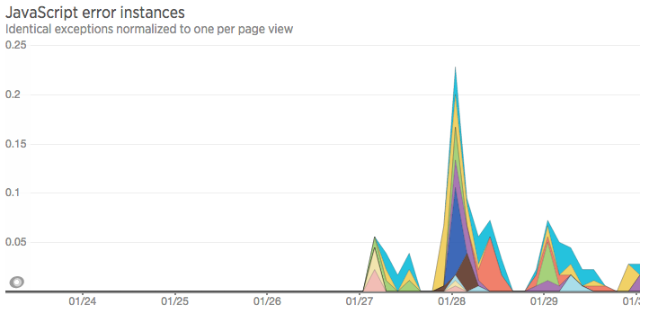

To keep high quality of [our product](https://studytube.nl "https://studytube.nl") we decided to integrate error monitoring for front-end performance and javascript exceptions, to catch all undesirable errors that appear on client side(and we sometime even don't know about them).

That's why I've made research of existing front-end monitoring services. There were more than 20 in my initial list that I collected from different sources, after I sorted them out and came to list of 6. They are **[Sentry](https://www.getsentry.com/ "https://www.getsentry.com/")**, **[Qbaka](https://qbaka.com/ "https://qbaka.com/")**, **[errorception](https://errorception.com "https://errorception.com")**, **[Raygun](https://raygun.io "https://raygun.io")**, **[Google Analytics](https://www.google.com/analytics/)** and **[New Relic](https://newrelic.com/ "https://newrelic.com/")**.

[Here](https://docs.google.com/spreadsheets/d/18BmN7-Yz4kNi5KYNQ3ml108YPKdlagqvvhxFPkmG5r4/edit#gid=0 "docs.google.com/spreadsheets") you could find comparison table for them. You are welcome to extend it by suggesting own criteria.

Finally we made decision to give **New Relic** a trial. We used it before for server side monitoring and for client side it also looks also not bad.

First minus that we've already found with **New Relic** was extremely big code snippet.

.
