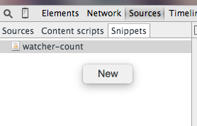
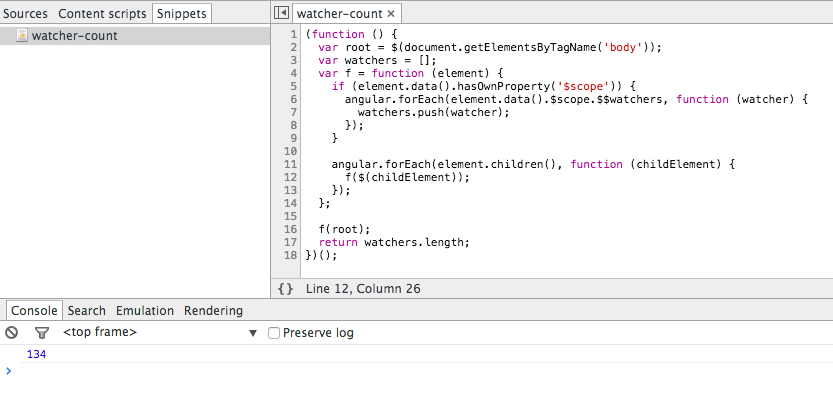

Еще одна прекрасная вещь внезапно обнаруженная мной в **Chrome** - это возможность создания **JavaScript сниппетов** - кусочков кода, которые можно будет выполнить в любой момент на странице.

Чтобы добавить новый сниппет просто заходим в **WebDeveloper** -> **Sources** -> **Snippets** (табик справа) и жмем "New":

Крайне удобно для тестирования и отладки. Например: я добавил **сниппет**, который подсчитывает **количество вотчеров** для моего **AngularJS** приложения:

Ключевые моменты JS-снипетов:

- позволяют использовать библиотеки подключенные к странице
- возможность выставлять брейкпоинты как в обычном скрипте
- прекрасная альтернатива [userscripts](https://userscripts-mirror.org/ "https://userscripts-mirror.org/") и браузерным закладкам([в которых тоже можно выполнять javascript код](https://stepansuvorov.com/blog/2012/03/debug-on/ "Debug ON. Кнопка в FireFox для разработчика."))

Глеб Бахмутов уже успел собрать [коллекцию популярных сниппетов](https://github.com/bahmutov/code-snippets "github.com/bahmutov").
