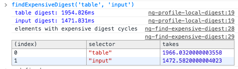
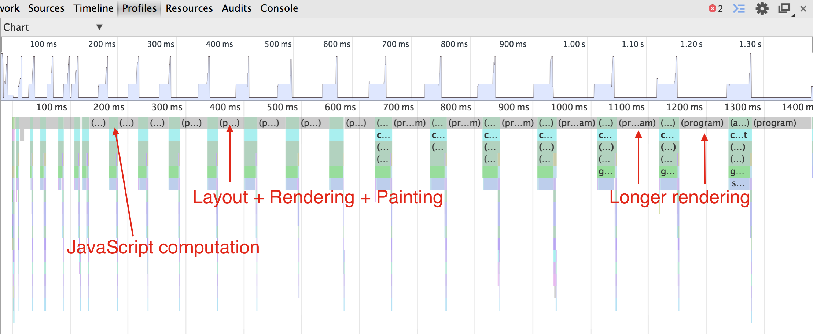
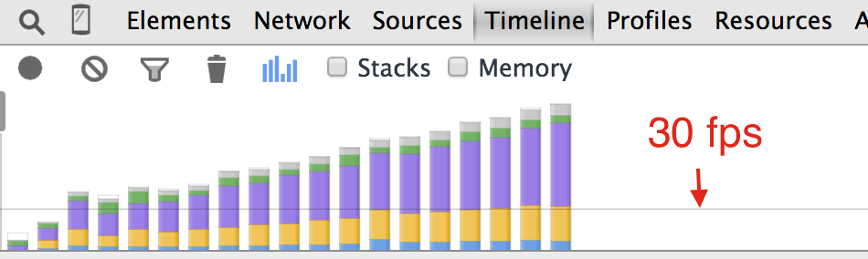
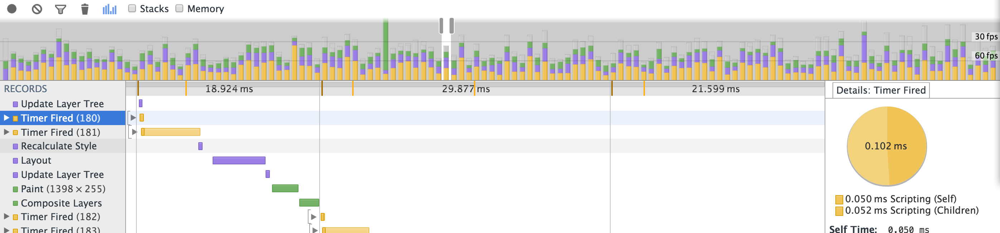
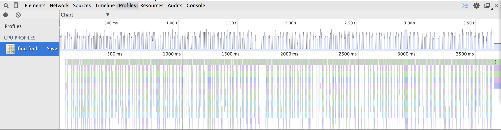
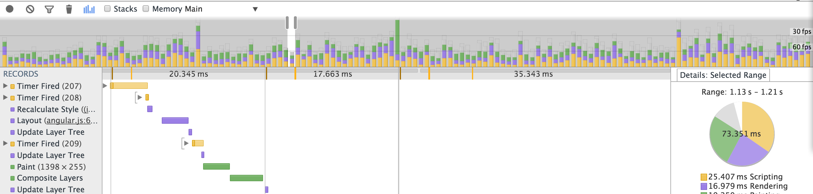
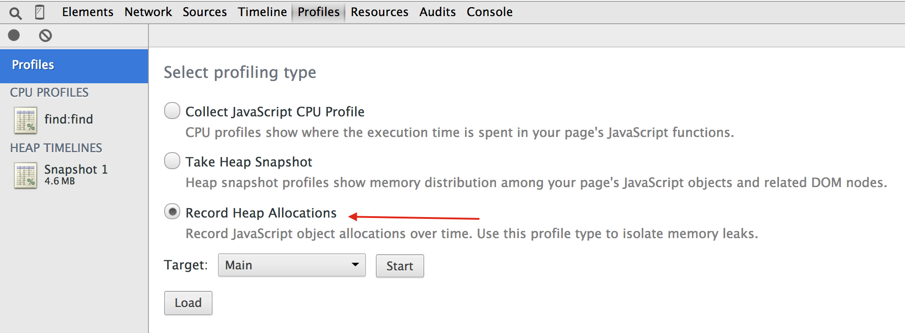

Вольный перевод статьи "[Improving Angular web app performance example](https://bahmutov.calepin.co/improving-angular-web-app-performance-example.html)". Трактат довольно фундаментальный. Большая часть методик оценки производительности подойдет для любого веб-приложения (не только AngularJS).

Состоит из следующих разделов:

- [Пример не оптимизированного приложения](#not-optimized-example)
- [Поверхностная оценка производительности](#quick-performance-overview)
- [Профилирование в Chrome с использованием сниппетов](#profiling-with-snippets)
- [Оптимизация цикла дайджеста](#digest-optimization)
- [Использование директивы bind-once](#bind-once)
- [Избавляемся от ng-repeat](#get-rid-off-ng-repeat)
- [Ускоряем начальный рендеринг](#initial-rendering)
- [Разбиваем "тяжелые" компоненты на небольшие части](#in-to-pieces)
- [Перекладываем вычисления на WebWorkers](#web-workers)
- [Оптимизация процесса выделения памяти](#memory-allocation-optimization)
- [Изоляция профиля памяти](#memory-profile-isolation)
- [Вычисление только по запросу](#on-request-compulation)
- [Минимизация наблюдаемых объектов](#watched-objects-minimization)
- [Выводы](#conclusions)

Как только необходимая функциональность вашего **AngularJS** приложения готова, следующий шаг - работа над **производительностью**, то есть: начальное время загрузки, отзывчивость к действиям пользователя: приложение должно работать быстро не заставляя пользователя ждать, иначе оно будет не очень удобным. Существую множество различных советов по повышению производительности, например: Steven Czerwinksi в своем посте "[Optimizing AngularJS: 1200ms to 35ms](https://blog.scalyr.com/2013/10/angularjs-1200ms-to-35ms/ "blog.scalyr.com")" предлагает следующие шаги:

- кеширование DOM элементов
- сокращение количества вотчеров
- отложенное создание элемента
- пропускать вотчеры спрятанных элементов

Я считаю все эти советы приемлемыми, но слишком сложными в правильной реализации. Вместо них я предлагаю следующие:

- Индивидуальная функциональность
    - оптимизировать **очевидные узкие места** на **JavaScript** (не AngularJS)
- Оценить и оптимизировать холостые проходы цикла дайджеста
    - удалить **ненужные фильтры** (тем самым сократив количество вотчеров)
    - удалить ненужные вотчеры переходом от **двунаправленого** связывания к **одностороннему**
- Проанализировать все места **обновления DOM**
    - тяжелые операции могут быть разбиты на более **простые модули** 
    - некоторые манипуляции могут быть сделаны за чет **вебворкеров**
- Минимизировать события по **сборке мусора**
    - **Повторно использовать память** вместо выделения новой

## Пример не оптимизированного приложения

В примере используется **AngularJS 1.2**, но техники профилирования приложения и нахождения "узких мест" могут быть применимы так же  и для последующих версий.

Для примера я написал небольшое **AngularJS** приложение( исходный код доступен [тут](https://github.com/bahmutov/primes "github.com")). Весь пример помещен в `index.html` файл, который может быть открыт в браузере (то есть веб сервер для запуска не нужен). Задача приложения  - вычислить N [простых чисел](https://ru.wikipedia.org/wiki/%D0%9F%D1%80%D0%BE%D1%81%D1%82%D0%BE%D0%B5_%D1%87%D0%B8%D1%81%D0%BB%D0%BE "ru.wikipedia.org"). Начнем мы с крайне неэффективной реализации и шаг за шагом будем улучшать ее.

Разворачиваем приложение локально:

[shell] git clone git@github.com:bahmutov/primes.git cd primes bower install angular-bindonce jquery angular-vs-repeat --force git checkout step-0 [/shell]

Откроем `index.html`. Страница выглядит очень просто: пользователь вводит желаемое число простых чисел и нажимает "Find". После чего числа вычисляются и выводятся в таблицу:

```html 
  <div ng-controller="primesController" ng-cloak> <button id="find" ng-click="find()">Find</button> <input ng-model="n" /> primes. <table> <tr ng-repeat="prime in primes | orderBy:$index "> <td>{{ "index" | lowercase }}</td> <td>{{ $index + 1 | number:0 | uppercase }}</td> <td>{{ "prime number" | lowercase }}</td> <td>{{ prime | number:0 | uppercase }}</td> <td>is prime? {{ prime | isPrime }}</td> </tr> </table> </div>  
 ```

Таблица содержит фильтры и порядок, чтобы показывать проблемы производительности с ними связанные.

Первый 5 простых чисел выглядят так:


## Поверхностная оценка производительности

Первоначальная версия довольно быстро находит первые 10 или даже 100 простых чисел. Но если попробовать найти 1000, то обязательно приложение начнет тормозить. Откуда такие тормоза?

Код AngularJS приложения довольно простой:

[javascript] function isPrime() ... function findPrime() ... angular.module('Primes', []) .filter('isPrime', function () { return isPrime; }) .controller('primesController', function ($scope) { $scope.n = 10; $scope.find = function () { console.log('computing first', $scope.n, 'primes'); $scope.primes = []; var k; for (k = 0; k < $scope.n; k += 1) { var prime = findPrime(k + 2); $scope.primes.push(prime); } }; });

[/javascript]

метод `$scope.find` выполняется очень долго для большого значения `$scope.n`. Обычно мы начинаем профилирование JavaScript вот так:

```javascript 
  $scope.find = function () { console.log('computing first', $scope.n, 'primes'); var started = new Date(); // computation var finished = new Date(); console.log('find took', finished - started, 'ms'); };  
 ```

Я предпочитаю [console.time](https://developer.chrome.com/devtools/docs/console-api#consoletimelabel "https://developer.chrome.com/devtools/docs/console-api#consoletimelabel") - что позволяет использовать меньше дополнительных переменных.

```javascript 
  $scope.find = function () { console.log('computing first', $scope.n, 'primes'); console.time('computing primes'); // computation console.timeEnd('computing primes'); };  
 ```

для 1000 у меня выдало

computing primes: 13084.714ms

То есть расчет занял 13 секунд!

## Профилирование в Chrome с использованием сниппетов

Вместо того, чтобы править код и вставлять метки времени, я использую [ng-profile-scope-method](https://github.com/bahmutov/code-snippets/blob/master/ng-profile-scope-method.js) сниппет (о сниппетах можно почитать [тут](https://stepansuvorov.com/blog/2015/01/javascript-%D1%81%D0%BD%D0%B8%D0%BF%D0%BF%D0%B5%D1%82%D1%8B-%D0%B2-chrome/ "JavaScript сниппеты в Chrome")). В этом методе зафиксированы id элемента и имя анализируемого метода (в нашем случае это "_find_", но вы можете их легко поменять профилируя другое приложение).

Запускаем сниппет, нажимаем на "Find", смотрим результаты:


Когда метод закончит работу, мы можем перейти во кладку **Profiles** и посмотреть загруженность процессора в момент выполнения метода. Начнем разбор с представления "**Chart**":


Отметим, что стек вызовов тривиален: функция обработчика события выполняется всего один раз за эти 13 секунд, так же как `$apply`, `$eval` и так до `$scope.find`. Внутри нашего метода `find` мы видим множественные вызовы к функции `findPrime`. Давайте посмотрим является ли `findPrime` "узким местом" для производительности.

Переключимся из предстваления "**Chart**" в "**Heavy**". Оно показывает функции, расположенные в порядке убывания по времени выполнения. 

В топе мы видим 2 функции - `isPrime` и `findPrime`, которые выполняются дольше всех. Обратите внимание на желтый треугольничек рядом с `isPrime`. Если вы наведете на него мышкой, то увидите всплывающую подсказку о том, что метод не может быть оптимизирован компилятором "[на лету](https://ru.wikipedia.org/wiki/JIT-%D0%BA%D0%BE%D0%BC%D0%BF%D0%B8%D0%BB%D1%8F%D1%86%D0%B8%D1%8F "wiki")". В данном случае это из-за `try-catch`, который находится внутри функции.

В нашем случае `isPrime` не требует `try-catch` блока совсем:

```javascript 
  function isPrime(n) { try { var k; for (k = 2; k < n; k += 1) { if (n % k === 0) { return false; } } } catch (err) { console.error(err); } return true; }  
 ```

Уберем его и запустим профайлер еще раз:


после чего мы видим как время выполнение `isPrime` с 7.2 секунд упало до 40 миллисекунд, а общее время выполнения с 13 до 5,8 секунд. Сниппет позволяет сохранять профили для разных запусков отдельно, что дает нам возможность сравнить их.

Итак, `findPrime` - наша новая цель для оптимизации. Давайте посмотрим на исходник:

```javascript 
  function findPrime(n) { var k = 1; var foundPrimes = []; while (foundPrimes.length < n) { if (isPrime(k)) { foundPrimes.push(k); } k += 1; }; return foundPrimes[foundPrimes.length - 1]; }  
 ```

Функция ищет N-ое простое число по средством вычисления всех предшествующих и возвращает последнее. Но при этом для нахождения следующего (N + 1) числа она проделает все сначала. Давайте попробуем использовать ранее найденые простые числа вынеся массив `foundPrimes` за пределы функции:

```javascript 
  var foundPrimes = []; function findPrime(n) { var k; if (foundPrimes.length) { k = foundPrimes[foundPrimes.length - 1] + 1; } else { k = 1; } while (foundPrimes.length < n) { if (isPrime(k)) { foundPrimes.push(k); } k += 1; }; return foundPrimes[n - 1]; }  
 ```

Изменения (тег [step-2](https://github.com/bahmutov/primes/releases/tag/step-2)) приводят к серьезному скачку производительности:


Теперь весь метод `$scope.find` выполняется за 389 мс, то есть скорость по сравнению с первоначальным вариантом увеличилась более чем в 40 раз!

Мы можем сделать еще одну простое изменение с целью оптимизации функции `isPrime`: тут больше вопрос математики - проверяя N на простоту, нам не нужно проверять остаток от деления на все простые числа идущие до него - достаточно дойти до корня из N:

```javascript 
  function isPrime(n) { var k; var limit = Math.sqrt(n); for (k = 2; k <= limit; k += 1) { if (n % k === 0) { return false; } } return true; }  
 ```

Обновить код можно перейдя к тегу [step-3](https://github.com/bahmutov/primes/releases/tag/step-3). Профайлер `$scope.find` показывает что мы избавились от всех явных тормозов:


## Оптимизация цикла дайджеста

Теперь можем переходить к профилирования метода объекта `scope`. Чтобы точно выявить слабые места, сделаем оценку на более серьезном объеме входных данных. Но сначала я добавлю небольшую деталь: вывод количества простых чисел (изменение в теге [step-4](https://github.com/bahmutov/primes/releases/tag/step-4)):

```html 
  <button id="find" ng-click="find()">Find</button> <input ng-model="n" /> primes. <p>AngularJs application that finds first {{ n }} prime numbers</p>  
 ```

Давайте попробуем сгенерировать 100 000 простых чисел. Это займет несколько секунд ( обновления DOM). Как только 100 000 простых чисел будут выведены на экран, попробуйте поменять количество (например: удалить один ноль). Обратите внимание на существенную задержку после нажатия на кнопку и обновления данных. Мы не модифицируем данные модели, только одно число. Таблица не должна обновляться, откуда задержка?

Чтобы отдебажить эту проблему давайте используем другой сниппет - [ng-idle-apply-timing](https://github.com/bahmutov/code-snippets/blob/master/ng-idle-apply-timing.js) (опять таки ничего не изменяя в коде). Он покажет сколько времени занимает грязная проверка (dirty checking) каждой переменной  в нашем приложении. Двойное связывание, $watch выражения и фильтры -  все это делает проход цикла дайджста более медленным.

Взглянем что получилось в профайле:


Мы видим, что только на цикл дайджеста уходит больше секунды (1274 мс). Хотелось бы это исправить. Самый надежный способ ускорить работу дайджеста - повыкидывать ненужные вотчеры.

Для начала посмотрим на элементы с самыми медленными вотчерами. Используем еще 2 сниппета: сначала [ng-profile-local-digest.js](https://github.com/bahmutov/code-snippets/blob/master/ng-profile-local-digest.js), после чего - [ng-find-expensive-digest.js](https://github.com/bahmutov/code-snippets/blob/master/ng-find-expensive-digest.js) (так исторически сложилось, что второй требует метод, который определяется в первом). Просто запустите их один за одним. И у нас в консоли появится вспомогательный метод `findExpensiveDigest`, который можем выполнить для таблицы и поля ввода:



Используем сниппет - [ng-count-watchers](https://github.com/bahmutov/code-snippets/blob/master/ng-count-watchers.js), чтобы посчитать общее количество вотчеров. Можете убедиться, что для случая с 100 000 простыми числами в приложении появляется аж 500 003 вотчеров! Из них 3 - обслуживают ng-repeat, вводимое значение и число в шаблоне. Остальные ( 500 000) занимаются наблюдением в ячейках таблицы:

```html 
  <tr ng-repeat="prime in primes | orderBy:$index "> <td>{{ "index" | lowercase }}</td> <td>{{ $index + 1 | number:0 | uppercase }}</td> <td>{{ "prime number" | lowercase }}</td> <td>{{ prime | number:0 | uppercase }}</td> <td>is prime? {{ prime | isPrime }}</td> </tr>  
 ```

Обратим внимание, что для каждой строчки используются избыточные фильтры. Например:`{{ "index" | lowercase }}` - это статический текст, который никогда не меняется, но Ангуляр вычисляет его снова и снова, а результаты всегда одни и те же, даже когда количество строк меняется. Давайте удалим фильтры `lowercase`, `uppercase`, `isPrime` , которые по сути ничего не делают(можно обновиться до тега [step-5](https://github.com/bahmutov/primes/releases/tag/step-5)):

```html 
  <tr ng-repeat="prime in primes | orderBy:$index "> <td>index</td> <td>{{ $index + 1 | number:0 }}</td> <td>prime number</td> <td>{{ prime | number:0 }}</td> <td>is prime? true</td> </tr>  
 ```

Обновленное приложение содержит уже только 200 003 вотчеров, и соотвественно цикл дайджеста проходит в 2 раза быстрее.

## Использование директивы bind-once

Производительность уже серьезно была улучшена удалением ненужных фильтров, но мы можем ускорить еще. Отметим то, что в то время, как таблица не меняется, мы продолжаем вычислять 2 вотчера на каждую строчку, каждый раз, когда мы меняем значение поля ввода( что запускает цикл дайджеста). Данные не изменяются, поэтому мы не должны вычислять выражение еще раз. Angular1.3 [представляет](https://docs.angularjs.org/guide/expression#one-time-binding) "одноразовое связывание" следующим синтаксисом `{{ ::prime}}`. Но AngularJS 1.2 "из коробки" такого увы не предоставляет. Как вариант можно использовать модуль [bindonce](https://github.com/Pasvaz/bindonce): изменения незначительны; фильтры также поддерживаются:

```html 
  <tr ng-repeat="prime in primes | orderBy:$index " bindonce> <td>index</td> <td bo-text="$index + 1 | number:0" /> <td>prime number</td> <td bo-text="prime | number:0" /> <td>is prime? true</td> </tr>  
 ```

Обновленное приложение имеет только 3 вотчера (после отображения 100 000 простых чисел), и цикл дайджеста занимает в этом случае только 5мс. Ну что ж это уже похоже на отзывчивый интерфейс.

Обновить код можно по тегу [step-6](https://github.com/bahmutov/primes/releases/tag/step-6). И не забудьте поставить модуль [bindonce](https://github.com/Pasvaz/bindonce):

[shell] bower instal angular-bindonce [/shell]

 

## Избавляемся от ng-repeat

Как показало профилирование: генерация таблицы занимает 10 секунд, при этом каждая строчка и ячейка порождают несколько функциональных вызовов.


Чтобы как-то улучшить эту часть, я написал свою функцию генерирования HTML и вывод его просто через `innerHTML`. То есть выкидываем `ng-repeat` вместе с содержимым (тег [step-7](https://github.com/bahmutov/primes/releases/tag/step-7)):

```javascript 
  // use AngularJs built-in filter var number = $filter('number'); function generateTableRows() { var k; var str = ''; for(k = 0; k < $scope.n; k += 1) { str += '<tr><td>index</td>'; str += '<td>' + number(k + 1, 0) + '</td>'; str += '<td>prime number</td>'; str += '<td>' + number($scope.primes[k], 0) + '</td>'; str += '<td>is prime? true</td></tr>'; } document.getElementsByTagName('table')[0].innerHTML = str; } $scope.find = function () { // generate primes list as before generateTableRows(); }  
 ```

Такое изменение дало увеличение производительности в 10 раз:

[](https://stepansuvorov.com/blog/wp-content/uploads/2015/02/in-code-table-generation.png)

Конечно же это лишает вас гибкости связывания представления с моделью, которую дает `ng-repeat` и так можно делать только тогда, когда вы точно уверенны, что данные меняться не будут.

 

## Ускоряем начальный рендеринг

Давайте подойдем к проблеме с другой стороны: если процесс вычисления всех результатов занимает много времени, то мы можем показать только первоначальные результаты, и сделать это довольно быстро. То есть пользователь увидит какие-то результаты, в то время как остальные все еще будут рассчитываться. Мы можем вычислить и вывести первые 100 чисел очень быстро ( < 30 мс). Я разбил логику на 2 шага и использовал $timeout сервис, чтобы выполнить второй шаг после того, как обновиться DOM и браузер отобразит эти первые 100 строк:

```javascript 
  $scope.find = function () { // code as before var firstBatchN = 100; var k; for (k = 0; k < firstBatchN; k += 1) { var prime = findPrime(k + 2); $scope.primes.push(prime); } generateTableRows(0, firstBatchN); // start second batch via event loop to let browser repaint // return promise to allow timing this action return $timeout(function computeSecondBatch() { for (k = firstBatchN; k < $scope.n; k += 1) { var prime = findPrime(k + 2); $scope.primes.push(prime); } generateTableRows(firstBatchN, $scope.n); }, 0); };  
 ```

Код доступен по тегу [step-8](https://github.com/bahmutov/primes/releases/tag/step-8).

На временном графике мы видим эти 2 шага довольно четко. Первая отрисовка заканчивается через 20мс после нажатия на кнопку find. Но пользователь не может ничего сделать с таблицей, так как вторая порция тормозит браузер пока вычисляются остальные числа и вычисляет отображение для всей таблицы:


 

## Разбиваем "тяжелые" компоненты на небольшие части

В ходе работы приложения для генерации и вывода чисел на экран браузер выполняет следующие операции:

- выполнение JavaScript
- построение отображения (позиция или размер каждого DOM элемента)
- отрисовка каждого компонента отдельно в буфер
- отрисовка всех элементов из буфера

Все действия совершаются в одном потоке, и это может представлять проблему производительности, когда одна из частей занимает много времени. Например: сложные CSS стили ведут к долгой отрисовке, блокировке клиентского кода. Каждая такая итерация(из 4 действий) должна занимать не больше чем 33мс, если мы хотим достичь **30 fps**, или меньше 16мс, если наша цель **60 fps**.

Предыдущем шаге мы разбили наше приложение на 2 части: первую выдачу и дальнейшую загрузку, которая уже серьезно тормозит браузер и не дает пользователю работать со страницей.

Давайте разобьем весь процесс на много маленьких частей, которые будут вычислять и отображать только 50 чисел. Полный цикл (выполнение кода, обновление DOM и рендеринг) не должен занять больше 30мс, не мешая пользователю взаимодействовать со страницей ( например: прокручивать вниз).

Чтобы запланировать выполнение кода после того как браузер отрисует предыдущую часть мы используем `$timeout` сервис:

```javascript 
  function computePrimes(first, last) { var k; for (k = first; k < last; k += 1) { var prime = findPrime(k + 2); $scope.primes.push(prime); } } function generateTableRows(first, last) { // ... тут мы генерируем HTML и сохраняем в str document.getElementsByTagName('tbody')[0].innerHTML += str; console.timeStamp('updated tbody ' + first + ' to ' + last); } function computeAndRenderBatch(first, last) { computePrimes(first, last); generateTableRows(first, last); // возвращает промис, который разрешиться после отрисовки DOM return $timeout(angular.noop, 0); }  
 ```

Главный вычислительный метод `$scope.find` теперь создает большую цепочку промисов, которые будут выполнятся один за одним. И на каждом шаге будет вычислено 50 простых чисел,  сгенерирован HTML и добавлен в DOM:

```javascript 
  $scope.find = function () { var batchSize = 50; var k; // начинаем с "нулевого" промиса (который сразу отрезолвится) var computeAndLetUiRender = $q.when(); var computeNextBatch; for (k = 0; k < $scope.n; k += batchSize) { computeNextBatch = angular.bind(null, computeAndRenderBatch, k, Math.min(k + batchSize, $scope.n)); computeAndLetUiRender = computeAndLetUiRender.then(computeNextBatch); } // return promise to let timing code snippet know when we are done return computeAndLetUiRender; };  
 ```

Изменения кода доступны в теге [step-9](https://github.com/bahmutov/primes/releases/tag/step-9).

Посмотрим на результаты профилирования:



Мы можем посмотреть на каждую порцию временного графика в отдельности, чтобы убедиться что наши действия выполняются одно за одним.


Но мы также можем заметить, что обновления постепенно замедляются. Фиолетовый столбик(отрисовка) становится все больше и больше с каждым разом.



Проблема в способе добавления новых строк в таблицу: каждый раз при добавлении браузеру приходиться перерисовывать всю таблицу!

```javascript 
  function generateTableRows(first, last) { // generate new rows HTML markup into variable str document.getElementsByTagName('tbody')[0].innerHTML += str; }  
 ```

Вместо замены всего содержимого таблицы мы можем создавать новую таблицу и просто добавлять ее в структуру документа ( _Мы так же можем добавлять другой элемент tbody в ту же самую таблицу. Но этот вариант не оценивался_ )

```javascript 
  function generateTableRows(first, last) { var k, txt = angular.bind(document, document.createTextNode); var table = document.createElement('table'); for(k = first; k < last; k += 1) { var row = table.insertRow(); row.insertCell().appendChild(txt('index')); row.insertCell().appendChild(txt(k + 1)); row.insertCell().appendChild(txt('prime number')); row.insertCell().appendChild(txt($scope.primes[k])); row.insertCell().appendChild(txt('is prime? true')); } // schedule DOM update by attaching new table element to the body document.body.appendChild(table); }  
 ```

Обновленния берем в теге [step-10](https://github.com/bahmutov/primes/releases/tag/step-10).

Ну вот мы и добились 30fps. Что означает, что мы можем прокручивать и смотреть результаты относительно без тормозов, в то время как браузер продолжает вычислять оставшиеся результаты.



 

## Перекладываем вычисления на WebWorkers

В итоге, я решил вынести вычисление простых чисел в поток вебворкеров, чтобы выполнять параллельно с основным кодом.  Перемещаем `isPrime` и `findPrime` методы в файл `primes.js`. Они будут общаться с основным кодом по средством сообщений:

```javascript 
  // primes.js onmessage = function (e) { var first = e.data.first; var last = e.data.last; var k, primes = []; for (k = first; k < last; k += 1) { var prime = findPrime(k + 2); primes.push(prime); } // посылаем результаты обратно postMessage(primes); };  
 ```

Чтобы упростить взаимодействие с вебворкерами, я создал сервис:

```javascript 
  angular.module('Primes', []) .factory('PrimeWorker', function ($q) { var worker = new Worker('./primes.js'); var defer; worker.onmessage = function(e) { defer.resolve(e.data); }; return { computePrimes: function (first, last) { defer = $q.defer(); worker.postMessage({ first: first, last: last }); return defer.promise; } } });  
 ```

Метод `$scope.find` должен обрабатывать вычисления асинхронно, поэтому

```javascript 
  .controller('primesController', function ($scope, $filter, $timeout, $q, PrimeWorker) { function computePrimes(first, last) { return PrimeWorker.computePrimes(first, last).then(function (numbers) { // копируем результаты в массив var k, n = numbers.length; for(k = 0; k < n; k += 1) { $scope.primes.push(numbers[k]); } }); } function computeAndRenderBatch(first, last) { // результатом будет промис return computePrimes(first, last).then(function () { generateTableRows(first, last); return $timeout(angular.noop, 0); }); }  
 ```

Код доступен по тегу [step-11](https://github.com/bahmutov/primes/releases/tag/step-11).

!Внимание: Для загрузки вебворкеров нам понадобится локально запустить веб-сервер. Могу порекомендовать [http-server](https://github.com/nodeapps/http-server). Устанавливает и запускается очень просто(команды выполняем из директории проекта):

[shell] $ npm install http-server -g $ http-server [/shell]

Профилирования процессора теперь показывает приятные узкие столбики для основного кода:



Временной график показывает, что все выполняется быстрее и почти все итерации попадают под **60fps**:



## Оптимизация процесса выделения памяти

Если наше приложение в процессе выполнения занимает и освобождает много памяти, то браузер должен переодически останавливаться, чтобы собрать освободившуюся память. Задержки при сборке мусора непредсказуемы и могут быть долгими. Чтобы найти этим события(сборка мусора) на временном графике включите фильтр и введите "_gc_" (garbage collection). В нашем случае мы видим серьезные задержки по сборке мусора: несколько мегабайт освобождаются каждый раз и это занимает более чем 100мс. (Для теста я генерировал 150 000 простых чисел порциями по 10 000). Это заметно не вооруженным взглядом, если вы включите график работы с памятью (галочка "Memory"):


Первый кандидат на освобождение памяти - массив `$scope.primes`. Отметим, что он растет динамически, потому что он начинается с размерности 0 и мы продолжаем добавлять новые простые числа в массив одно за одним:

```javascript 
  var k, n = numbers.length; for(k = 0; k < n; k += 1) { $scope.primes.push(numbers[k]); }  
 ```

Это очень не эффективно с точки зрения выделения памяти: когда новый элемент добавляется в непустой массив, среда выполнения выделяет память под новый массив (обычно выделяется в 2 раза больше памяти), скопировать числа и почистить память за исходным. Я изменил код задав массив необходимой длинны с самого начала (используя заданное количество простых чисел):

```javascript 
  $scope.primes = new Array($scope.n); $scope.computedN = 0; // copy numbers var k, n = numbers.length; for(k = 0; k < n; k += 1) { $scope.primes[$scope.computedN] = numbers[k]; $scope.computedN += 1; }  
 ```

Обновляемся из тега [step-12](https://github.com/bahmutov/primes/releases/tag/step-12).

Теперь временной график показывает не такие серьезные скачки в памяти:


Примечание: иногда профайлер барахлит и нужно закрыть все и открыть заново.

 

## Изоляция профиля памяти

Чтобы лучше увидеть выделение памяти давайте изолируем конкретные шаги. Для начала давайте выключим генерацию DOM - она создает много "шума" на графике при размещении элементов.

```javascript 
  function computeAndRenderBatch(first, last) { return computePrimes(first, last).then(function () { // generateTableRows(first, last); return $timeout(angular.noop, 0); }); }  
 ```

Теперь мы можем запустить профайлер выделяемой памяти, а не профайлер процессора. Включаем профайлер и затем нажимаем кнопку "Find":



После чего мы можем увидеть выделение памяти под большие массивы с начала. (прим.: _можем навести мышкой, чтобы увидеть конкретные значения_). Также можно отметить что общий размер памяти 600 008 байт (при генерации 150 000 простых чисел). Движок V8 обнаружил что мы добавляем только целые числа в массив, поэтому используется только 4 байта на элемент. Массив также имеет свойство `length` - эти дополнительные 8 байт.


Этот профиль дает нам представление о выделении памяти из основного кода, но он не показывает выделение памяти в вебворкерах. Изучить утечки памяти в вебворкерах выберите "primes.js" перед стартом профилирования памяти


Собраный профиль веделения памяти на вебворкерах менее детален из-за браузерных ограничений. Но мы все равно можем четко увидеть растущее выделение памяти. Если посмотрим детально - обнаружим массив `foundPrimes`:


Для массива `foundPrimes` мы так же можем сразу выделить необходимое количество памяти (тем самым предотвращая постоянное изменение размера и сборку мусора).

## Вычисление только по запросу

Давайте изменим способ генерации данных приложением. Вместо предвычислений тысяч простых чисел, сгенерируем небольшую часть чисел и отрисуем таблицу. Если пользователь прокрутит до конца таблицы в поисках большего количества чисел, мы сгенерируем новую партию чисел и добавим их в DOM. Можно легко привязать генерацию к прокрутке используя директиву [ngInfiniteScroll](https://binarymuse.github.io/ngInfiniteScroll/index.html). Для этой директивы нам понадобится также подключить jQuery:

```html 
  <script src="bower_components/jquery/dist/jquery.min.js"></script> <script src="bower_components/angular/angular.js"></script> <script src="bower_components/ngInfiniteScroll/build/ng-infinite-scroll.min.js"></script>  
 ```

Для простоты я снова использую `ng-repeat`. Мы запустим `$scope.find` метод тогда, когда границы таблицы сравняются с границами окна пользователя. Первый вызов `$scope.find` сделаем вручную с помощью атрибута `infinite-scroll-immediate-check`.

```html 
  <table id="table" width="500"> <tbody infinite-scroll="find()" infinite-scroll-distance="3" infinite-scroll-immediate-check="true" infinite-scroll-disabled="computing"> <tr ng-repeat="prime in primes"> <td>index</td> <td>{{ $index + 1 | number:0 }}</td> <td>prime number</td> <td>{{ prime | number:0 }}</td> <td>is prime? true</td> </tr> </tbody> </table>  
 ```

Я выкинул ручную генерацию html таблицы, оставил только вычисление числа (которое по прежнему в вебворкере).

```javascript 
  $scope.find = function () { $scope.computing = true; return computePrimes($scope.primes.length, $scope.primes.length + batchSize) .then(function () { console.log('computed', $scope.primes.length, 'primes'); $scope.computing = false; }); };  
 ```

Обновляем код в теге [step-13](https://github.com/bahmutov/primes/releases/tag/step-13).

Теперь страница показывает только первые 100 чисел. Если вы начнете прокручивать вниз, то новые будут вычислены новые числа  и добавлены к таблице. Генерация довольно быстрая, чтобы не тормозить прокрутку. На временном графике мы можем увидеть 3 столбика для генерации первых 400 чисел (первые 100 сгенерированны до профилирования):


## Минимизация наблюдаемых объектов

Еще одна не очевидная причина тормозов в AngularJS - тяжелые вотчеры, а именно вотчеры, которые наблюдают за сложным объектом, а еще хуже за результатом функции, которая возвращает такой объект. Вот эти 2 вотчера:

[javascript] angular.module('Primes', []) .controller('primesController', function ($scope) { $scope.primes = ... $scope.$watch('primes', ...); // OR $scope.$watch(function () { return $scope.primes; }, ...);

[/javascript]

AngularJS делает грязную проверку - в ходе каждого цикла дайджеста каждая наблюдаемая функция вычисляется и возвращает значение, которое сравнивается с предыдущим возвращенным значением. Это означает, что последнее значение было сохранено. Если вы используете вотчер с [глубоким сравнением](# "для объектов это полное сравнение вложенных значений, а не только ссылки на объект"), тогда ангуляр сохраняет полную копию возвращаемого объекта. Это может быть довольно дорого с точки зрения производительности. Например массив с объектами:

```javascript 
  $scope.n = 10000; $scope.primes = new Array($scope.n); for (k = 0; k < $scope.n; k += 1) { $scope.primes[k] = { foo: { bar: 'baz' } }; } $scope.$watch(function primesWatcher() { return $scope.primes; }, angular.noop, true); // do nothing on value change  
 ```

Взять код можно из тега [step-14](https://github.com/bahmutov/primes/releases/tag/step-14).

Изначально загрузка приложения задерживатся на 500мс из-за объекта возвращаемого из `primesWatcher` и копируемого для дальнейшего сравнения. Приложение понесет тоже наказание каждый раз, когда объект primes будет изменен.


Важная заметка: полная копия занимает НАМНОГО больше времени, чем полное сравнение. Отсюда и задержка, которая появляется не в момент прохода дайджеста, а только когда что-то изменено. На практике это означает медленную реакцию на ввод пользовательских данных, когда результат вотчера копируется.

Несколько предложений как победить дорогостоящее полное копирование в вотчерах:

- стараться использовать сравнение по ссылке (но не полный перебор)
- повторно использовать один и тот же  вотчер для нескольких действий

Например:

```javascript 
  // вместо нескольких вотчеров $scope.$watch(function () { return $scope.primes; }, foo, true); $scope.$watch(function () { return $scope.primes; }, bar, true); $scope.$watch(function () { return $scope.primes; }, baz, true); // используем один $scope.$watch(function () { return $scope.primes; }, function () { foo(); bar(); baz(); }, true);  
 ```

-  использовать свою логику определения изменения состояния

Объект `primes` изменяется каждый раз, когда мы добавляем новое число:

```javascript 
  .controller('primesController', function ($scope) { var primesChanged = 0; $scope.find = function () { $scopes.primes.push(findNextPrime()); primesChanged += 1; }; $scope.$watch(function () { return primesChanged; }, function () { ... }); });  
 ```

Тут я использую счетчик, чтобы гарантировано запускать вотчер, когда значение изменяется. Если бы я просто возвращал true/false, цикл дайджеста бы не заметил разницы, так как только разница возвращаемых значений играет роль, а не сами значения возвращаемые функцией.

## Выводы и дальнейшее исследование

Улучшение производительности любого приложения это пошаговый процесс.

1. Профилируйте, чтобы найти проблемные места
2. Удаляется проблемные места
3. Повторяйте шаги 1-2

Я считаю целесообразным сначала удалить самые явные проблемные места, прежде чем погружаться в полный анализ. Во-первых, мы удаляем код, который дает основные тормоза. Во-вторых, удаление этого кода могло повлиять на другие проблемные места.

Как правило код любого JavaScript приложения имеет проблемные места. Как только клиентский код оптимизирован, я переключаюсь на профилирование и оптимизацию Ангуляра, по большей части это удаление лишней работы, которую делает фреймворк. После чего, я переключаю внимание на выполнение кода/браузерную отрисовку, в надежде разбить большие куски на сравнительно небольшие части.

Граматное решение по улучшению производительности требует знаний JavaScript, оптимизаторов среды выполнения, процесса браузерного рендеринга и специфики фреймворка вашего приложения. В первую очередь оно требует сравнение производительности приложения с ожиданиями пользователя интерфейса при различных сценариях. AngularJS имеет некоторые проблематичные места, такие как грязная проверка в ходе цикла дайджеста. Однако, это очень гибкий фреймворк, как вы могли убедиться на примерах. Я смог изменить части системы, заменить шаги, но это по прежнему Ангулар приложение. То есть мы можем улучшить производительность каких-то конкретных частей без жертвы гибкости и простоты для всего приложения.

**UPD**: как альтернативу ng-repeat c ngInfiniteScroll можно использовать директиву [angular-vs-repeat](https://kamilkp.github.io/angular-vs-repeat "https://kamilkp.github.io/angular-vs-repeat") (обрабатывать только "видимые" строчки), которая так же дает хороший прирост к производительности.
