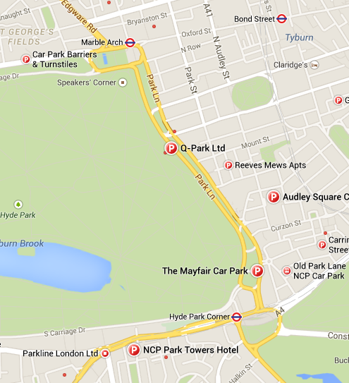
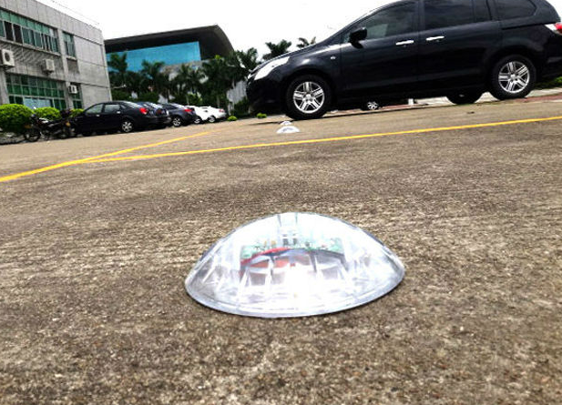

Why not to create service to show **free parking spots**? No, not only one parking area, for all nearest parkings by exact location. It could be web-site, web-app or mobile app, also extension for existing car navigation systems. It could be even just API for another companies.

Why it could be handy?

Yes, we can open something like **google maps** and ask for nearest parking:

Yes, it's good option. But what if all of them are full? May be some of them are closed. I had terrible experience looking for a parking place for about 2 hours. I had only 6 hours to travel around the city, so it was pretty crucial.

Almost all paid parking garages already have automated check and show you amount of available spots.

so we need only to connect their local systems to our database that they could provide us information. Our side - it's only simple API. From their side could be much more difficult, because you don't know what kind of software is installed there. But parking providing companies should be interested in such kind of connection, because it's extra promotion for them.

The situation with public parkings is not that clear. It could be solved only with each municipality individually. Before discussion it's good to have concrete technical solution. I googled a bit and found that a lot of similar technical devices had already been made. For example [this](https://rosimits.en.alibaba.com/product/60051035494-219526306/ROSIM_Wireless_Geomagnetic_and_Optic_Parking_Space_Detection_Sensor_Replace_Ultrasonic_Sensor.html "alibaba.com") one:

Also you probably would need to get support of internet provider that also should not be difficult. Media/internet provider will get extra service that would be available for free only for users of this provider. Nice offer, isn't it?

When you finish with the negotiation stage you can start build our application. To have first quick prototype we could use google maps api, only put there our parking info sings:

Of course, like with other startups the main thing is to make our service popular. For this you probably need to implement such solution only for several cities. And after... just provide API to other parking companies.

...and well done.

 

If you want to use this idea - please read the [welcome note](https://stepansuvorov.com/blog/2015/02/start-me-up/ "https://stepansuvorov.com/blog/2015/02/start-me-up/") :)
