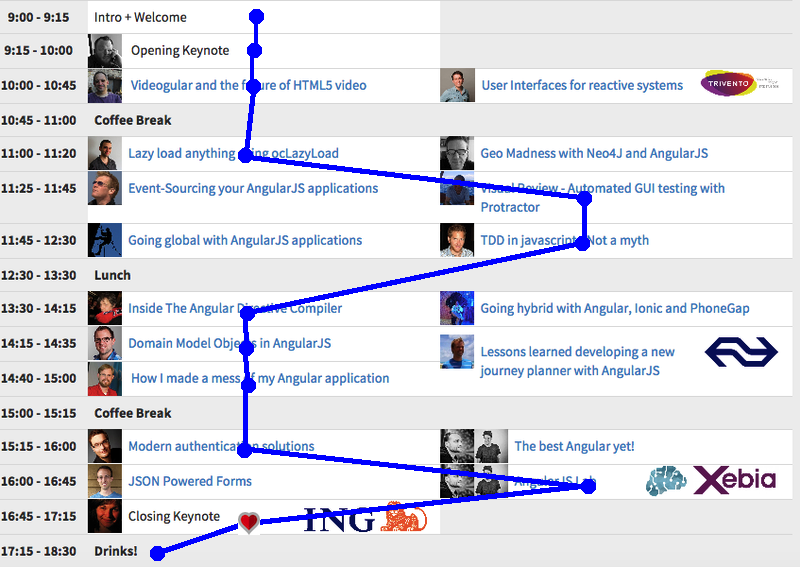
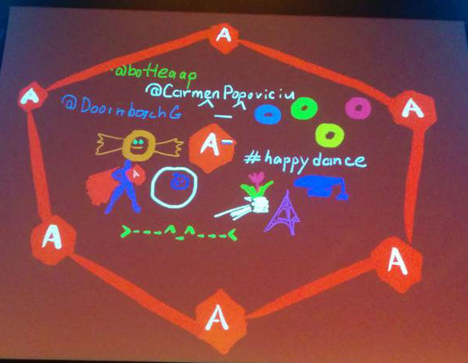

I was happy to visit [NG-NL Conference in Amsterdam](https://www.ng-nl.org/ "https://www.ng-nl.org/") (the first AngularJS one in NL) and would like to share my thoughts with you.

As far as there were a lot of topics to discuss conference was run in 2 tracks. [Here](https://www.ng-nl.org/#schedule "https://www.ng-nl.org/#schedule") you can find the whole schedule. I followed next route:

 so several words about each one.

## Intro + Welcome ([slides](https://docs.google.com/presentation/d/1tE3fQUbmQUsMDmA0wc7z6dEhtyLk44GBKrVRtB58xoc/edit#slide=id.g78c807a97_329 "docs.google.com/presentation"), [video](https://www.youtube.com/watch?v=dJFV8wFU23A "youtube.com"))

It was great speech by [Aaron Frost](https://twitter.com/js_dev). We can say that it was about everything and nothing(from tech side) the same time. He provided good structured way how everyone can grow as a professional inside AngularJS/JavaScript(and probably not only) community.

After several days/weeks/months listeners could forget the context, but they never forget awesome comparison that authors of frameworks and tools like builders who are constructing a bridge across the river, river of different development issues. And they know that these bridges would be used not only by them but mostly by juniors. So he wished us _create our own bridges, help to improve existing ones and never troll builders_.

Very inspiring! Thank you, Aaron.

## Videogular and the future of HTML5 video ([slides](https://slides.com/elecash/deck#/), [video](https://www.youtube.com/watch?v=I7ZUkd44-Co "youtube.com"))

It was presentation of [Videogular](https://www.videogular.com/ "https://www.videogular.com/") - HTML5 video player for AngularJS by [Raúl Jiménez](https://twitter.com/elecash). First part of the presentation for me was like "reading" documentation for component and explaining obvious things. Second part was more interesting with life coding and real example. Site [sawfish.stimme.de](https://sawfish.stimme.de/ "https://sawfish.stimme.de/") shows **Videogular** connected to google maps API that is really impressing!

**@Raul**, I will definitely have more detailed look on your project.

## Lazy load anything using ocLazyLoad ([slides](https://slides.com/ocombe/ng-nl#/), [video](https://www.youtube.com/watch?v=mM45wIg_fpI "youtube.com"))

A very short talk by [Olivier Combe](https://twitter.com/OCombe). He presented his extension [ocLazyLoad](https://github.com/ocombe/ocLazyLoad "https://github.com/ocombe/ocLazyLoad") that allows to do lazy loading for modules in AngularJS. Pointed out how important lazy loading is, especially for mobile limited network connection. Also it was some explanation how it could work with router (both ngRoute and ui-router). It's nice that ocLazyLoad also support dependancy injection for loaded modules.

There are some expectations to get similar functionality in Angular1.5, we'll see.

**@Olivier**, why only 20 min for such a fundamental concept? Already dived into the [source code](https://github.com/ocombe/ocLazyLoad/blob/master/dist/ocLazyLoad.js "github.com").

## Visual Review - Automated GUI testing with Protractor

[Daniel Marjenburgh](https://twitter.com/dmarjenburgh) presented [Visual Review](https://github.com/xebia/VisualReview "https://github.com/xebia/VisualReview") - tool to check visual changes between different project builds (btw name is terrible extremely difficult to google it :). The tool works together with protractor (thanks to special plugin [VisualReview-protractor](https://github.com/xebia/VisualReview-protractor "https://github.com/xebia/VisualReview-protractor")) that makes it really tasty. The base idea is quite simple: to make and compare screenshots. In protractor scenario code it looks simply like:

[javascript] vr.takeScreenshot('AngularJS-homepage'); [/javascript]

**@Daniel**, I liked the idea. Only one question is still open for me: how could I make it work with remote browsers (for example [Browserstack](https://www.browserstack.com/ "https://www.browserstack.com/") service)?

## TDD in javascript - Not a myth ([slides](https://slides.com/ofird/tdd-in-javascript-not-a-myth--2#/))

In all the details and for the very basics - TDD in JavaScript by [Ofir Dagan](https://twitter.com/ofirdagan2). In this presentation you could find answers for all the questions: "why to do testing?", "how to do it right?", "which tools to use?", "how to analyse the coverage?" and even "how mother nature do TDD". It's really good and quick introduction for developers who want to start with testing.

**@Ofir**, I wish I met you 2 years ago when I started my "trial and error method" with TDD.

## Inside The Angular Directive Compiler ([video](https://www.youtube.com/watch?v=saA4rUSBSUk))

I even could not imaging that this lecture about Directive Compiler would be so interesting for me. Step by step together with [Tero Parviainen](https://twitter.com/teropa) we recreated functionality of [$compileProvider.$compile](https://docs.angularjs.org/api/ng/service/$compile "docs.angularjs.org") method. It consists of 4 steps:

- **compile** (parse html template for directives)
- **link** (link them to the scope)
- **inheritance** (create new scope if needed and operate with it)
- **isolation** (not provide the scope by itself but do attribute binding)

**@Tero**, you pushed me to look into source code more often :) And of course thank you for the book!

## Domain Model Objects in AngularJS ([video](https://www.youtube.com/watch?v=iz9zBWrhZUg "youtube.com"))

[Gert Hengeveld](https://twitter.com/GHengeveld) showed how we could create Model layer based on javascript classes (or constructor functions). During all the presentation I had filling that backend developer wants to bring his concepts to client side(To be sure that I understood concept correctly I went to [original article](https://medium.com/opinionated-angularjs/angular-model-objects-with-javascript-classes-2e6a067c73bc "Angular model objects with JavaScript classes")). I was not convinced that I should try this approach. There were so many theoretical things that we ostensibly would be able to do with this structure(I even don't remember the whole list): validation, relations, etc... I would like to see your implementation of this concepts. Because without implementation it's nothing to discuss. In our applications for data layer we are using [Restangular](https://github.com/mgonto/restangular "https://github.com/mgonto/restangular") wrapped with our services where we do validation and all this stuff, and it works pretty well.

**@Gert**, if you have some code to share - please show it, I really would like to have a look.

## How I made a mess of my Angular application ([slides](https://slides.com/djsmith/how-we-made-a-mess-of-our-angular-app/#/), [video](https://www.youtube.com/watch?v=n8JdXkKhDyU&feature=em-subs_digest "youtube.com"))

Very funny speech by [Dave Smith](https://twitter.com/djsmith42) about past Angular mistakes and ruler punishment. I just provide the list of mentioned mistakes and solution(in brackets) for them:

- scope abuse ( do not create scope everywhere)
- global controller functions ( use another syntax )
- shadow scope ( use "controllers as " or nested model)
- $watch abuse ( use ng-change, events, flux pattern)
- ng-include ( just don't use ng-include)
- pass scope like param to services ( never do so)
- home grown build tools ( many existing proven tools)

btw, it was a suggestion to put own Angular mistakes on twitter with tag [#ngoops](https://twitter.com/hashtag/ngoops?src=hash) (not much for now)

**@Dave**, mine were(except several from your list):

- bad file structure
- everything in controller (DOM manipulations and business logic)
- used jQuery a lot instead native directives

## Modern authentication solutions ([slides](https://www.dropbox.com/s/6144v595abh2lzq/steyer_oauth2_javascript.pdf?dl=0), [video](https://www.youtube.com/watch?v=7oGDG47KrXU "youtube.com"))

[Manfred Steyer](https://twitter.com/ManfredSteyer) told us a lot about OAuth 2.0 and OpenID and not much about AngularJS implementation.  And it would be also interesting to hear about some existing solutions for Angular and compare them.

**@Manfred**, 45 min definitely not enough for OAuth specific. I guess audience divided into 2 parts: who worked with OAuth before - for them it was boring, and who did not know this protocol - they still don't know it.

## AngularJS Lab

I don't know why, but we skipped this.

But still I had quite interesting talk with [Christoph Burgdorf](https://twitter.com/cburgdorf). Christoph, thank you for advise about detecting language for authorised user.

## Closing Keynote ([video](https://www.youtube.com/watch?v=czHsSDw6Dys "youtube.com"))

I'm glad to be with [Carmen Popoviciu](https://twitter.com/CarmenPopoviciu) in one community.

 

**@organisers**, **@speakers,** thank you very much for such a great event!
