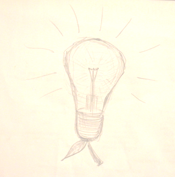

I decided to create special category where I'll describe all ideas of projects (or startup if you want) which came into my mind. Ideas from real and virtual world. Ideas that have right for life, but for a long time continue to be  at the embryo stage. I do not want to store them in my head, otherwise the warehouse will be full and there will be no place for new ideas.

If you find something interesting for you and would like to bring it to life - you are more than welcome!

It would be also interesting to hear your thought about these ideas.

_[now the same in Russian]_

Решил сделать специальный раздел, где описывать все идеи проектов (если хотите - "стартапов"), которые приходят в голову. Идеи как реального, так и виртуального мира. Идеи, которые имеют право на жизнь, но при этом долгое время продолжают находится на стадии эмбриона. Я не хочу их складировать в голове, иначе склад переполнится и для новых идей места уже не будет.

Если найдете среди них что-то, что вы заходите воплотить в жизнь - пожалуйста! Используйте их на здоровье.

Критика в комментариях так же приветствуется. Мне будет интересно послушать ваше мнение.
