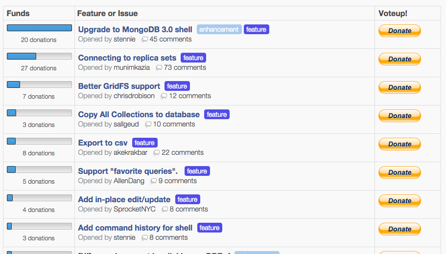

Idea brought by [Oleg Polovets](https://www.linkedin.com/profile/view?id=70178367 "linkedin"). Oleg, I hope you don't mind sharing it here. The idea quite simple, but more the useful for popular open-source projects.

Usually if your open-source solution is widely used you have a quite big backlog with requests to update some parts of your code. And in almost all the cases you don't have time to cover them all immediately. So which one to take first?

What if we organise something like a poll for each backlog issue? But to make votes even more exact we will ask users not just click the button, but to donate for each vote. By this will filter votes of users that really need this issue.

Robomongo already [does so](https://robomongo.org/backlog "https://robomongo.org/backlog"). But the idea is to create a service(I called it BacklogDonator) that could be easily connected to your github repo and provide such kind of list.
