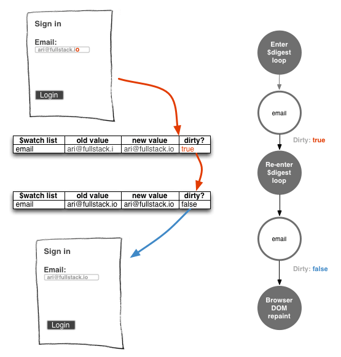

Я уже создавал [упрощенную модель внедрения зависимостей AngularJS](https://stepansuvorov.com/blog/2014/03/%D0%B2%D1%8B%D0%B4%D0%B8%D1%80%D0%B0%D0%B5%D0%BC-%D0%BB%D0%BE%D0%B3%D0%B8%D0%BA%D1%83-di-%D0%B8%D0%B7-angularjs/), теперь решил тоже проделать с циклом дайджета.

Именно всемогущий дайджет и решает работу всех вотчеров, а так как двойное связывание строится на вотчерах, то он вообще все решает.

Место действия `$rootScope`, а еще точнее -  `Scope.prototype`. Именно там определяется метод `$digest`.

## Постановка задачи

Попробуем сформулировать условие задачи: нам необходимо реализовать такой метод `digest`, который проверит все наблюдаемые переменные и, если значение было изменено, вызовет колбэк.

Дополнительно нам нужно договориться как мы будем определять/задавать этим самые наблюдаемые переменные. Допустим мы сделаем это тоже через метод `watch`, как это делает **AngularJS**.

Итого имеем:

```javascript 
  var rootScope = function () {}; rootScope.prototype = { watch: function (watchExp, listener) {}, digest: function () {} }  
 ```

(я специально не использую $ перед `rootScope`, `watch` и `digest`, чтобы как-то разделить реализации AngularJS и мою)

Ну и соотвественно вариант использования подразумевает быть таким:

```javascript 
  var scope = new rootScope(); scope.x = 5; scope.watch('x', function(newValue, oldValue){ alert('changed:' + oldValue + '->' + newValue) }); scope.x = 10; scope.digest();  
 ```

этот код должен вывести алерт со значениями.

## Реализация

Займемся методом `watch`. У него четкое назначение - создавать "вотчеры" - то есть объекты, которые будут в себе хранить информацию о наблюдаемом объекте.

Чтобы хранить где-то эти вотчеры создадим специальное свойство-массив у объекта `rootScope`:

```javascript 
  var rootScope = function () { this.watchers = []; };  
 ```

Теперь при каждом вызове метода `watch` можем записывать новый объект в этот массив:

```javascript 
  ... watch: function (watchExp, listener) { var watcher = { watchExp : watchExp, listener : listener || function() {}, lastValue: this[watchExp], }; this.watchers.push(watcher); }, ...  
 ```

C методом `watch` разобрались, теперь перейдем к методу `digest`. По идее этот метод должен пробегать по всем вотчерам и смотреть не изменились ли они. А если изменились - вызывать их обработчики:

```javascript 
  digest: function () { var scope = this; this.watchers.forEach(function(watcher){ if(watcher.lastValue !== scope[watcher.watchExp]){ watcher.listener.call(scope, scope[watcher.watchExp], watcher.lastValue); } }); }  
 ```

и еще, в случае когда значение обновилось, нам нужно сохранить новое значение:

```javascript 
  digest: function () { var scope = this; this.watchers.forEach(function(watcher){ if(watcher.lastValue !== scope[watcher.watchExp]){ watcher.listener.call(scope, scope[watcher.watchExp], watcher.lastValue); watcher.lastValue = scope[watcher.watchExp]; } }); }  
 ```

Как будто бы все. Но нет - мы забыли еще добавить механизм "грязной проверки", которая позволяет убедиться в том, что мы "ни о ком не забыли". Уточнение: при выполнении обработчиков вотчеров мы могли изменить значения других наблюдаемых объектов, то есть снова их сделали "грязными".

Чтобы это учесть введем специальную переменную - индикатор статуса `dirty`:

```javascript 
  digest: function () { var scope = this, dirty = false; this.watchers.forEach(function(watcher){ if(watcher.lastValue !== scope[watcher.watchExp]){ watcher.listener.call(scope, scope[watcher.watchExp], watcher.lastValue); watcher.lastValue = scope[watcher.watchExp]; dirty = true; } }); return dirty; }  
 ```

теперь завернем всю нашу логику в метод `digestOnce` и будем выполнять его до тех пор, пока не "почистим" все вотчеры:

[javascript] digest: function () { var dirty; do { dirty = digestOnce(this); } while (dirty);

function digestOnce(scope) { var dirty = false; scope.watchers.forEach(function (watcher) { if (watcher.lastValue !== scope[watcher.watchExp]) { watcher.listener.call(scope, scope[watcher.watchExp], watcher.lastValue); watcher.lastValue = scope[watcher.watchExp]; dirty = true; } }); return dirty; } } [/javascript]

Ну вот и все: упрощенная модель дайджеста готова. С кодом можно поиграться [тут](https://jsfiddle.net/STEVER/y1hgjjt4/ "jsfiddle").

## Бонус

Во избежание зацикливания дайджеста( например: в случае циклических зависимостей) мы можем ограничить количество проходов c помощью специальной переменной. В **AngularJS** эту переменную назвали `TTL` (вероятно от аббревиатуры "time to live"):

```javascript 
  digest: function () { var dirty, ttl = 10; do { dirty = digestOnce(this); if (dirty && !(ttl--)) { throw "10 digest iterations reached"; } } while (dirty); ...  
 ```

Также в **AngularJS** есть возможность снятия вотчера путем выполнения функции возвращаемой из метода `$watch`. Реализуем эту функциональность сохранив синтаксис AngularJS. Для этого нам нужно удалить наш вотчер из массива вотчеров:

```javascript 
  watch: function (watchExp, listener) { var watcher = { watchExp: watchExp, listener: listener, lastValue: this[watchExp], }, scope = this; this.watchers.push(watcher); return function unwatch(){ scope.watchers.splice(scope.watchers.indexOf(watcher), 1); }; }  
 ```

Ну и еще раз [весь код](https://jsfiddle.net/STEVER/xub4ge4z/ "jsfiddle.net").

## P.S.

Крайне рекомендую поковыряться в исходниках **AngularJS**, вот [тут](https://github.com/angular/angular.js/blob/master/src/ng/rootScope.js#L363 "rootScope.js#L721"). Я вот внезапно обнаружил, что у **$watch** есть еще 4-тый недокументированный параметр prettyPrintExpression.
