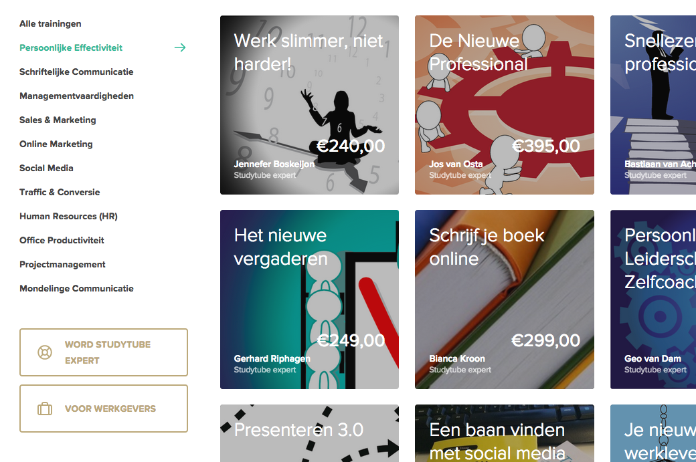

 Вдохновленный примером анимации от [яйцеголового](https://egghead.io/ "https://egghead.io/") решил реализовать такой же подход у себя на проекте, а именно: при навигации по разным вью делать не "дерганую" резкую подгрузку, а плавную. Пишем простую анимацию на **css-transitions** и пользуемся **angular-animate**.

Для начала убедимся что **angular-animate** модуль подключен к проекту:

1. подключен сам файл **angular-animate.js**
2. мы заинжектили **ngAnimate** модуль в наш проект

Теперь можем написать нашу анимацию:

\[css\] \[ui-view\].ng-enter, \[ui-view\].ng-leave { left: 0; right: 0; -webkit-transition:all .5s ease-in-out; transition:all .5s ease-in-out; }

\[ui-view\].ng-enter { opacity: 0; }

\[ui-view\].ng-enter-active { opacity: 1; }

\[ui-view\].ng-leave { opacity: 1; }

\[ui-view\].ng-leave-active { opacity: 0; } \[/css\]

И все, наслаждаемся анимацией при переходе.  Это работает с **ui-router**, с **ngRoute** вероятно тоже будет работать, если подправить селекторы.

[Вот тут](https://www.studytube.nl/instructors/categories/15/persoonlijke-effectiviteit "https://www.studytube.nl/instructors/categories/15/persoonlijke-effectiviteit") можно посмотреть живой пример. При выборе категории будет анимирована подгрузка контента.
