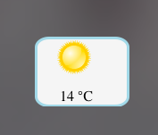

На самом деле создать виджет для маковского дашборда дело 5 минут. Не знаю зачем все так запутали в мануалах и статьях.

Всего навсего нужно создать директорию, в которой сделать **html страничку** и манифест файл - **Info.plist** и файл **Default.png** - картинка, которая будте показываться, пока виджет не инициализирован. После чего переименовать эту директорию в \*.wdgt. Все. Советы по обходу граблей под катом.

Подсказки:

- файл **Default.png** должжен быть обязательно - без него виджет не будет валидным
- внимательно просмотрите [описание полей](https://developer.apple.com/library/mac/documentation/AppleApplications/Conceptual/Dashboard_ProgTopics/Articles/WidgetBasics.html#//apple_ref/doc/uid/TP40008117-SW15 "developer.apple.com") и возможных значений для info.plist
- если вы хотите работать с сетью, обязательно должен стоять специальный ключ разрешающий работу с сетью:
    
    [xml] <key>AllowNetworkAccess</key> <true/> [/xml]
    
- очень часто возникают странные проблемы с кешированием: и даже установив новую версию виджета вы видите, что ничего не обновилось. Я решал это путем переименования файлов/названия самого виджета/версии виджета
- иконку для виджета можно задать поместив в папку файл icon.png
- с дебагом все совсем печально: никакой консоли нет. в сети советуют тупо создать текстовое поле в виджете и туда логировать в случае необходимости информацию, типа:
    
    [javascript] document.getElementById('debug').textContent = 'something that you want to log'; [/javascript]
    

## Пример

Как примера я взял разработку погодного виджета, пожалуй одного из самых популярных. Данные беру с [openweathermap](https://openweathermap.org/ "https://openweathermap.org/").

Для удобства создал **grunt** конфигурацию, которая сама копирует файлы и переименовывает папку в файл с расширением **\*.wdgt**.

Код примера [тут](https://github.com/stevermeister/myweather.wdgt "github.com").

В моем виджете всегда светит солнышко. _It's not a bug, it's feature_.
