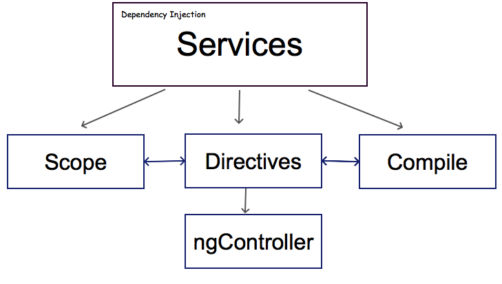
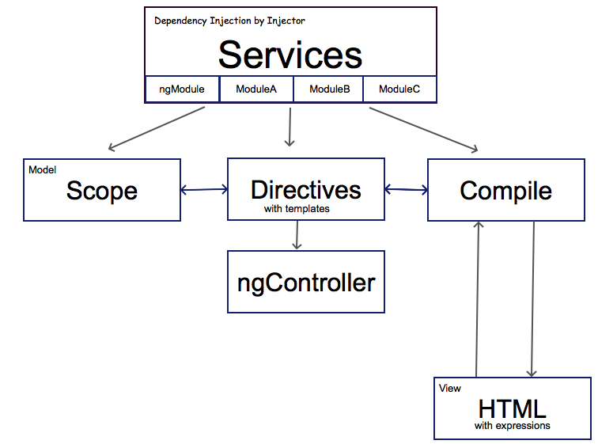
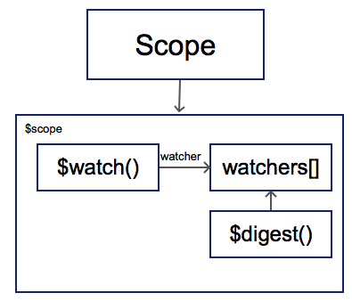
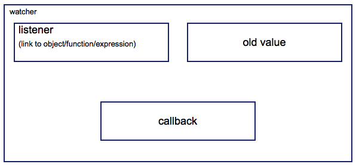
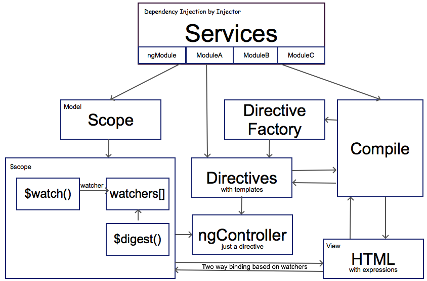

2 years ago you [Sergey](https://www.ilinsky.com/ "https://www.ilinsky.com/") asked me to create **AngularJs Concept Diagram**, and finally I have enough knowledge and time to do this task. Better late than never.

After many hours of going back and forth in source code of AngularJS I think I came to understanding all the concepts of framework and their interactions. So the simplified diagram is not complex at all:

All based on [Dependency Injection](https://en.wikipedia.org/wiki/Dependency_injection "wiki")(DI) approach and the instances of DI are AngularJS Services. The main 3 of them: **Scope**, **Directive**, **Compile**. **Compile** is a service, it's obvious. Yes, **Scope** [is also service](https://github.com/angular/angular.js/blob/master/src/ng/rootScope.js#L70 "github"). **Directive** constructor itself is just method of **Compile** service(that is linked to **yourModule.directive**), but when you create new directive instance it will be [still a service](https://github.com/angular/angular.js/blob/master/src/ng/compile.js#L829 "github"), just with specific suffix. And **controller** (which is **ngController**) is [just a directive](https://github.com/angular/angular.js/blob/master/src/ng/directive/ngController.js#L229 "github.com"), one from the set that AngularJS provided from the box.

Lets have a look on concepts list from [official tutorial](https://docs.angularjs.org/guide/concepts):

Concept

Description

[Template](https://docs.angularjs.org/guide/concepts#template)

HTML with additional markup

[Directives](https://docs.angularjs.org/guide/concepts#directive)

extend HTML with custom attributes and elements

[Model](https://docs.angularjs.org/guide/concepts#model)

the data shown to the user in the view and with which the user interacts

[Scope](https://docs.angularjs.org/guide/concepts#scope)

context where the model is stored so that controllers, directives and expressions can access it

[Expressions](https://docs.angularjs.org/guide/concepts#expression)

access variables and functions from the scope

[Compiler](https://docs.angularjs.org/guide/concepts#compiler)

parses the template and instantiates directives and expressions

[Filter](https://docs.angularjs.org/guide/concepts#filter)

formats the value of an expression for display to the user

[View](https://docs.angularjs.org/guide/concepts#view)

what the user sees (the DOM)

[Data Binding](https://docs.angularjs.org/guide/concepts#databinding)

sync data between the model and the view

[Controller](https://docs.angularjs.org/guide/concepts#controller)

the business logic behind views

[Dependency Injection](https://docs.angularjs.org/guide/concepts#di)

Creates and wires objects and functions

[Injector](https://docs.angularjs.org/guide/concepts#injector)

dependency injection container

[Module](https://docs.angularjs.org/guide/concepts#module)

a container for the different parts of an app including controllers, services, filters, directives which configures the Injector

[Service](https://docs.angularjs.org/guide/concepts#service)

reusable business logic independent of views

We already have **DI**, **Compiler**, **Directives**, **Scope**, **Service**. Let's extend our diagram little bit:

Here I specify that **DI** concept is made by **Injector** entity. Services are grouped in **modules**. Base module of Angular is **[ng](https://github.com/angular/angular.js/tree/master/src/ng "github")**, where you could find all the "native" services and directives(I call it ngModule on diagram to make more clear). Examples of another modules provided by AngularJS are ngRoute, ngAnimate, ngSanitize, ngCookies and others.

I marked out that **Scope** is kind of **Model** in AngularJS.

**View** is presented like extended **HTML**(extended by expressions and directives). Html is analysed and compiled back with **Scope** data by **Compile** service: [starting from the app root element](https://github.com/angular/angular.js/blob/master/src/Angular.js#L1515 "github") recursively to each nested directive. Directives can use **Templates** which are also in extended HTML format.

I think that the concepts like **digest** and **watchers** are unfairly skipped in the main list. Let's look at Scope concept in detail:

Each **Scope** instance (**$scope** on diagram) has array of **watchers**, **$watch()** method to add new watcher and **$digest()** method to control the watchers.

We have array of watchers, but what is watcher itself?

Watcher is just an object with 3 basic properties:

- listener - observable entity (could be object property, expression(string) or function)
- old value - stored value to compare with new one
- callback - function to call in case if output of listener and old value do not match

So **watcher** is just an object with special properties. All operations over watchers are executed by **$digest** method. It goes threw all the watchers, compare values: stored and listener actual and execute callbacks if the values are not equal.

And now we come back to general diagram:

I've added last concept from the list - **Data Binding**. It's made on watchers. Each view binding with a scope - it's just one more watcher to the watchers list of this scope(or two watchers in case of **Two Way Binding**). When some of scope properties have been changed it will make corresponding watchers "_dirty_" - it means that listener value and old value are not equal now. And with new **digest cycle** ($digest method call) dirty watchers will be updated(and their callbacks will be executed). Digest cycle will last till all the watchers are clean. That why it has well known name "dirty checking".

I tried to put all the concepts with their dependencies on diagram and keep it as clear as possible. Hope it will be helpful for you.
