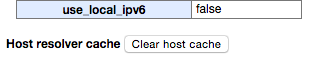

Found something new for myself when followed by [chrome://net-internals](chrome://net-internals).

To clean-up **DNS** cache you should just select DNS from dropdown and after click the button "Clear host cache":

