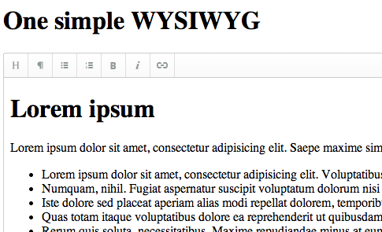

We've just updated our **WYSIWYG AngularJS Editor** by removing iframe from it, so [**ngWig**](http://stevermeister.github.io/ngWig/ "http://stevermeister.github.io/ngWig/") became even more light-weight. Welcome to use, test and contribute!
