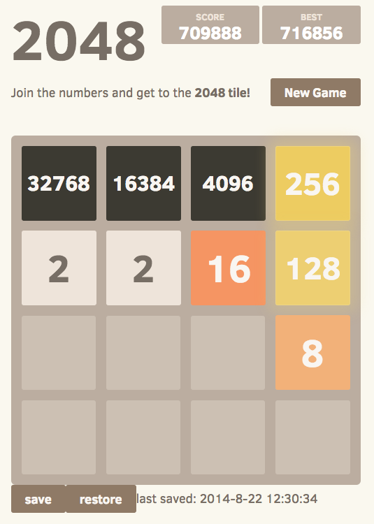

When I just started playing [2048](http://gabrielecirulli.github.io/2048/) I got 2048 number in several days and in a few days more I was able to reach this number in half an hour so the game became quite boring for me, because each time when you fail on bigger numbers you should begin from the very first stage. So why not to have possibility to save the result? Even it's not provided by authors of the game it should be not difficult to create such plugin, because everything is stored in localStorage, and, of course, it should already be a lot of different solutions. I found this userscript - [2048 save game](https://greasyfork.org/en/scripts/3189-2048-save-game/code). And now we can play for bigger numbers and think about more effective algorithm.

And our goal now not just reach some number, but to reach the maximum possible number! ;)
