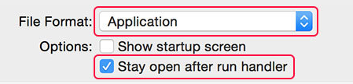

Оказывается Objective-C теперь можно писать на JavaScript, точнее обращаться к его свойствам. Вот [тут](http://habrahabr.ru/post/239635/) на хабре разбирается пример как это делать. Если лень читать все - под катом я делаю выжимку из статьи.

Все что там нужно сделать:

- открыть на маке "**Script Editor**" (это программа в которой мы пишем наше приложение)
- переключиться на язык **JavaScript** (по умолчанию там **AppleScript**)
- скопировать код [отсюда](https://gist.github.com/stevermeister/3a5bba129eceb8ea3f18#file-obect-c-javascript-js) (я его еще больше упростил чем было изначально на хабре)
- сохранить. **!важно**: при сохраненнии выбрать вариакт "сохранить как приложение" и поставить галочку:

То есть `$.` это и есть обращение к Objective-C свойствам.

Вот и все. Теперь можем запускать наше приложение. Функциональности там никакой нет, только окно с текстовым полем. Чтобы там что-то появилось запаситесь фантазией и [мануалом](https://developer.apple.com/library/mac/documentation/Cocoa/Conceptual/WinPanel/Tasks/SettingWindowAppearance.html).
