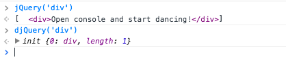
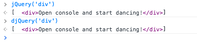

В продолжение рубрики "Пишем jQuery c нуля" хотел бы рассказать о внутреннем поисковом движке, той ключевой функциональности, которая и дала название "jQuery" (Javascript **query**). Плюс рассмотрим момент инициализации/создания jQuery объекта.

Все разработчики, которые хоть раз использовали **jQuery**, знают, что если написать:

\[javascript\] $('div.myclass') \[/javascript\]

нам вернуться все элементы попадающие под этот селектор. Но вот, что происходит внутри и как jQuery обрабатывает эти селекторы и выдает результаты, знает не каждый.

Поисковый движок получил имя **Sizzle** и в последствии был выделен в [отдельную библиотеку](https://sizzlejs.com/ "https://sizzlejs.com/"), которую [включает в себя](https://github.com/jquery/jquery/blob/master/src/selector-sizzle.js#L6 "github.com") **jQuery**.

С появлением в браузерах методов для поиска элементов по селекторам - [querySelector](https://developer.mozilla.org/ru/docs/Web/API/Document/querySelector "developer.mozilla.org"), [querySelectorAll](https://developer.mozilla.org/ru/docs/Web/API/Document/querySelectorAll "developer.mozilla.org") острая необходимость в Sizzle пропадает. Мы его можем использовать только для старых браузеров и использовании [расширенных поисковых фильтров](https://api.jquery.com/category/selectors/ "api.jquery.com").

Итого как себя ведет jQuery получив строку-селектор параметром:

1. анализ [регулярным выражением](https://github.com/jquery/jquery/blob/master/src/core/init.js#L16 "github.com")
2. если это **id** - то получаем элемент с помощь **document.getElementById**
3. если есть возможность, используем **querySelectorAll**
4. если нет возможности использовать querySelectorAll - используем **Sizzle**

В своей djQuery я не планирую поддерживать старые браузеры, а фильтры может добавлю потом, поэтому воссоздавать полную функциональность Sizzle не вижу смыла.

Выделю только ключевые моменты:

-  если Sizzle обнаруживает #id селектор внутри строки, то он игнорирует остальное, то есть:

\[javascript\] $('div.myclass#myelem') \[/javascript\]

и

\[javascript\] $('#myelem') \[/javascript\]

будут восприняты одинаково

- разбор селектора идет с права на лево, это важно если вы занимаетесь низко уровневой оптимизацией и есть возможность задать более четкое условие справа.
- опять таки, кто стремиться к высокой производительности, тому лучше не увлекаться кастомными фильтрами поиска, которые не дают использовать querySelector даже на современных браузерах

Так ну а теперь немного кода, чтобы дополнить наш djQuery проект.

Как мы и договорились поддерживать старые браузеры не будем, поэтому ограничимся использованием querySelector:

\[javascript\] var result = document.querySelectorAll(selector); \[/javascript\]

Но просто результат мы не можем вернуть, так как помним, что jQuery возвращает свой экземпляр, поэтому:

\[javascript\] return this; \[/javascript\]

ну и предварительно наполним этот объект результатами:

\[javascript\] for (var i = 0; i < results.length; i++) { this\[i\] = results\[i\]; } this.length = i; \[/javascript\]

все бы хорошо, но правильно работать будет только, если мы сделаем new, то есть вызов:

\[javascript\] new djQuery('div') \[/javascript\]

это не совсем то, чего мы хотели. Как создать контекст уже внутри конструктора?

Хочется сделать как-то так:

\[javascript\] var djQuery = function(selector, context) { return new djQuery(selector, context); }; \[/javascript\]

Только, понятное дело, внутренняя функция не может дублировать внешнюю. Поэтому сделаем метод `init`, в который перенесем внутренности djQuery инициализации:

\[javascript\] var djQuery = function(selector, context) { return new init(selector, context) };

init = function( selector ) { var results = document.querySelectorAll(selector); for (var i = 0; i < results.length; i++) { this\[i\] = results\[i\]; }

this.length = i; }; \[/javascript\]

А для того, чтобы все методы прототипа djQuery были доступны из объектов созданных с помощью init конструктора свяжем их прототипы:

\[javascript\] init.prototype = djQuery.prototype; \[/javascript\]

Ну вот теперь можем выполнить:

\[javascript\] djQuery('div') \[/javascript\]

И получить ожидаемый список объектов.

Но если мы сравним в консоли результаты функций (нашей и jQuery), то можем заметить следующее:

Почему-то jQuery выводит результаты в виде массива, а наша djQuery возвращает объект. Оказывается, чтобы объект воспринимался как массив в нем должны присутствовать следующие метод `splice`. Ну что ж, добавим их в прототип вместе с `push` и `sort`:

\[javascript\] djQuery.prototype = { length: 0, push: \[\].push, sort: \[\].sort, splice: \[\].splice }; \[/javascript\]

И... Ура! мы добились того, чего хотели:

Еще добавим небольшую проверочку для случая, когда селектор не был передан:

\[javascript\] if(!selector){ return this; } \[/javascript\]

Текущая версия кода в теге [step-2](https://github.com/stevermeister/djQuery/tree/step-2).
