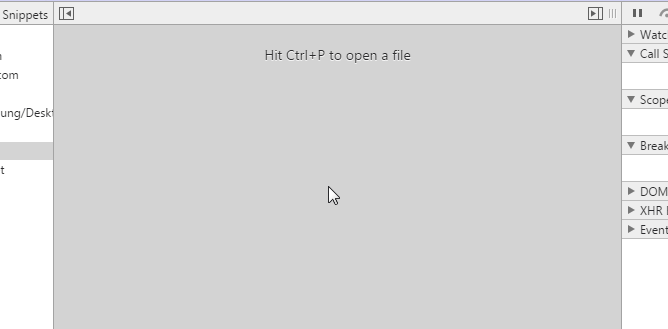
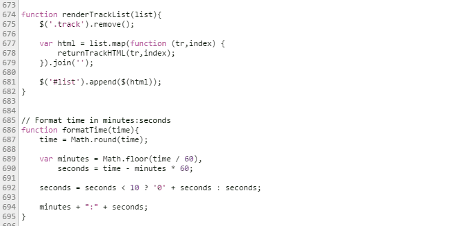

- Быстрое переключение между файлами
- Поддержка мультикурсора
- Pretty Print

## Быстрое переключение между файлами

Такая функция есть в большинстве современных редакторов, теперь она и в Chrome - вызывается по нажатию **Ctrl + P** (**Cmd + P** для Mac):

так же позволяет переходить по строкам в файле, если набрать :номер_строки

## Поддержка мультикурсора

Воспользоваться мультикурсором можно используя **Ctrl** (**Cmd** для Mac)

## Pretty Print

Добавлена функция автоматического форматирования кода Pretty Print.

Пост был составлен на основе вот [этой статьи](https://tutorialzine.com/2015/03/15-must-know-chrome-devtools-tips-tricks/), от туда же взяты и иллюстрации.
