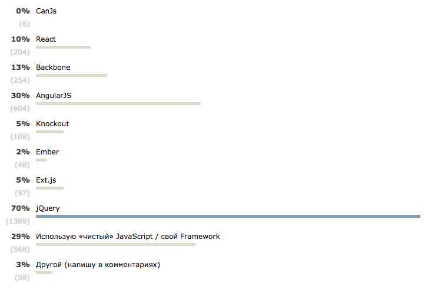

Провел [на хабре фреймворк опрос](https://habrahabr.ru/post/257825/), на который откликнулось около 2к человек и получил такие результаты:

Сразу прошу простить за такое безграмотное составление. Да вы правы, все, кто писал в комментариях, что **jQuery** - это не фреймворк (как и **React**, **Can.js**, **Backbone**). Так же было очень опрометчиво не включить **Closure**, **Polymer**, **Aurelia**, **Durandal** и **Marionette**(отдельно от **Backbone**).

И тем не менее результаты довольно интересные:

- **AngularJS** возглавляет гонку (если не считать **jQuery**)
- **React** довольно быстро набирает обороты
- **Ember** не набрал и 5% - для меня это стало сюрпризом
- **Ext.js** - медленно умирает цепляясь за энтерпразы
- И по прежнему большой процент разработчиков не использует фреймворки вообще
