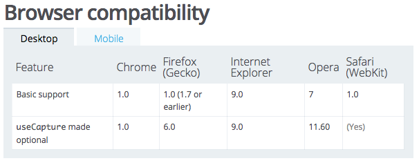

В продолжение серии постов "Пишем jQuery c нуля". Решил осветить тему события загрузки дома(**DOMContentLoaded**) и регистрацию колбэков по этому событию через jQuery.

Как мы знаем: в jQuery есть вспомогательный метод **$.ready()**, который принимает параметром функцию и вызывает ее по событию **DOMContentLoaded**. Попробуем воссоздать у себя в djQuery такой же метод.

Должно быт как-то так:

```javascript 
  var callbacks = []; djQuery.ready = function(callback) { callbacks.push(callback); }  
 ```

Теперь сделаем, чтобы колбэки выполнились по событию загрузки DOM:

```javascript 
  document.addEventListener( "DOMContentLoaded", function() { callbacks.forEach(function(callback) { callback.apply(); }); });  
 ```

Вынесем функцию отдельно(как это сделано в jQuery) и назовем ее `completed`:

```javascript 
  function completed() { callbacks.forEach(function(callback) { callback.apply(); }); } document.addEventListener( "DOMContentLoaded", completed );  
 ```

И еще хорошо бы отписаться от события, когда мы его получим:

```javascript 
  function completed() { document.removeEventListener( "DOMContentLoaded", completed); callbacks.forEach(function(callback) { callback.apply(); }); } document.addEventListener( "DOMContentLoaded", completed );  
 ```

Для старых браузеров jQuery проделывает еще 2 вещи:

Ставит 3тий параметр false (useCapture - опция, которая и так выключена для новых версий браузеров):

```javascript 
  document.addEventListener( "DOMContentLoaded", completed, true);  
 ```

и дополнительно слушает еще одно событие:

```javascript 
  window.addEventListener( "load", completed, false );  
 ```

Мы этого всего для нашего djQuery делать не будем, так как



Плюс нам еще осталось добавить короткую форму записи для `$.ready(callback)`, которая представляет из себя:

```javascript 
  $(callback);  
 ```

То есть, если мы передадим в jQuery функции как параметр, она будет записана в  `$.ready` колбэки и выполнится по событию загрузки DOM:

```javascript 
  if(typeof selector === 'function'){ djQuery.ready(selector); return this; }  
 ```

Теперь для проверки отдельно от нашей библиотеки пишем:

```javascript 
  djQuery(function(){ console.log('DOMContentLoaded'); });  
 ```

или просто:

```javascript 
  $(function(){ console.log('DOMContentLoaded'); });  
 ```

Код можно взять в теге [step-3](https://github.com/stevermeister/djQuery/tree/step-3).
