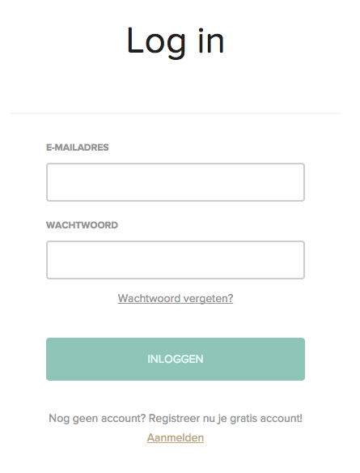
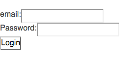
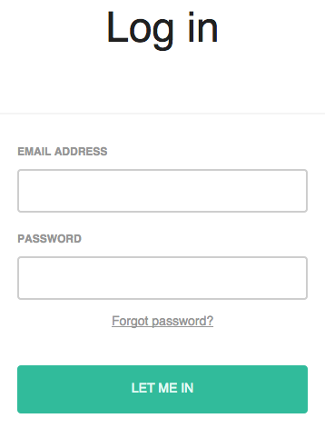

Стыдно признаться, но на момент написания этого поста, я так и не разобрался с [React.js](https://facebook.github.io/react/), поэтому добро пожаловать всем начинающим реактовцам.

Я просто прокомментирую свои действия, возможно они кому-то сэкономят время разбора на старте и поиска необходимых ресурсов.

Ну что ж... зайдем, конечно, на официальный сайт в раздел "[Getting Started](https://facebook.github.io/react/docs/getting-started.html)". Сразу же есть примеры на фидлере - это хорошо. Посмотрим на [первый](https://jsfiddle.net/reactjs/69z2wepo/). OMG! Что это за хрень?!

\[javascript\] return 
Hello {this.props.name}
; \[/javascript\]

Для тех, кто привык к "обычному" JavaScript такая форма записи покажется более чем странной. Благо дается [второй](https://jsfiddle.net/reactjs/5vjqabv3/) пример, где сделано все тоже, только без черной магии.

Пока мы все еще в шоке от этого синтаксиса, предлагаю посмотреть 18 минут примера работы с React.js:

https://www.youtube.com/watch?v=L-3kegPlQ\_c#t=18

Попробуем по шагам пройти [стартер кит](https://facebook.github.io/react/docs/getting-started.html#starter-kit).

Вроде бы основная идея понятна: для черной магии используем атрибут

script type="text/jsx"

и библиотеку, которая будет это парсить:

Переходим к [туториалу](https://facebook.github.io/react/docs/tutorial.html). Вам понадобится сервер, потому хорошо бы сразу скачать себе [server.js](https://github.com/reactjs/react-tutorial/blob/master/server.js) и положить в корень, после чего выполнить команды:

\[shell\] $ npm install express body-parser $ node server.js \[/shell\]

Что почерпнул из туториала:

- **componentDidMount** - запускается по умолчанию после того как компонент примонтирован к DOM
- **ref="author"  - this.refs.author** - связь по ref-аттрибуту
- **onSubmit={this.handleSubmit}** - Реакт работает с "кэмлКейсом" при определении обработчика события

Я надеюсь у всех завелась эта простая формочка со списком комментариев. Если нет - пишите что не работает в комментариях - я с радостью помогу разобраться.

Далее следуем к разделу "[Думаем Реакт сущностями](https://facebook.github.io/react/docs/thinking-in-react.html)" (Thinking in React).

Резюмируя: разрабатывая приложение на React.js должны действовать в следующеем направлении:

- разбить UI на компоненты
- реализовать эти компоненты статически
- определить минимальный набор стейтов
- определить где должны находится данные каждого стейта
- добавить данные

Далее оф сайт предлагает посмотреть видео докладов с конференций. Можете пропустить этот шаг - сэкономите Х часов. Полезной информации для начала работы там практически нет. (_Ну так для позитива можно конечно глянуть [видео](https://www.youtube.com/watch?v=YJNUK0EA_Jo) презентации Александра Соловьева_)

Вместо этого я рекомендую посмотреть серию видео лекций [React Fundamentals](https://egghead.io/series/react-fundamentals) на сайте яйцеголового.

...

Ok, думаю пришло время открыть редактор и что-то написать. Я взял пример из жизни - разработку приложения авторизации для нашего продукта. Так как [наш продукт](https://www.studytube.com/) состоит из набора отдельных приложений, а каждое приложение требует авторизации, то здорово было бы вынести эту функциональность в отдельное приложение.

Возьмем заготовку из туториала:

\[html\] <html> <head> <title>Login Form</title>    </head> <body> 

  </body> </html> \[/html\]

Теперь посмотрим какие компоненты у нас есть:

Пока что явно вырисовывается только один компонент - форма логина. Ок добавим для нее Реакт-класс и создадим статический элемент:

\[javascript\] var LoginForm = React.createClass({ render: function() { return ( <form className="loginForm">  email:<input type="text" name="email" ref="email"/>  Password:<input type="password" name="password" ref="password"/>  <input type="submit" value="Login"/> </form> ); } });

React.render(<LoginForm/>, document.getElementById('content')); \[/javascript\]

Не забываем про ref атрибут, чтобы потом можно было удобно получить доступ к данным.

Вот что у нас получилось:

пока не густо. Перенесем стили и маркап со старого приложения. Тут нужно не забыть, что в реакт-компонентах мы прописываем не class атрибут, а className. Плюс закрываем все теги, да, и input тоже, для JSX это важно. Получили статическую версию со стилями:

Теперь добавим первое действие - сабмит формы:

\[javascript\] <form className="form" onSubmit={this.handleSubmit}> \[/javascript\]

handleSubmit, как вы уже знаете из туториала, - наш хендлер сабмита, который будет отправлять данные:

\[javascript\] handleSubmit: function(e) { e.preventDefault();

var loginData = {}; loginData.email = React.findDOMNode(this.refs.email).value.trim(); loginData.password = React.findDOMNode(this.refs.password).value.trim(); loginData.academyId = 1;

$.post('http://localhost:3000/auth', loginData,function(result){ console.log(result); }); } \[/javascript\]

На сервере пока просто заглушка:

\[javascript\] app.post('/auth', function(req, res) { if(req.body.email === 'xxx' && req.body.password === 'xxx'){ var data = true; } else { data = false; } res.send(JSON.stringify(data)); }); \[/javascript\]

Время подумать о реакции UI на ответ сервера. Для начала разберем вариант не верных логина/пароля. Мы хотим подсветить поля формы красным и вывести сообщение.

Опишем наш стейт и определим в нем свойство отвечающее за правильность данных формы:

\[javascript\] getInitialState: function() { return { isValid: true }; }, \[/javascript\]

Теперь если запрос вернет ошибку:

\[javascript\] var self = this; $.post('http://localhost:3000/auth', loginData,function(result){ if(result !== 'true'){ //очень грубо сделано только для примера self.setState({isValid: false}); } }); \[/javascript\]

И пропишем в рендер-методе, что делать при разных значениях свойства стейта:

\[javascript\] var errorClass = this.state.isValid?'':'input--error'; \[/javascript\]

\[html\] <input type="text" className={"input input--full " + errorClass} name="email" ref="email"/> \[/html\]

И еще круто было бы не только менять класс, чтобы как-то выделить поле с ошибкой, но еще и выводить сообщение:

\[html\] Invalid email... \[/html\]

Сообщение об ошибке - это хороший кандидат, чтобы стать отдельным компонентом. Так и сделаем:

\[javascript\] var ErrorMessageInput = React.createClass({ render: function(){ return {this.props.text} } }); \[/javascript\]

и теперь в нашем основном элементе:

\[javascript\] {!this.state.isValid?<ErrorMessageInput text="Invalid email..."/>:null} \[/javascript\]

Сделаем так, чтобы при изменении поля ошибки сбрасывались. Для этого повесим обработчики на поля ввода:

\[html\] <input type="text" className={"input input--full " + errorClass} ref="email" onChange={this.handleChange}/> ... <input type="text" className={"input input--full " + errorClass} ref="password" onChange={this.handleChange}/> \[/html\]

и пропишем саму функцию обработчик:

\[javascript\] handleChange: function() { this.setState({ isValid: true }); }, \[/javascript\]

Что еще можно улучшить? Давайте сделаем кнопку логин не активной, когда не все поля введены. Для этого добавим в стейт наши поля:

\[javascript\] getInitialState: function() { return { email: '', password: '', isValid: true }; }, \[/javascript\]

и теперь при изменении поля мы должны обновить стейт, добавим в наш handleChange метод:

\[javascript\] handleChange: function() { this.setState( { isValid: true, email: React.findDOMNode(this.refs.email).value, password: React.findDOMNode(this.refs.password).value }); }, \[/javascript\]

и добавить атрибут, который будет рендериться по условию:

\[html\] <button disabled={!this.state.email || !this.state.password}>Let me in</button> \[/html\]

Итоговый код компонента:

\[javascript\] var LoginForm = React.createClass({ getInitialState: function() { return { email: '', password: '', isValid: true }; }, handleChange: function() { this.setState( { isValid: true, email: React.findDOMNode(this.refs.email).value, password: React.findDOMNode(this.refs.password).value }); }, handleSubmit: function(e) { e.preventDefault();

//your code to communicate with server //... //just to test self.setState({ isValid: false }); }, render: function() { var errorClass = this.state.isValid ? '' : 'input--error';

return ( 
 
 
 
Log in
 
 
 
 <form className="form" onSubmit={this.handleSubmit}> 
 <label className="input-decorator"> <input type="text" className={"input input--full " + errorClass} value={this.state.email} name="email" ref="email" onChange={this.handleChange}/>

Email address
 {!this.state.isValid ? <ErrorMessageInput text="Invalid email..."/> : null} </label> 

 <label className="input-decorator"> <input type="password" className={"input input--full " + errorClass} value={this.state.password} name="password" ref="password" onChange={this.handleChange}/>

Password
 {!this.state.isValid ? <ErrorMessageInput text="... or password"/> : null} </label> 

 <a href="/restore-password" className="form\_\_action-secondary">Forgot password?</a> 

 <button className="button button--primary button--full" disabled={!this.state.email || !this.state.password || !this.state.isValid}>Let me in </button> 
 </form> 
 
 ); } }); \[/javascript\]

 

Что еще полезного почитать?

- Building robust web apps with React ([part1](https://maketea.co.uk/2014/03/05/building-robust-web-apps-with-react-part-1.html), [part2](https://maketea.co.uk/2014/04/07/building-robust-web-apps-with-react-part-2.html), [part3](https://maketea.co.uk/2014/05/22/building-robust-web-apps-with-react-part-3.html), [part4](https://maketea.co.uk/2014/06/30/building-robust-web-apps-with-react-part-4.html) )
- [React’s diff algorithm](https://calendar.perfplanet.com/2013/diff/) (и [перевод](https://habrahabr.ru/post/217295/) на хабре)
