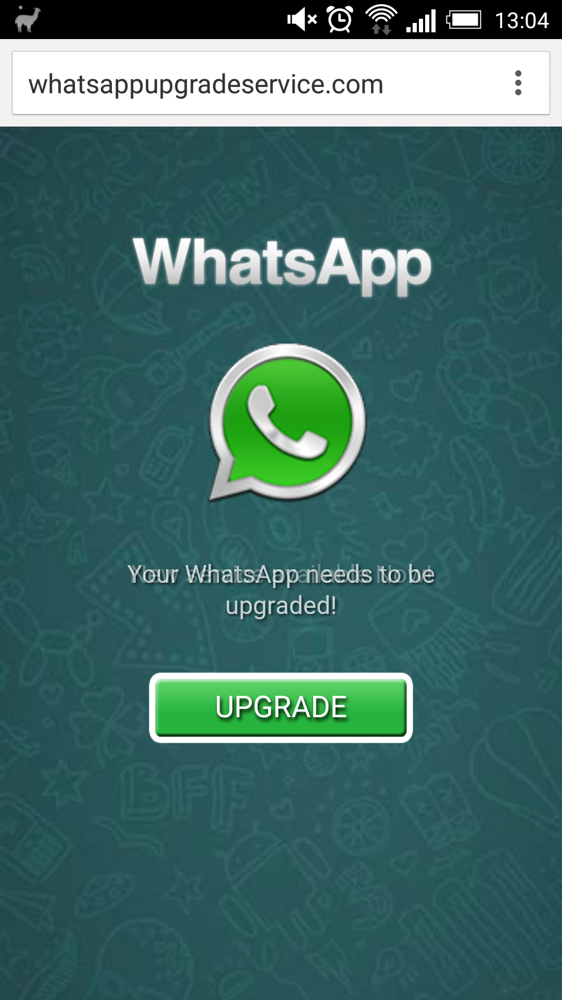
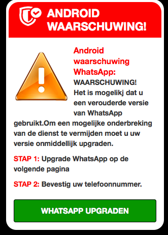
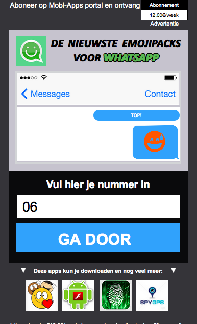

Something really weird is going with my **Android** phone: from time to time it opens me browser with [this](https://whatsappupgradeservice.com/customer.freeservice.386/fm9s2l/vio2b5sl.php?brd=HTC&mod=One%20M7&brw=Chrome%20Mobile&ts=tfx03&var1=7d312a26-b1b4-4509&var2=5535aff562729e420e8ceeb6&var3=&cs=9ku3&voluumdata=vid..00000003-3d0b-4b7d-8000-000000000000__vpid..9755b000-125a-11e5-870e-3422459de878__caid..36e10a12-38aa-4efc-af99-15dccbccefe5__rt..R__lid..9b7d3f32-ec7e-4423-bb87-b66cf87e1f52__oid1..b4f877ce-18af-45b0-ad44-5c07aae38467__oid2..46469e09-fd14-49d1-b60f-a1fac563a8a3__var1..7d312a26-b1b4-4509__var2..5535aff562729e420e8ceeb6__rd..&imp_id=7d312a26-b1b4-4509&app_id=5535aff562729e420e8ceeb6) link. By domain **whatsappupgradeservice.com** I immediately realised that it's fake.

I checked the logic: after you click the button "Ok" it redirects you to page with even more interesting domain name - **update-1.com**. ([full link](https://www.update-1.com/page?cam=267&country=nl&pub=47&subid=13292873813&pubid=5707_1909_15357)) And I see this:

The page says that I should upgrade **Whatapp** application as soon as possible. And when you click green button it forward you to **mobl-apps.com**, where you see:

So as we see the final goal of these bastards is to subscribe you to a paid service (12 euro per week).

whois for this domain name of course does not provide any information:

Domain Name: MOBL-APPS.COM
Registrar: GODADDY.COM, LLC
Sponsoring Registrar IANA ID: 146
Whois Server: whois.godaddy.com
Referral URL: https://registrar.godaddy.com
Name Server: NS55.DOMAINCONTROL.COM
Name Server: NS56.DOMAINCONTROL.COM
Status: clientDeleteProhibited https://www.icann.org/epp#clientDeleteProhibited
Status: clientRenewProhibited https://www.icann.org/epp#clientRenewProhibited
Status: clientTransferProhibited https://www.icann.org/epp#clientTransferProhibited
Status: clientUpdateProhibited https://www.icann.org/epp#clientUpdateProhibited
Updated Date: 06-nov-2014
Creation Date: 06-nov-2014
Expiration Date: 06-nov-2015

Only when it was registered and where.

By IP - **31.3.102.91** - we could also get a hosting:

inetnum:        31.3.102.0 - 31.3.102.255
netname:        XLIS-VPS35
descr:          XL Internet Services Amsterdam Network
country:        NL
admin-c:        XLIS-RIPE
tech-c:         XLIS-RIPE
status:         ASSIGNED PA
mnt-by:         XLIS-NL-MNT
mnt-domains:    XLIS-NL-MNT
created:        2011-05-25T19:27:38Z
last-modified:  2011-05-25T19:27:38Z
source:         RIPE  Filtered

role:           XL Internet Services Hostmaster
address:        XL Internet Services BV
address:        Delftsestraat 5b
address:        3013AB Rotterdam
address:        The Netherlands
phone:          +31 10 270 94 70
fax-no:         +31 10 433 44 60
abuse-mailbox:  abuse@xl-is.net
nic-hdl:        XLIS-RIPE
admin-c:        XLIS-RIPE
tech-c:         XLIS-RIPE
remarks:        ------------------------------------------------
remarks:        E-mail is the preferred contact method!
remarks:        ------------------------------------------------
remarks:        Please use one of the following addresses:
remarks:        abuse@xl-is.net   - for abuse notification
remarks:        support@xl-is.net - for technical questions
remarks:        info@xl-is.net    - for anything else
remarks:        ------------------------------------------------
mnt-by:         XLIS-NL-MNT
created:        2007-01-11T12:57:00Z
last-modified:  2011-01-03T17:26:11Z
source:         RIPE  Filtered

% Information related to '31.3.96.0/21AS35470'

route:          31.3.96.0/21
descr:          XL Network
origin:         AS35470
mnt-by:         XLIS-NL-MNT
created:        2011-04-08T15:36:05Z
last-modified:  2011-04-08T15:36:05Z
source:         RIPE  Filtered

so it's Rotterdam. Probably it's good to call the hosting provider and ask WTF?!

The most weird thing that I did not install any new applications, moreover I removed almost all that I had and installed 3 different anti-virus applications and made scan - without any result.

Also I went to app manager "run" tab: no strange apps were there.

If you know the solution - please share, because I'm going to reinstall the whole operation system :(
