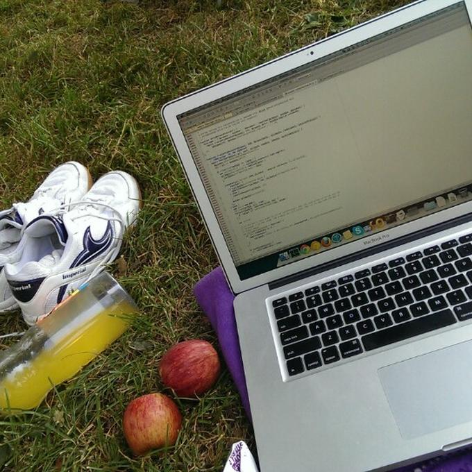

I've already made some notes about [ideal company](https://stepansuvorov.com/blog/2014/06/%D0%BA%D0%BE%D0%BC%D0%BF%D0%B0%D0%BD%D0%B8%D1%8F-%D0%BC%D0%BE%D0%B5%D0%B9-%D0%BC%D0%B5%D1%87%D1%82%D1%8B/)(ru), now after one year I decided to review the points and made new list.

## Location

- forest, mountains, nature
- eco area
- IT city

## Building/Infrastructure

- high building ... actually I wanna castle
- underground floors - data center
- middle level - offices
- penthouse -recreation area
- bicycle parking

## Design/Interior

- every element has something from company style
- each department has own style

## Working zone

- team/department oriented open space
- ergonomic furniture
- plants and flowers
- hardware is always(<0.5 year) the best you can find
- brain teasers place

## Recreation area

- ping-pong tables (each floor)
- horizontal/parallel bars(each floor)
- swimming pool (penthouse)
- billiard-tables
- gym (penthouse)

## Food & Drinks

- big restaurant (penthouse)
- buffet (each sector/floor)
- beverages and fruits

## Skill Up

- own pet projects
- cutting-edge technologies
- professional trainings and master classes

## Team Building

- business trips (conferences and collaboration with other studios)
- company events
- active team play game competitions

 

You are more than welcome to put comments here.
