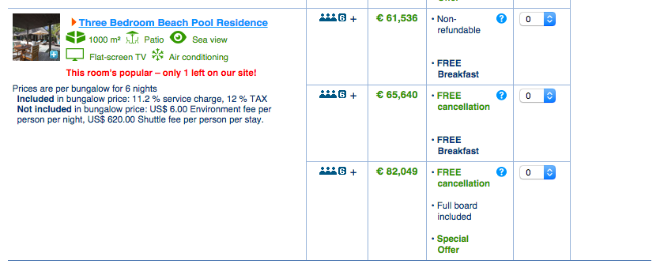
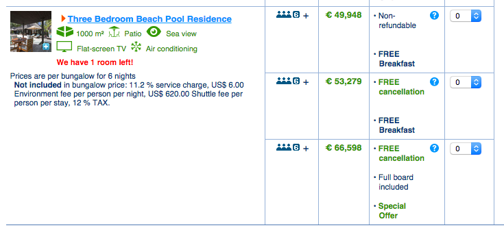

I really hope there is another cause of doing what I disclosed on booking.com, otherwise we can remove question mark from the title.

In this post I'm going to uncover booking.com price trick(?cheat/bug/feature) and explain you how to make price lower in several clicks.

This story beings with the dialogue with my girl-friend when we were discussing hotel options and sending links to each other. She is not an authorised user, but I am, with a "**genius**" title (it means that for some hotels I can get extra discount). Everything was going well till the moment when we found that I got higher prices. The funniest thing was that I saw an original price that was crossed out and a new lower price, but that lower price was still much higher than the price that my girl-friend had. Yes, you heard me correctly, higher prices even with **GENIUS** account!

I could not believe my eyes! So we checked several times all the options: the hotel, dates, number of nights. Everything was correct and the same.

I logged out. The prices became higher, that is correct. The question was still open: why my girl-friend saw lower prices?

I guessed that the reason could be browsing from different locations. I immediately decided to check it out and switch on the proxy.

I was really impressed by results: depending on location you get different prices. Yes, for budget hotels the difference is not so high, but let me show you an example with [luxury one](https://www.booking.com/hotel/mv/anantara-kihavah-villas-maldives.html?checkin=2015-11-09&checkout=2015-11-15). Scroll down to the "_Three Bedroom Beach Pool Residence_" and depending on location you'll see these prices:

or these prices:

Oh boy! The difference is almost **20k euros** after IP-address change!

I played around with different locations (proxy servers) and got such consistency:

- **US** - cheap
- **Europe**(Germany) - expensive
- **Eastern Europe** (Romania, Ukraine) - cheap
- **Hong Kong** - cheap

So how to get best prices if you are booking from Europe? Just switch your IP address to one from the "cheap" zone.

**P.S.:** it works not for all the hotels.

the nice post illustration was taken from fightingidentitycrimes.com
