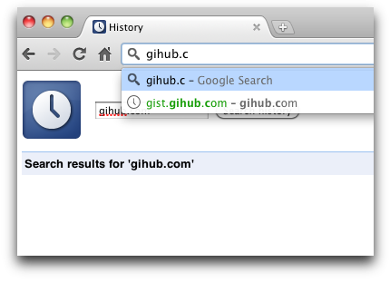

Sometimes misprint could lead to problems with your location bar autocomplete (it will suggest you wrong varian first). For example you accidentally visited `gist.gihub.com` (note the missing _t_), and now that URL auto completes each time you start typing `gist.…`.

It's really annoying.  How can we remove this URL? In case if we don't want to remove everything, just exact URL.

I found really nice answer [here](http://superuser.com/a/398800/473228). All you need - just select the URL and press **\[Shift\] + \[Delete\]**. (for Mac is **\[Fn\] + \[Shift\] + \[Delete\]**).
