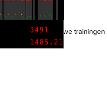

[ng-stats](https://github.com/kentcdodds/ng-stats) is nice utility from [Kent C. Dodds](https://github.com/kentcdodds) that allows you to see statistics for your page's angular digest/watches.

to install just put this code into your bookmarks:

[javascript] javascript: (function() {var a = document.createElement("script");a.src = "https://rawgithub.com/kentcdodds/ng-stats/master/dist/ng-stats.js";a.onload=function(){window.showAngularStats()};document.head.appendChild(a)})(); [/javascript]
