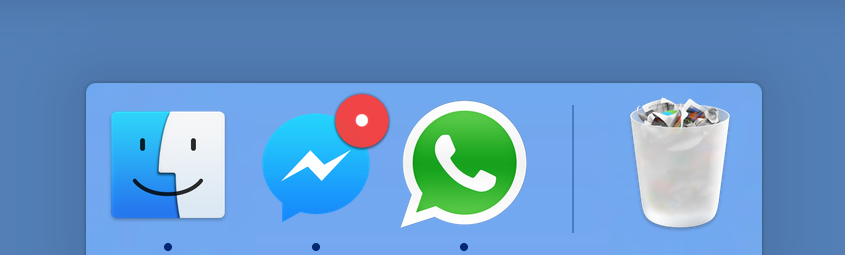

[**Nativefier**](https://github.com/jiahaog/nativefier) is a command line tool that allows you to easily create a desktop application for any web site with succinct and minimal configuration. Apps are wrapped by [Electron](http://electron.atom.io/) in an OS executable (`.app`, `.exe`, etc.) for use on Windows, OSX and Linux.

Just one command to run:

$ nativefier maps.google.com
