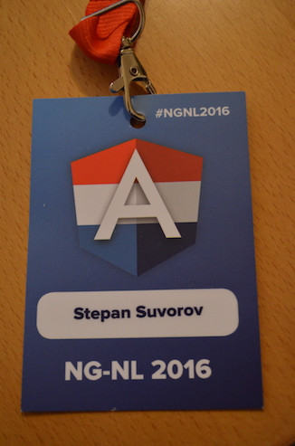
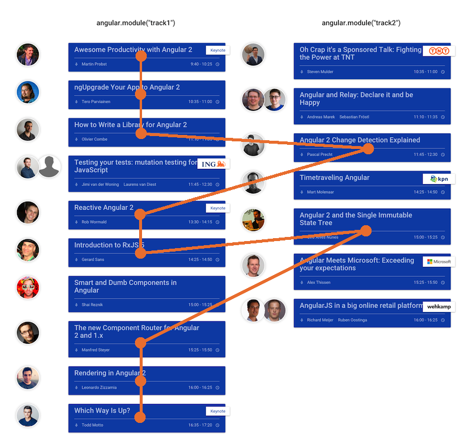

This year I also visited [NG-NL Conference in Amsterdam](http://www.ng-nl.org/ "http://www.ng-nl.org/") and to [keep the tradition](http://stepansuvorov.com/blog/2015/02/ng-nl-brief-review/) will share my notes/thoughts about it.

Basically the conference was dedicated to looking deep in **Angular2 parts** and **reactive programming** experiments.

All the topics were split into 2 tracks. You can find all the program details [here](http://ng-nl.org/#/#programme). My route was the following:

_Because keynote talks were not separated and columns were not sync in time you could get the illusion of time jump_.

## Awesome Productivity with Angular 2 ([video](https://www.youtube.com/watch?v=1RzYpIAn-3g))

[Martin Probst](https://twitter.com/martin_probst) started keynote with kind of excuse why we need to do step forward -"_frameworks have to move_" - that sounds really funny. Probably it was soft launch or preparation not to scary developers with new features.

After it was quick introduction of all new things in Angular2. New **template syntax** that gets rid of tons nested directives and uses explicit attribute binding, and you always know whether it is property, event or two-way binding:

- **\[property\]** - property binding
- **(event)** - event binding
- **\[(two-way)\]** - two-way biding (still confusing)

Some words about the **component concept** that will kill old directives, scopes, controllers. Exact announcement about **performance**: Angular2 is 4-times faster than Angular1.

Martin also said that team works not only on framework but also on the environment. To make dev tools unified and productive. So [angular-cli](https://github.com/angular/angular-cli).

And it was a part why we should use **TypeScript**:

- makes code more reliable
- much better doc generation
- allows autocompletion
- gives safer API changes
- fast API renaming

And, of course, the statement that we can easily use Angular2 without TypeScript is not true, using Angular2 without TypeScript is hard pain: even examples on official site are not always up-to-date.

Well, it was quite informative, thank you!

## ngUpgrade Your App to Angular 2 (slides coming soon, video coming soon)

It was light talk by [Tero Parviainen](https://twitter.com/teropa) who showed the step by step migration to Angular2 with help of **ngUpgrade**.

When you have ideal decoupled component application you can start with ngUpgrade:

\[javascript\] import {UpgradeAdapter} from 'angular2/upgrade';

var adapter = new UpgradeAdapter(); var app = angular.module('myApp', \[\]);

adapter.bootstrap(document.body, \['myApp'\]); \[/javascript\]

and to have new components in old project you should you such hack:

\[javascript\] app.directive('productDetail', adapter.downgradeNg2Component(ProductDetail)); \[/javascript\]

and the same goes for services:

\[javascript\] adapter.addProvider(ProductService); \[/javascript\]

But when you code is not ideal (that we usually call real life) you have to solve all architectural issues first and only then do ngUpgrade manipulations.

Fist step could be to remove all ng-include and ng-controller statements and replace them into components. For more detailed instructions check [this Tero's article](http://teropa.info/blog/2015/10/18/refactoring-angular-apps-to-components.html).

**@Tero**, the way of presenting information by commenting code videos works perfectly!

 

## How to Write a Library for Angular 2 ([slides](http://slides.com/ocombe/ngnl2016#/), video coming soon)

[Olivier Combe](https://twitter.com/OCombe) was making fast coding talk about steps of Angular2 library creation.

First of all it would be better to make workshop out of this talk, to let everyone do the same steps. Because when you don't do it simultaneously all the steps looks so obvious.

I know Olivier, that's not his first conference in speaker role, but he was nervous and all talk was in a hurry, it looked like he'd prepared presentation for an hour and was told to make it in 15 minutes.

There were some hint how to setup Karma preprocessors for TypeScript.

Did not know about [.nmpignore file](https://docs.npmjs.com/misc/developers#keeping-files-out-of-your-package) before.

**@Olivier**, it would be really nice addition if you put some code and commands into your presentation.

 

## Angular 2 Change Detection Explained ([slides](http://pascalprecht.github.io/slides/angular-2-change-detection-explained/#/), [video](https://www.youtube.com/watch?v=CUxD91DWkGM))

Couldn't miss [Pascal Precht](https://twitter.com/PascalPrecht) talk and switched to track2 for it. Should also say that room was [overcrowded](http://stepansuvorov.com/blog/wp-content/uploads/2016/02/DSC_7434.jpg).

The talk started with explaining the problem that we want to solve - basically it's Model - DOM synchronisation. (recommended reading "[Change And Its Detection In JavaScript Frameworks](http://teropa.info/blog/2015/03/02/change-and-its-detection-in-javascript-frameworks.html)" by Tero Parviainen) Model could be changed by:

- events (click, submit)
- ajax requests and fetching data from remote source
- timers

and how Angular gets known about it? -  ZONES!

Some explanation about async flow magic and back to zones:

\[javascript\] zone.run(() => { foo(); setTimeout(doSth, 0); bar(); }); \[/javascript\]

and for Angular2 it's [ngZone](https://angular.io/docs/js/latest/api/core/NgZone-class.html).

More details in [Understanding Zones](http://blog.thoughtram.io/angular/2016/01/22/understanding-zones.html) and [Zones in Angular 2](http://blog.thoughtram.io/angular/2016/02/01/zones-in-angular-2.html).

Smart change detection with **immutable objects**: it's easy to check whether object has changed or not.

**ChangeDetectionStrategy.OnPush** - where you could setup logic and do not update component each time.

**Observables** to setup change "listener" only for specific component.

**@Pascal**, waiting for your superduper demo examples code :)

 

## Lunch

During lunch brake I had a chance to speak to [Igor Minar](https://twitter.com/IgorMinar) and [Martin Probst](https://twitter.com/martin_probst), asked them about **TypeScript** like an extra complexity to move a project to Angular2. It looks like they are going solid for it, even with future ES7 and decorators. So if you want to use Angular2 you MUST learn TypeScript. It was a good advice from Martin to try TypeScript with current Angular1.X version and only after, when we are confident enough move to Angular2 and use it together. Let's see how far we will go.

 

## Reactive Angular 2 ([slides](https://docs.google.com/presentation/d/1dC4oyxrE5IqDSJpKI_akszfFgBx24vC7YDYzmbrvnmM/edit#slide=id.p), [video](https://www.youtube.com/watch?v=xAEFTSMEgIQ))

It was life coding with [Rob Wormald](https://twitter.com/robwormald). He lifted the curtain of **reactive programming**. We made Typeahead component with **Observables**, it was really nice example to show how to put everything in one stream. Then we created chat app with firebase. And after it was Todo app with Redux. Third one was really difficult to follow.

Related example from Rob suddenly found on internet - [plnk](http://plnkr.co/edit/NfRZv6aY5OpaljKuzEym?p=preview).

 

## Introduction to RxJS 5 ([slides](http://slides.com/gerardsans/ng-nl-rxjs5#/), [video](https://www.youtube.com/watch?v=loYkHSQ_4Dg))

More reactive stuff from [Gerard Sans](https://twitter.com/gerardsans). History of streams: **pipes**(unix, 1973) - > **streams**(node.js, 2009) -> **observables** (Microsoft, 2012) ->**observables** (Angular2, 2014). Some obvious things that you can do with array in ES5 like forEach, map, filter, reduce. Examples with Observables. Subscribe. No debugger support yet.

RxJs could be implementation in Angular2 for:

- asynchronous processing
- http
- forms: controls, validation
- component events

...and again Typeahead component example ([plnk](http://plnkr.co/edit/B4BxDWgegexn7gq6qql4?p=preview)), now with nicer styles.

 

## Angular 2 and the Single Immutable State Tree ([slides](https://speakerdeck.com/cironunes/angular-2-and-the-single-immutable-state-tree), video coming soon)

Talk of [Ciro Nunes](https://twitter.com/cironunesdev) about immutables has a lot in common with Pascal's "Angular 2 Change Detection Explained".

pure function - returns new object.

**ChangeDetectionStrategy.OnPush**

**Redux** - unidirectional data flow.

Angular implementation

\[javascript\] const appStore = createStore(rootReducer); bootstrap(App, \[ provide('AppStore', {userValue: appStore}), Actions \]); \[/javascript\]

or

- [ngrx/store](https://github.com/ngrx/store)
- [Managing state in Angular2 applications](http://victorsavkin.com/post/137821436516/managing-state-in-angular-2-applications) 

**@Ciro**, it looks like 3rd link under presentation is broken.

 

## The new Component Router for Angular 2 and 1.x ([slides](http://de.slideshare.net/ManfredSteyer1/angular-2-and-15-routing), video coming soon)

[Manfred Steyer](https://twitter.com/ManfredSteyer) started with some kind of fast slides, some of them with German notation.

Router LIfe Cycle Callbacks:

- onActivate
- onDeactivate
- canDeactivate
- @canActivate

Nice concept of honest authorisation with checkbox only :)

Lazy loading for components is there.

Router part inside each component:

\[javascript\] app.component('bookFlight', { controller: BookFlightController, templateUrl: 'components/book-flight/book-flight.html', $routeConfig: \[ { path: '/', component: 'passenger', name: 'Passenger' }, { path: '/flight', component: 'flight', name: 'Flight', useAsDefault: true }, { path: '/booking', component: 'booking', name: 'Booking' }, { path: '/passenger/:id', component: 'passengerEdit', name: 'PassengerEdit' } \] });

\[/javascript\]

Access control could be done via @canActivate:

\[javascript\] app.component('passengerEdit', { controller: PassengerEditController, template: passengerEditTemplate, $canActivate: () => { console.debug("$canActivate"); return true; } }); \[/javascript\]

Can be installed in Angular1 via ng-controller, unfortunately did not find this place in your code.

Link to router config examples: [Angular2](https://github.com/manfredsteyer/angular-2-component-router-sample/blob/master/app.js) and [Angular1.5](https://github.com/manfredsteyer/angular-1.5-component-router/blob/master/wwwroot/app/app.ts)

**@Manfred**, I think it should be some piece of code that goes after each model slide for better understanding. Second thing - we don't need ControllerAs for Angular1.5 anymore.

 

## Rendering in Angular 2  ([slides](http://zizzamia.github.io/rendering-in-angular-2/), [video](https://www.youtube.com/watch?v=IbLO08NMMXY))

[Leonardo Zizzamia](https://twitter.com/Zizzamia) presented one more topic about trying to solve problem of synchronising Model and UI.

Render decoupling to make it possible to use different renders. Make it possible to have the same code base, same templates for different platforms.

[Canvas Root Render](https://github.com/matsko/angular2-canvas-renderer-experiment)

Angular2 Rendering is still in beta

and nice app - https://getplan.co based on Angualr1.4.9 (still migrating to 2)

 

## Which Way Is Up? ([video](https://www.youtube.com/watch?v=oO0b7iplgYY))

[Todd Motto](https://twitter.com/toddmotto) told us a nice story about Jerry, a pirat-packman-developer

I'll not retell you the story, better wait for the video ;)

Todd just assembled all our doubts and fears about JS boom(what technology to use?), open source and participating in community life.

Some lessons from the story:

- don't be scared of new technologies
- but don't try to use them all at once, just keep an eye on them
- contribute to open source projects - the great way of knowledge sharing
- you know it well only when you can explain it well - write a blog, explain your thoughts
- and keep in mind:

Nothing was achieved in comfort zone!
