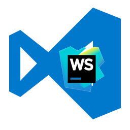
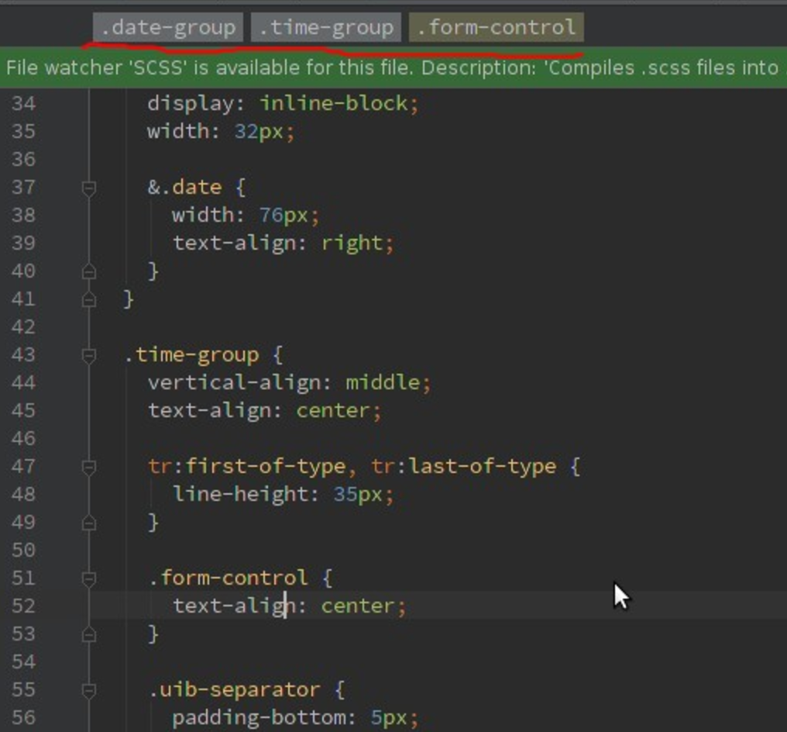

**\*UPDATED 6.06.2018\*** 

So what should you do not to lose all the features in **Visual Studio Code** that you already got used to in **WebStorm**?

- file **icons** (by default there are no icons, but [you can setup them](https://code.visualstudio.com/blogs/2016/09/08/icon-themes))
- WebStorm **shortcuts** ([plugin](https://marketplace.visualstudio.com/items?itemName=k--kato.intellij-idea-keybindings) or [manual setup](https://github.com/odynvolk/intellij-visual-studio-code/blob/master/keybindings/keybindings.json))
- integrated **terminal** ([just open it](https://code.visualstudio.com/docs/editor/integrated-terminal))
- **autosave** ([change the setting](https://code.visualstudio.com/Docs/editor/codebasics#_save-auto-save))
- **smart tags** - to edit 2 tags same time ([plugin](https://marketplace.visualstudio.com/items?itemName=formulahendry.auto-rename-tag))
- **autoimport**
- **path autocomplete** ([plugin](https://marketplace.visualstudio.com/items?itemName=christian-kohler.path-intellisense))
- **live templates** (they are [called **snippets**](https://code.visualstudio.com/Docs/customization/userdefinedsnippets))(also [ng2 snippets](https://marketplace.visualstudio.com/items?itemName=johnpapa.Angular2))
- **local history** (unfortunately looks like [plugin](https://marketplace.visualstudio.com/items?itemName=xyz.local-history) is too green for now)
- limit line - to keep line less than X symbols (settings -> "editor.rulers": [120])

Did I miss something?

## Really missing parts or problems:

- - folded blocks copy
    - a lot of bugs with path autocomplete
    - files multi-select ([github issue](https://github.com/Microsoft/vscode/issues/1023))
    - smart tags not always work when code split into 2 lines
    - no autoformat for selected block
    - multiterminal without tabs
    - quick search/filter for file structure (by typing)
    - TODO parser by the whole project ([plugin](https://marketplace.visualstudio.com/items?itemName=minhthai.vscode-todo-parser))

- SCSS class name completion for the HTML

## Something Extra plugins:

- [Angular Language Service](https://marketplace.visualstudio.com/items?itemName=Angular.ng-template) - must have for Angular projects
- [git history](https://marketplace.visualstudio.com/items?itemName=donjayamanne.githistory)
- [angular2-inline](https://marketplace.visualstudio.com/items?itemName=natewallace.angular2-inline)
- [color-picker](https://marketplace.visualstudio.com/items?itemName=anseki.vscode-color)
- [autocompletion and refactoring support for SCSS](https://marketplace.visualstudio.com/items?itemName=mrmlnc.vscode-scss)
- [CSS class name completion for the HTML](https://marketplace.visualstudio.com/items?itemName=Zignd.html-css-class-completion)
- [Wrap selected text with html tags](https://marketplace.visualstudio.com/items?itemName=bradgashler.htmltagwrap)
- [npm autocomplete](https://marketplace.visualstudio.com/items?itemName=christian-kohler.npm-intellisense)
- [project manager](https://marketplace.visualstudio.com/items?itemName=alefragnani.project-manager)
- [import cost](https://marketplace.visualstudio.com/items?itemName=wix.vscode-import-cost)
- [Settings Sync](https://marketplace.visualstudio.com/items?itemName=Shan.code-settings-sync) (store and share setting with git) - [my settings](https://gist.github.com/stevermeister/1d78211325ad36d44c88a15dd6a70769).
- [Angular 2 TypeScript Emmet](https://marketplace.visualstudio.com/items?itemName=jakethashi.vscode-angular2-emmet)
- [TypeScript Hero](https://marketplace.visualstudio.com/items?itemName=rbbit.typescript-hero) - for automatic import

## Fun:

- [Send messages to slack from VSCode](https://marketplace.visualstudio.com/items?itemName=sozercan.slack)
- [Human-like typing for GIFs and live demos](https://marketplace.visualstudio.com/items?itemName=dansilver.typewriter)
- [Vim emulation](https://marketplace.visualstudio.com/items?itemName=vscodevim.vim)
