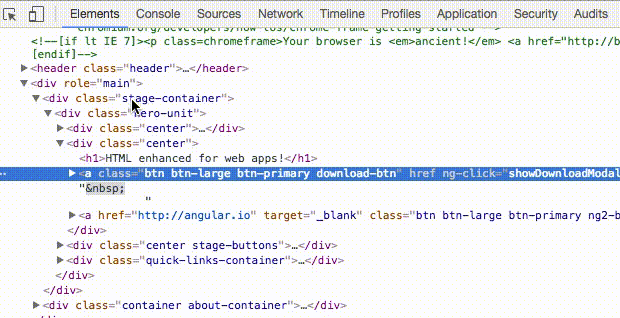

Мы уже все привыкли к **angular.element API** предоставляемое AngularJs, благодаря чему мы можем выбрать элемент и дальше исследовать его свойства в консоли обращаясь как :

`> angular.element($0)`

Более подробно [тут](https://stepansuvorov.com/blog/2013/03/angularjs-%D0%BF%D0%BE%D0%BB%D1%83%D1%87%D0%B0%D0%B5%D0%BC-scopeinjectorcontroller-%D0%B8%D0%B7-dom/).

Но что же может нам дать **Angular2**?

Оказывается в **Angular2** мы тоже можем кое-что получить.

Во-первых, убедимся что у нас не включен продакшен мод, в котором посмотреть ничего не получится. В коде не должен вызываться метод **enableProdMode**:

\[javascript\] import { enableProdMode } from '@angular/core'; enableProdMode(); \[/javascript\]

Теперь можем проинспектировать элемент и набрать в консоли: `> ng.probe($0)`

получим тем самым доступ к API отрисованного компонента(можно сделать на корневом теге). Так же мы можем теперь получить экземпляр класса нашего компонента: `> ng.probe($0).componentInstance`

соотвественно, если мы захотим изменить какое-то свойство: `> ng.probe($0).componentInstance.user.name = "Bob"`

Теперь чтобы изменения были применены к UI нам нужно запустить **ChangeDetection** (то что вы первом Ангуляре вы делали через **$scope.$apply()**). Самый простой способ запустить механизм обнаружения изменений - обратиться к сервису **changeDetectorRef** через специальное отладочное свойство **\_debugInfo**: `> ng.probe($0)._debugInfo._view.changeDetectorRef.detectChanges()`

Но учтите, в данном случае вы запускаете **ChangeDetection** только для текущего выбранного компонента и всех его детей. При этом если вы хотите применить изменения ко всему приложению - необходимо проделать тоже самое только с корневым элементом.
