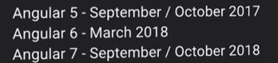
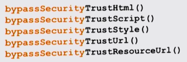
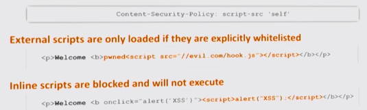
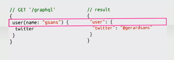

great organisation, great speakers, great conference, unfortunately I don't have time for detailed overview and provide you only with brief-brief notes.

## Keynote or "don't worry about Angular4" by [Igor Minar](https://twitter.com/IgorMinar) ([video](https://www.youtube.com/watch?v=aJIMoLgqU_o))

The main point was the Angular team goes to [semver](https://semver.org/) versioning and they are going to produce major candidate each half year, so we will see Angular3 **Angular4** already in march 2017 and so on:

So Angular2 is just Angular, and Angular1 is AngularJS. That's all you need to know about naming.

I had a chance to ask Igor about missing documentation for ng2 library creation. And he promised to take care about it the following week. And unfortunately after a month it's still a draft

<blockquote class="twitter-tweet" data-lang="en">
<a href="https://twitter.com/IgorMinar">@IgorMinar</a> on <a href="https://twitter.com/ngbeconf">@ngbeconf</a> you promised to take care about docs "how to create Angular library". how is it going with it?
— Stepan Suvorov (@stevermeister) <a href="https://twitter.com/stevermeister/status/819527760678973440">January 12, 2017</a></blockquote>

## Reactive parenting with Angular 2 by [Pawel Kozlowski](https://twitter.com/pkozlowski_os) ([video](https://www.youtube.com/watch?v=EMjTp12VbQ8))

Pavel explained the **[ViewContainerRef](https://angular.io/docs/ts/latest/api/core/index/ViewContainerRef-class.html)** concept and own **ngIf** implementation based on it. A lot of unclear diagram illustrations that make complex topic event more complex. After he should how to build popover(component) that will be dynamically inserted into the view with help of **[ComponentFactoryResolver](https://angular.io/docs/ts/latest/api/core/index/ComponentFactoryResolver-class.html)** and **[entryComponents](https://angular.io/docs/ts/latest/api/core/index/NgModule-interface.html#!#entryComponents-anchor)** ngModel property.

Be prepared that to understand that material you will have to watch the video 2-3 times.

## Boosting the security of your Angular 2 by [Philippe De Ryck](https://twitter.com/philippederyck) ([video](https://www.youtube.com/watch?v=l89acmnGMSc))

Angular is providing some XSS security content escaping out of the box. If you want to skip the escaping you can use one of bypass strategies:

Use AOT to make it even safer (no evals).

How to prevent XSS when it's already there: **Content Security Policy** (CSP) is a new browser security policy. Could be delivered **in headers** or in **meta** tags.

You can use google [csp-evaluator](https://csp-evaluator.withgoogle.com/) to check your site.

## Unleashing the power of GraphQL by [Gerard Sans](https://twitter.com/gerardsans) ([video](https://www.youtube.com/watch?v=VYpJ9pfugM8))

Facebook started with GraphQL 2012 for Mobile Native Teams, from 2015 it's opensourced. github migrated their api to graphQl in 2016.

query-data one-to-one relation:

Nice intro GraphQL and a lot of examples of Angular implementation.

## Angular the Application Architecture software the Scalable by [Minko's Gechev](https://twitter.com/mgechev) ( [Video](https://www.youtube.com/watch?v=gtOPAj9_FSM) )

First part was too abstract and about nothing, second part was about Redux integration that was also not so obvious.

## Angular and React by [Pascal Precht](https://twitter.com/PascalPrecht) & [Oliver Zeigermann](https://twitter.com/DJCordhose) ([video](https://www.youtube.com/watch?v=FIi6AkI7wKE))

- runtime performance tuning (rendering drag and drop for svg-boxes. improved performance with onPush and Immutable objects)
- server-side rendering (how to setup SSR, Angular more complex in terms of setup)
- 3rd-party library integration

I guaranty that you would like to return back to this presentation and watch it again.

## Practical AngularJS DevOps by [Nick Trogh](https://twitter.com/nicktrog) ([video](https://www.youtube.com/watch?v=x-BRn7aRrA4))

Talk was about using Microsoft DevOps tool from Microsoft guy with mentioning some obvious things between this and then.

## Start-up Performance with Lazy Loading by [Manfred Steyer](https://twitter.com/ManfredSteyer) ([video](https://www.youtube.com/watch?v=i0y5bJx8RFc))

- **Lazy Loading** base idea and implementation
- **canLoad** guard to prevent loading
- **Preloading** and **Preloading strategy**
- The right way of doing **Shared Module**

[Sources](https://github.com/manfredsteyer/preloading-ngbe-2016).

## Angular 2 Forms by [Todd Motto](https://twitter.com/toddmotto) ([video](https://www.youtube.com/watch?v=8CbZCmAwBCc))

There are 2 approaches:

- template driven
- reactive

Parts of reactive one:

- FormControl - Control
- FromGroup - Group of Controls
- FromArray - Array of Controls
- FromBuilder - Helper to generate Controls
- Validators

Than Todd showed really nice example of dynamic forms - [Pizza Creator](https://github.com/toddmotto/angular-pizza-creator) and explained its code. The most interesting part - custom controls (from [18:36](https://youtu.be/8CbZCmAwBCc?t=18m36s)) by using [ControlValueAccessor](https://angular.io/docs/ts/latest/api/forms/index/ControlValueAccessor-interface.html). The most exciting part about keyboard control: so you have native behaviour on your custom controls.

## Making SVG and Canvas Graphics by [Tero Parviainen](https://twitter.com/teropa) ([video](https://www.youtube.com/watch?v=30li6w62eCo))

First part is about **SVG** in general and several hint what to do with it in Angular:

- use the **svg:** namespace prefix
- use the **attr.** prefix for binding to attributes
- don't use element selectors for components

The same for **canvas**:

- put a <canvas> tag in a component template
- give it a reference variable name
- inject to component class as @ViewChild()
- draw from component lifecycle hooks

and for **SVG animations**:

- use CSS for simple things
- use **ngAnimate** for tighter integration
- use **[Greensock](https://greensock.com/)** for complex animations or better browser compatibility

and the thing about **canvas animations**, that you need to take **requestAnimationFrame()** out of Angular Zone:

\[javascript\] this.ngZone.runOutsideAngular(() =&gt; this.paint(true)); \[/javascript\]

[Source code](https://github.com/teropa/ng-gfx-demos) for all the demos.
