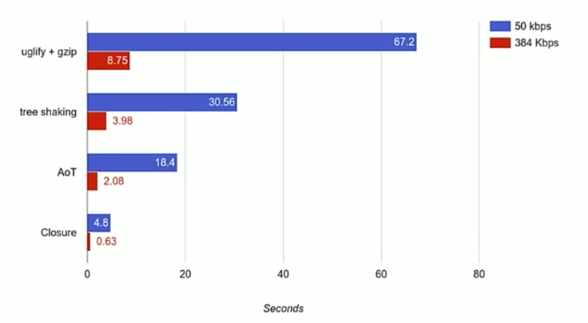
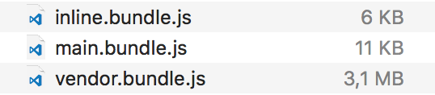
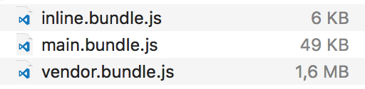

## Что это такое?

**AOT** или **Ahead-of-Time** - вариант компиляции приложения(альтернатива **JIT** или **Just-in-time**), которая выполняется один раз при сборке приложения. **JIT** выполняется каждый раз при запуске приложения в браузере.

 

## Зачем это делать?

- компиляция шаблонов до сборки (выявление ошибок при сборке)
- более быстрый запуск приложения
- скомпилированный файл получается меньше (не нужно включать компилятор в сборку)
- вопрос безопасности (меньше вероятность внедрения)

 

## Больше цифр

\* взято из презентации [Optimizing Angular 2 Apps](https://www.youtube.com/watch?v=_VnV7R4Ncwc) от Martin Probst.

## Живые цифры (сам проверил 2017-01-18)

angular-cli стартер без AOT(**ng build**):

angular-cli стартер c AOT (**ng build --aot**):

## Больше информации?

- [Официальная дока](https://angular.io/docs/ts/latest/cookbook/aot-compiler.html)
- Презентация [The Angular 2 Compiler](https://www.youtube.com/watch?v=kW9cJsvcsGo) от Tobias Bosch
- [source-map-explorer](https://www.npmjs.com/package/source-map-explorer) - полезный инструмент для анализа бандла
