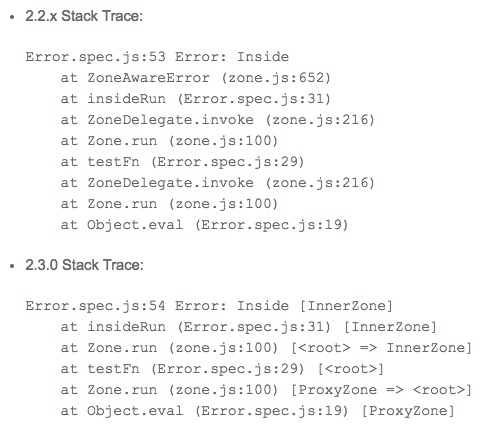

Пройдемся по основным моментам:

- Наследование компонентов
- Сервис языка шаблонов Ангулар ( [Angular Language Service](https://github.com/angular/angular/tree/master/modules/%40angular/language-service) )
- Улучшеный стек zone.js
- Доступ к версии Ангуляра
- Обновление rxjs

## Наследование компонентов

То, что мы все ждем еще с первой версии Ангуляра, наконец-то пришло, и нам не нужно придумывать своих велосипедов:

[javascript] @Component({ selector: 'person', template: ` <h4>Person: {{name}}</h4>

` }) export class Person { @Input() name: string; }

@Component({ selector: 'employee', template: ` <h4>Employee: {{name}}, id: {{id}}</h4>

` }) export class Employee extends Person { @Input() id: string; }

<div> <person name="John"></person> <employee name="Tom" id="45231"></employee> </div>

[/javascript]

То есть мы удобно можем расширить существующий компонент, при этом переопределив селектор и шаблон.

\* привер взят из [Angular 2 — New features in Angular 2.3](https://medium.com/@gerard.sans/angular-2-new-features-in-angular-2-3-f2e73f16a09e#.4ueyfyfi4)

## Сервис языка шаблонов Ангулар

Сервис поможет средствам разработки(IDE) лучше понимать шаблоны, делать проверку и подсвечивать ошибки. Сервис будет редактор-независимый, но при этом приоритет отдается VS Code ([plugin](https://github.com/angular/vscode-ng-language-service)). По факту это только проба пера и полноценную доработанную версию можно ждать в Angular 4.

## Улучшеный стек zone.js

Стек трейс для ошибок стал более четкий



## Доступ к версии Ангуляра

Версию Ангуляра мы можем получить как импортировав специальную константу **VERSION**:

```javascript 
  import {VERSION} from '@angular/core'; console.log(VERSION);  
 ```

так и из атрибута корневого элемента:


## Обновление rxjs

Теперь(начиная с версии **2.4**) под капотом будет стабильная **5.0.1**. До этого долгое время оставалась **5.0.0-beta.12**.
