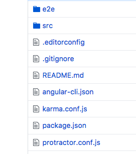
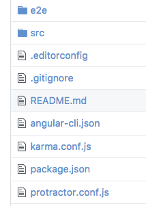

Do you see the same what I see right now? I don't know why but github team decided to change link color and folder color to ugly acid blue.

Hardly got used to it and decided to create [userscript](https://github.com/stevermeister/userscripts/blob/master/github-old-colors.user.js) to return the normal color. You are welcome to contribute.

To install userscript you can use [Tampermonkey google extension](https://chrome.google.com/webstore/detail/tampermonkey/dhdgffkkebhmkfjojejmpbldmpobfkfo?hl=en).
