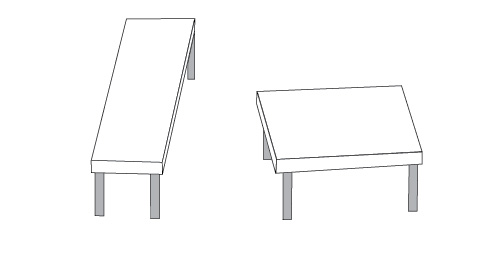

Already like a good tradition I visited [**ng-nl**](https://ng-nl.org/) conference ([ng-nl 2015](http://stepansuvorov.com/blog/2015/02/ng-nl-brief-review/), [ng-nl 2016](http://stepansuvorov.com/blog/2016/02/ng-nl-2016-brief-review/)).

Same as previous year it was great place and awesome people around.

But this time they really messed up with the schedule. I expected to have order of the topics that is provided on official web site, but appeared that it's not actual and I had to follow the app one, basically the only place. And the app was lagging :(

Strange that this year I did not see anybody from the core Angular team. Also no old good [Pascal Precht](https://twitter.com/PascalPrecht) and [Tero Parviainen](https://twitter.com/teropa) in the list. At least we had good presentation by [Todd Motto](https://twitter.com/toddmotto) about **Reactive Forms** and really inspiring **GraphQL** talk by [Uri Goldshtein](https://twitter.com/urigoldshtein).

...Instead of a keynote it was a talk...

## Angular's Reactive Forms by Todd Motto ([code](https://github.com/toddmotto/angular-pizza-creator), [video](https://www.youtube.com/watch?v=cWZDKihoMWM))

It was the same talk that Todd gave on **ng-be**. (see [ng-be 2016 brief review](http://stepansuvorov.com/blog/2016/12/ng-be-2016-brief-review/)). But today he was in a hurry to present all the materials and did not really keep the focus of audience. It might be some difficulties with understanding for developers who did not try Angular Forms before.

Good part comparing to **ng-be** talk was general architectural overview and going deep into real code from the high level.

some Q&A:

- automatic generation HTML(not to duplicate form-model description twice)
    - no solution for now
- good example of structural directive and dynamic component
    - structural directive - reimplementation of ngFor is pretty nice one
    - dynamic component - wizard or toster concepts
- opinion about Augury
    - did not have time for it. Working hard on the [course](https://ultimateangular.com/).

## Demystifying Ahead-Of-Time compilation in Angular by [Wassim Chegham](https://twitter.com/manekinekko) ( [slides](http://slides.com/wassimchegham/demystifying-ahead-of-time-compilation-in-angular-2-aot-jit#/), [video](https://www.youtube.com/watch?v=Cne9MzWrZ5I&index=11&list=PLQi8NNYCH8TDFnOhjrIsjZGMD6Ks8SQid))

Quick intro about JIT.

**JIT** bad points

- bundle size
- perfomance
- bootstrapping
- security

AOT generates VM friendly code, but needs context, and context is provided by **ngModules**.

some words about **Tree Shaking** (30-60% less code)

So good points about **AOT**:

- no security eval issue
- faster time to interaction
- smaller vendor bundle size

Easy use with **angular-cli**:

ng build --aot

Problems to make code "AOT ready"

- lambda expression (must be export )
- access modifiers (template properties should be public)
- no variable exports

Q&A:

- security: looking for interesting compiler injection examples
    - don't know any, but evals are always evil.
- bundle size: AOT makes only vendor part smaller, but your app code became bigger
    - yes, that was mentioned with asterisk on the slides
- angular universal: what's the status?
    - now SSR is part of ng4, but Angular Universal still exists like something bigger. We are working on different server rendering engines right now. Current implementation is on express. We would love to get as much feedback as possible from real projects.

## Building a dynamic SPA with Angular by [Filip Bech-Larsen](https://twitter.com/Filipbech) ([slides](https://www.slideshare.net/FilipBruunBechLarsen/dynamic-content-with-angular?ref=https://twitter.com/i/cards/tfw/v1/842333700012535808?cardname=player&autoplay_disabled=true&forward=true&earned=true&lang=en&card_height=130&scribe_context=%7B%22client%22%3A%22web%22%2C%22page%22%3A%22search%22%2C%22section%22%3A%22default%22%2C%22component%22%3A%22tweet%22%7D), [video](https://www.youtube.com/watch?v=5h9YcYTBUQ0&index=3&list=PLQi8NNYCH8TDFnOhjrIsjZGMD6Ks8SQid))

It was creasy talk about wrong way of doing things in Angular and reinventing own wheel.

So general, about everything...

about aot, about ssr...

need to review the video and return back to you with more details. for now have unstructured mess in my mind.

## Addicted to AngularJS by [Pete Bacon Darwin](https://twitter.com/petebd) and [George Kalpakas](https://twitter.com/gkalpakas) ([video](https://www.youtube.com/watch?v=5FEjA_dhnQs&index=9&list=PLQi8NNYCH8TDFnOhjrIsjZGMD6Ks8SQid))

What's wrong with AngularJs?

- scaling to large teams
- scaling to large applications
- different platforms are not supported

Why not just go Angular right away

- apps are really large
- a lot of 3rd party dependancies
- code base is large (other projects also on AngularJs as well)

[ngUpgrade](https://angular.io/docs/ts/latest/guide/upgrade.html#!#how-the-upgrade-module-works), steps to go:

- correct structure with typescript
- bootstrapping
- downgrading components (so you create new components in Angular style but downgrade to AngularJs to make it work all together inside one app )
- downgrading services
- upgrade components (it works with AOT!!!)
- upgrade services
- rewrite all to Angular

Future

- lazy loading
- better testing story
- better dual-router story
- less boilerplate (better compiler integration + tooling)
- better docs and examples

Q&A with George:

- Is ngUpgrade for upgrading old components fixes templates as well?
    - Yes
- Seriously?!
    - Yes.
- So we will be able to run AOT for old components?!
    - Yes!

## ACME (Angular CLI to Manage Everything) by [David Müllerchen](https://twitter.com/webdave_de) ([code](https://github.com/angular/angular-cli), [video](https://www.youtube.com/watch?v=Rjuk9AJQysk&index=4&list=PLQi8NNYCH8TDFnOhjrIsjZGMD6Ks8SQid))

Funny Lego story about about Angular CLI and back to command line running all the commands one by one:

npm i -g @angular/cil
ng new ng-nl-demo --routing
cd ng-nl-demo
ng serve

Also code generation

ng g component hi-nl
ng g module foo

...and runinng on diffrent environments.

Could be handy for newbies, but for people who already tried angular-cli quite a boring talk.

Q&A:

- Do you know about any plans to have 3rd party module installation via angular-cli (like ng install angular-material)
    - Don't know.
- Same about libraries. It would be really convenient to see environment ready for library creation.
    - Don't know.

## Component based API for your Angular Components with GraphQL by [Uri Goldshtein](https://twitter.com/urigoldshtein) ([videos](https://www.youtube.com/watch?v=44tW0uOiqkg&index=5&list=PLQi8NNYCH8TDFnOhjrIsjZGMD6Ks8SQid))

Why not REST:

- lots of calls
- lots of nested unneeded data

Key points:

- it's only single request, and no useless overfetching.
- **[Schema](http://graphql.org/learn/schema/)** to describe data/request structure.
- nice tool to check our graphQL requests
- some documentation on Angular Cookbook.
- [Apollo Client chrome extension](https://chrome.google.com/webstore/detail/apollo-client-developer-t/jdkknkkbebbapilgoeccciglkfbmbnfm).
- easy to use with angular. (Example are coming...)
- the way to synchronise the state
- Any backend - Any client - Any language.

## Improving Startup Performance with Lazy Loading in Angular by Manfred Steyer ( [code](https://github.com/manfredsteyer/lazy-loading-preloading-angular) , [video](https://www.youtube.com/watch?v=n6EMOeCDfjc&index=12&list=PLQi8NNYCH8TDFnOhjrIsjZGMD6Ks8SQid) )

I've already saw this talk on [ng-be](http://stepansuvorov.com/blog/2016/12/ng-be-2016-brief-review/), so I decided to go to workshop instead.

Strictly recommend you to watch part about **preloading of lazy modules**.

 

## Workshop: [Maxim Salnikov](https://twitter.com/webmaxru) - Progressive Web  Apps using the Angular Mobile Toolkit

It was just a disaster for audience and for Maxim. He prepared such a great workshop, but to do it in a proper way we would need 4-6 hours, but had to manage to finish in about 30 minutes.

You can check [here](https://docs.google.com/document/d/19S5ozevWighny788nI99worpcIMDnwWVmaJDGf_RoDY/edit#heading=h.z3fi3lc8mayc) detailed step-by-step description of the workshop.

 

## Breaking Bias by [Joy Eames](https://twitter.com/josepheames) ( [video](https://www.youtube.com/watch?v=ia1rhbO-NY0&index=7&list=PLQi8NNYCH8TDFnOhjrIsjZGMD6Ks8SQid) )

Nothing todo with Angular, just talk about psychology and our stereotypes/biases

- difference between tables

these 2 tetragons have the same sides!

- [monkeysphere](https://en.wikipedia.org/wiki/Dunbar's_number) concept
- [implicit association test](https://implicit.harvard.edu/implicit/user/agg/blindspot/indexfi.htm)
