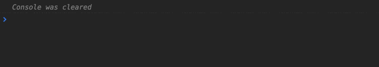
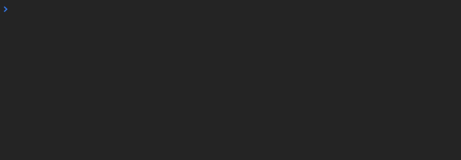
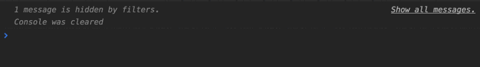
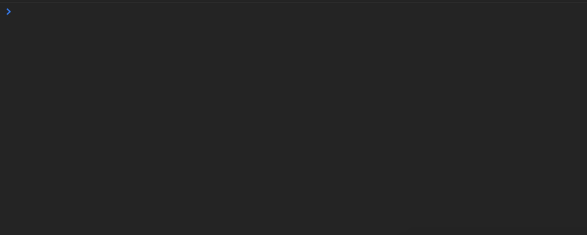
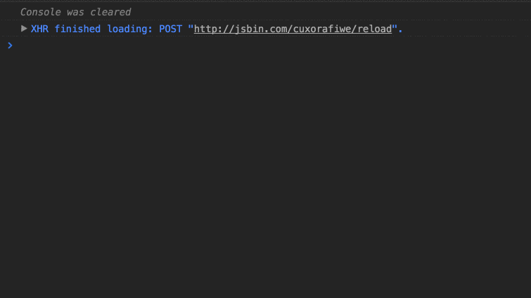

Перевод поста [RxJS — Six Operators That you Must Know](https://netbasal.com/rxjs-six-operators-that-you-must-know-5ed3b6e238a0#.6c599ctsl).

## 1\. Concat

```typescript
const getPostOne$ = Rx.Observable.timer(3000).mapTo({id: 1});
const getPostTwo$ = Rx.Observable.timer(1000).mapTo({id: 2});

Rx.Observable.concat(getPostOne$, getPostTwo$).subscribe(res => console.log(res));
```



удобно, когда важен порядок вывода последовательностей.

## 2. forkJoin

_ аналог **Promise.all()**

```typescript
const getPostOne$ = Rx.Observable.timer(1000).mapTo({id: 1});
const getPostTwo$ = Rx.Observable.timer(2000).mapTo({id: 2});

Rx.Observable.forkJoin(getPostOne$, getPostTwo$).subscribe(res => console.log(res)) 
```



## 3\. mergeMap

```typescript
const post$ = Rx.Observable.of({id: 1});
const getPostInfo$ = Rx.Observable.timer(3000).mapTo({title: "Post title"});

const posts$ = post$.mergeMap(post => getPostInfo$).subscribe(res => console.log(res));
```

_ применяется, когда у вас есть **Observable**, элементы последовательности которого тоже **Observable**, а вам хочется объединить все в один поток (чтобы все элементы внутренние Observable порождали событие основного). Не путать со **switchMap**!



 

## 4. pairwise

_ возвращает не только текущее значение, но в месте с ним и предыдущее значение последовательности

```typescript
// Tracking the scroll delta
Rx.Observable
  .fromEvent(document, 'scroll')
  .map(e => window.pageYOffset)
  .pairwise()
  .subscribe(pair => console.log(pair)); // pair[1] - pair[0]
```  


## 5. switchMap

```typescript
const clicks$ = Rx.Observable.fromEvent(document, 'click');
const innerObservable$ = Rx.Observable.interval(1000);

clicks$.switchMap(event => innerObservable$)
                    .subscribe(val => console.log(val));
```

**switchMap** делает **complete** для предыдущего **Observable**, то есть в данном случае у нас всегда будет только один активный Observable для интервала:



а вот **mergeMap** нам бы на каждый клик порождал новую **interval** последовательность.

## 6. combineLatest

_ получить последние значения из каждой последовательности при эммите одного из них:

```typescript
const intervalOne$ = Rx.Observable.interval(1000);
const intervalTwo$ = Rx.Observable.interval(2000);

Rx.Observable.combineLatest(
    intervalOne$,
    intervalTwo$ 
).subscribe(all => console.log(all));
```


