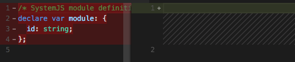

**UPD**: Статься обновлена 2017-04-24

Статья написана на основе перевода/переработки [Server Side Rendering With Angular 4](https://www.softwarearchitekt.at/post/2017/03/07/server-side-rendering-with-angular-4.aspx).

Что нам дает серверный рендеринг?

- более быструю загрузку "первого экрана"
- поисковая оптимизация (предоставление статики для поисковых ботов)
- социальные превью для страничек

С первых же дней Angular2 **Angular** включал поддержку этой опции в виде отдельного проекта [Angular Universal](https://universal.angular.io/). Так как **серверный пререндеринг** одна из ключевых киллер-фич, то начиная с **Angular 4** было принято решение включить доработанную версию непосредственно во фремворк.

В этой статье мы описываем необходимые шаги чтобы расширить существующее Angular 4 приложение добавив серверный рендеринг. Мы будем использовать конфигурацию [webpack](https://github.com/webpack/webpack) сгенерированную с помощью [Angular CLI](https://cli.angular.io/), полный пример можно найти [тут](https://github.com/stevermeister/angular-ssr).

## Достаем Webpack конфиг из Angular CLI

Если вы используете Angular CLI, то вам необходимо извлечь webpack конфиг для возможной дальнейшей настройки:

```
ng eject
```

**Внимание****!** Убедитесь в том, что вы понимаете что делает команда **[ng eject](https://github.com/angular/angular-cli/wiki/eject)**.

Вариант конфигурации(**webpack.config.js**) предложенный CLI не включает **Uglify** плагина, а **AOT** компиляция отключена, давайте включим обе опции:

\[javascript\]
\[...\]
"plugins": \[
	\[...\],
	new AotPlugin({
          \[...\]
	  // влючаем AOT
	  "skipCodeGeneration": false
	}),

	// добавляем UglifyJsPlugin
	new webpack.optimize.UglifyJsPlugin()
\]
\[...\]
\[/javascript\]

В то время как **AOT** совсем не обязательно для серверного рендеринга, комбинируя эти опции мы можем добиться прекрасного результата в плане скорости загрузки.

## Необходимые пакеты

Все необходимое для Angular уже подключено с помощью angular-cli, кроме пакета @angular/animations, который поставим вручную:

npm install --save @angular/animations

теперь подумаем о сервере.  В представленном решении используются [node.js](https://nodejs.org/en/) вместе с [express](http://expressjs.com/). Поэтому мы установим express c его типами вместе с **@angular/platform-server**:

```
npm i @angular/platform-server@next --save
npm i express @types/express --save
```

## Создание корневого модуля для серверного рендеринга

Для использования серверного рендеринга нам нужен корневой модуль, который включает ServerModule. Согласно [примеру от Rob Wormald](https://github.com/robwormald/ng-universal-demo/), мы также включаем корневой модуль нашего основного приложения (тот что отрисовывается в браузере):

\[javascript\]
// app.server.module.ts

import { NgModule } from '@angular/core';
import { ServerModule } from '@angular/platform-server';
import { AppModule } from './app.module';
import { AppComponent } from './app.component';

@NgModule({
  imports: \[
	  ServerModule,
	  AppModule
  \],
  bootstrap: \[
	  AppComponent
  \],
  providers: \[ \]
})
export class AppServerModule {}
\[/javascript\]

Далее мы должны расширить **BrowserModule** основного приложения указав идентификатор приложения (просто строка):

\[javascript\]// app.module.ts

@NgModule({
    imports: \[
        BrowserModule.withServerTransition({
            appId: 'demo-app'
        }),
        HttpModule,
        FormsModule,
	    \[...\]
    \],
    \[...\]
})
export class AppModule {}\[/javascript\]

## AOT для сервера

Так как **AotPlugin** не поддерживает серверный AOT, мы используем компилятор Angular напрямую, для этого создадим **tsconfig.server.json** (копию **tsconfig.json**) со следующими настройками **angularCompilerOptions**:

```
"compilerOptions": {
    [...]
},
[...]
"angularCompilerOptions": {
  "genDir": "src/aot",
  "entryModule": "./src/app.server.module#AppServerModule"
}
```

Настроим алиас команду в **package.json**:

```
[...]
"scripts": {
    [...]
    "ngc:server": "ngc -p tsconfig.server.json"
}
[...]
```

После вызова

```
npm run ngc:server
```

компилятор создаст дополнительные TypeScript файлы для проекта.

Внимание! До выполнения команды если вы используете структуру файлов сгенерированную Angular CLI (<1.0.0-rc.1), то вам еще прийдется стереть содержимое файла **./src/typings.d.ts**:



Иначе получите следующую ошибку: _Error at ./src/typings.d.ts:2:13: Subsequent variable declarations must have the same type. Variable 'module' must be of type 'NodeModule', but here has type '{ id: string; }'._

Теперь можем создать главный файл для сервера - **main.server.ts**, в котором используем сгенерированный **AppServerModuleNgFactory**:

\[javascript\]
//main.server.ts
import 'zone.js/dist/zone-node';
import { renderModuleFactory } from '@angular/platform-server';
import { enableProdMode } from '@angular/core';
import { AppServerModuleNgFactory } from './aot/src/app/app.server.module.ngfactory';
import \* as express from 'express';
import \* as fs from 'fs';

function ngExpressEngine() {
  return function (filePath, options, callback) {
    renderModuleFactory(AppServerModuleNgFactory, {
      document: fs.readFileSync(filePath).toString(),
      url: options.req.url
    }).then(string =&amp;gt; {
        callback(null, string);
      });
  };
}

enableProdMode();

const app = express();
app.engine('html', ngExpressEngine());

app.set('view engine', 'html');
app.set('views', '.');

app.get('/', (req, res) =&amp;gt; {
  res.render('index', { req });
});

app.get('/page2\*', (req, res) =&amp;gt; {
  res.render('index', { req });
});

app.use(express.static('.'));

app.listen(8000, () =&amp;gt; console.log('listening...'));
\[/javascript\]

Убедимся что в роутере основного модуля также есть данные стейты:

\[javascript\]
//app.module.ts
    RouterModule.forRoot(\[
      { path: '', component: HomeComponent, pathMatch: 'full' },
      { path: 'page2', component: Page2Component }
    \])
\[/javascript\]

## Webpack для серверного рендеринга

Давайте создадим отдельный webpack конфиг(**webpack.server.config.js**) для сборки бандла серверного рендеринга, отличием будут следующие строчки:

```
  // main.server.ts
  
  [...]
  target: 'node',
  [...]
  "entry": {
    "main": [
      "./src/main.server.ts"
    ]
  },
```

Так как подход использует всего один бандл, то **CommonsChunkPlugin** можно вырезать, также можно убрать **NoEmitOnErrorsPlugin**.

Чтобы один бандл не перетирал другой, мы сделаем вывод в другой файл:

```
  "output": {
    "path": path.join(process.cwd(), "dist"),
    "filename": "[name].server.bundle.js",
    "chunkFilename": "[id].server.chunk.js"
  },
```

и сконфигурируем специальным образом **AotPlugin**:

```
new AotPlugin({
  "entryModule": __dirname + "/src/app/app.server.module.ts#AppServerModule",
  "hostReplacementPaths": {
    "environments\\environment.ts": "environments\\environment.ts"
  },
  "exclude": [],
  "tsConfigPath": "./tsconfig.server.json",
  "skipCodeGeneration": false
}),
```

## Итого

Компилируем клиент:

```
webpack
```

Компилируем сервер:

```
ngc -p tsconfig.server.json && webpack --config webpack.server.config.js
```

Запускаем

```
cd dist
node main.server.bundle.js
```

## **UPD:** Кеширование ngExpressEngine

Чтобы не перегружать файловую систему, мы можем кешировать результат чтения файла:

\[javascript\]
let templateCache = {};
function ngExpressEngine() {
  return function (filePath, options, callback) {
    if (!templateCache\[filePath\]) {
      let file = fs.readFileSync(filePath);
      templateCache\[filePath\] = file.toString();
    }
    renderModuleFactory(AppServerModuleNgFactory, {
      document: fs.readFileSync(filePath).toString(),
      url: options.req.url
    }).then(string =&amp;gt; {
      callback(null, string);
    });
  };
}
\[/javascript\]

## **UPD2: Удобные команды для запуска**

Мы можем прописать следующие алиас-команды в package.json:

```
"scripts": {
	[...]
	"build": "npm run build:client",
	"build:client": "webpack",
	"build:server": "ngc -p tsconfig.server.json && webpack --progress --config webpack.server.config.js",
	"build:all": "npm run build:client && npm run build:server",
	[...]
}
```

## UPD3: Проблемы с APP\_BASE\_HREF

Для серверного модуля(app.server.module) необходимо указать **APP\_BASE\_HREF**:

providers: \[{provide: APP\_BASE\_HREF, useValue : '/' }\]

иначе будет следующая ошибка:

Error: No base href set. Please provide a value for the APP\_BASE\_HREF token or add a base element to the document.

## UPD4: 2 модуля в одной папке ломают Angular CLI

И вы получаете следующую ошибку:

Error locating module for declaration
 SilentError: Multiple module files found:

Чтобы починить пришлось во всех местах переименовать **app.server.module.ts** в **app.server-module.ts**
