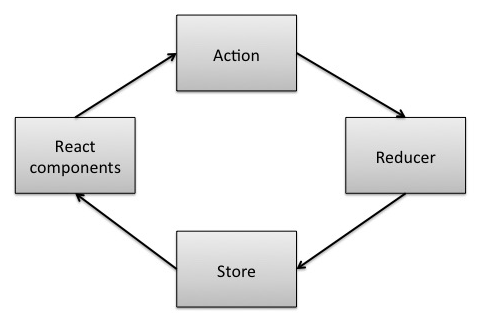

Предлагаю вам перевод статьи [Learn Redux by coding a Mini-Redux](http://blog.jakoblind.no/2017/03/13/learn-redux-by-coding-a-mini-redux/).

Существует множество ресурсов по изучению **Redux**: официальная документация, примеры, учебники, статьи, видео уроки... Имея такое большое количество информации многие начинающие **Redux** разработчики порой просто теряются в ней.

Другой подход изучения - это самостоятельно написать прототип **Redux**, чтобы понять основы библиотеки. Для меня это был реальный прорыв.

**Не беспокойтесь, это совсем не сложно.** Ядро Redux, как вы убедитесь, достаточно просто.

Для начала нам необходимо общее понимание что делает **Redux**.

## Что конкретно делает Redux?

Основная идея **Redux** - всегда иметь единственное состояние приложения. Это состояние представляет из себя Javascript объект - Redux **Store**, который доступен только для чтения. Если вы хотите изменить состояние, то вам нужно породить **Action**, что тоже является Javascript объектом.

Элементы вашего приложения могут подписываться на изменение состояния **Store**. Если мы посмотрим на примере с React, то компоненты React получают уведомление о изменении состояния и могут изменить отображение базируясь на новых данных.

Чтобы обновить **Store**, когда приходит **Action**, используется **Reducer** - обычная Javascript функция.

## Давайте начнем писать код!

Обобщая, мы должны сделать 3 вещи:

1. Получать состояние приложение из **Store**
2. Разобрать событие **Action**, которое будет передано на **Reducer**, который изменит состояние **Store**.
3. Следить за изменениями **Store**

Так же мы должны определить начальные значения для **Store** и **Reducer**, давайте с этого начнем:

https://gist.github.com/stevermeister/f081b321b521e2bce69733da42aa6190

 

## 1\. Получение состояния (state)

Мы создали функцию, которая просто сохраняет начальное состояние и редьюсер локально. Теперь давайте реализуем возможность получения этого состояния с помощью специального метода :

https://gist.github.com/stevermeister/8501a3223d5d6bd70bb42ce2a088a3b4

## 2\. Отправка события (dispatch an action)

Следующий шаг - отправка события:

https://gist.github.com/stevermeister/264750ace5e45bd4ee041d9656b49ab8

Функция **dispatch** используя текущее состояние отправляет событие на редьюсер, который мы определили при инициализации. А он в свою очередь перезаписывает объект currentState новым значением.

## 3\. Подписка на изменения

Теперь мы можем получать и обновлять состояние! Оставшийся шаг - сделать возможность подписаться на изменения:

https://gist.github.com/stevermeister/b9315d65a8cfdee8589f0a9da17ba61a

Теперь мы можем вызывать **subscribe** с коллбэк-параметром, который будет вызван в случае получения события на изменнеие состояния.

## Все готово.

Это все что нам нужно было сделать для создания mini-Redux.

На официальной [github странице](https://github.com/reactjs/redux) есть пример как использовать **Redux**. Мы можем скопировать пример, чтобы протестировать нашу собственную реализацию **Redux**:

https://gist.github.com/stevermeister/4b515d5246ca90b66f0c701560a3c80a

Поиграться с кодом можно [тут](https://plnkr.co/edit/OX7hNMlFXtEA2d7aSU1Y?p=preview).

## Выводы

Мы разработали рабочую версию аналога **Redux**, которая уместилась в 18 строчках кода. Впечатляет, правда?

Конечно, этот код не для продакшена. Сравнивая с реальной библиотекой мы выкинули отлов ошибок, не поддерживаем множественные подписки и другие возможности.

Теперь вы знаете основные принципы того как работает Redux, что поможет вам лучше ориентироваться в потоке информации.
