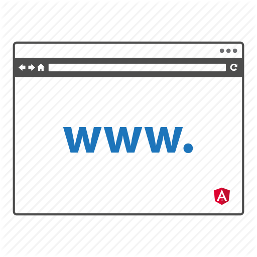
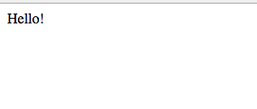

_Очень маловероятно, что вы захотите добавлять Angular в приложение только для того, чтобы завести один компонент. Рекомендую смотреть на этот пост, не как на практическое руководство к действию, а как на работу по исследованию возможностей фреймворка._

Предположим что у нас уже есть какой-то компонент, который мы хотим вывести на странице не **Angular** приложения:

https://gist.github.com/stevermeister/0fa603b4a2d98eaf71263b3f7b181e22

Для запуска **Angular** нам нужно также создать модуль, объявить наш компонент в нем и указать на то, что он будет инициирован **динамически**:

https://gist.github.com/stevermeister/0408b48d28a22638c0711821636aa6d3

Создав модуль, мы можем его бустрапить:

https://gist.github.com/stevermeister/773a866d6912fb08f2af9b8bcf098606

## Использование фабрики компонентов

Чтобы инициировать динамически компонент, нам нужен **componentFactoryResolver**, который мы можем получить из сущности нашего модуля:

https://gist.github.com/stevermeister/0256fd2a45cebdb4f207e5dc84908be7

теперь можем получить фабрику для нашего конкретного компонента:

https://gist.github.com/stevermeister/1c90c8d4383efb3d34ca96e193c2ec0b

и с помощью полученной фабрики создать компонент:

https://gist.github.com/stevermeister/f6f89631dfd9d5cde07e11f557aef562

обратите внимание, что мы произвели создание компонента прям на самом элементе (**querySelector('hello')**), но это не обязательно, мы бы также могли инициализировать контейнер, который содержит наш hello-элемент (например **body**).

Мы вывели компонент на страницу.

Но еще не все.

## Подключаем механизм обнаружения изменений (Change Detection)

Чтобы представление нашего компонента реагировало на изменение состояния приложения, нам необходимо добавить [**hostView**](https://angular.io/api/core/ComponentRef#hostView) компонента в приложение (**ApplicationRef**). Для этого используем метод [attachView](https://angular.io/api/core/ApplicationRef#attachView):

 ngModuleRef.injector.get(ApplicationRef).attachView(componentRef.hostView);

Получим:

https://gist.github.com/stevermeister/a43f1fbf4f6174c7f70281aa998ae63b

Также мы можем сделать отложенную инициализацию по таймеру (например: через 5 секунд):

https://gist.github.com/stevermeister/98820b3cd5c5ece59dabc963a172ec73

Вот [тут](https://github.com/javascriptru/angular-for-non-angular-apps) полный пример.
