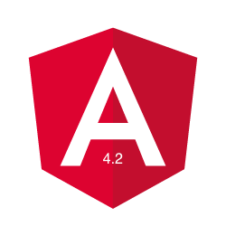

- оператор не нулевого присвоения ( **[Non-null assertion operator](https://www.typescriptlang.org/docs/handbook/release-notes/typescript-2-0.html#non-null-assertion-operator)** ) теперь можно использовать в шаблонах:
    
    ```
    <h2>{{ user!.name }}</h2>
    ```
    
- очень много изменений по анимации (смотрите в отдельном посте)
- добавили поддержку **mix** & **max** стандартных валидаторов (но уже в [4.3.0-beta.0](https://github.com/angular/angular/compare/4.2.1...4.3.0-beta.0) удалили эту возможность признав как **breaking change**)
- в тестах появились 3 вспомогательных метода:
    - **TestBed.overrideProvider()** - [приближает возможность](https://docs.google.com/document/d/1VmTkz0EbEVSWfEEWEvQ5sXyQXSCvtMOw4t7pKU-jOwc/edit) тестировать в **AOT**,
    - **flush()** - для сбрасывания всех счетчиков и выполнения колбэков всех асинхронных операций,
    - **fixture.[whenRenderingDone](https://github.com/angular/angular/pull/16732/files#diff-06a7a4c8d110ad13148ca89fd955d385R19)()** - возвращает промис, который ждет выполнения всех анимаций
