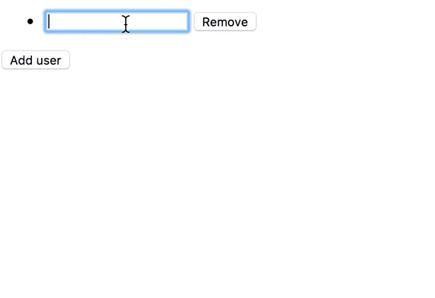

В отличии от **AngularJS** в **Angular** сделали целый модуль, который помогает в обработке форм.

Angular предлагает 2 подхода работы с формами:

- основанный на шаблонах (**template-driven**)
- реактивный (**reactive**)

Шаблонный более традиционный для декларативного подхода фреймворка. Реактивный появился позже и считается более прогрессивным и гибким. Мы разберем оба подхода.

## Подключение модуля форм

Для начала работы с формами необходимо подключить модуль форм(**FormsModule**):

```typescript
import { FormsModule } from '@angular/forms';
```

если мы хотим работать в реактивном подходе, то подключаем модуль **ReactiveFormsModule**:

```typescript
import { ReactiveFormsModule } from '@angular/forms';
```

И конечно импортируем их в наш основной модуль:

```typescript
@NgModule({
  //...
  imports: [
    BrowserModule,
    FormsModule,
    ReactiveFormsModule
  ],
  //...
})
```

## Шаблоно-ориентированный подход (template-driven)

В шаблонно ориентированном подходе мы по большей части оперируем 3мя сущностями: [**ngModel**](https://angular.io/api/forms/NgModel), **[ngModelGroup](https://angular.io/api/forms/NgModelGroup)** и [**ngForm**](https://angular.io/api/forms/NgForm).

## ngModel

Чтобы привязать данные к элементу формы мы можем поставить директиву **ngModel**:

```html
<input type="text" [ngModel]="name">
```

Есть 3 способа как получить введенные данные:

- двухстороннее связывание
- обработку события изменения
- ссылку на элемент (либо ngModel)

## ngModel и двухстороннее связывание (two way binding)

Способ, который пришел из **AngularJs** и в **Angular** практически не используется, но тем не менее, его хорошо знать:

```html
<input type="text" [(ngModel)]="name">
```

то есть вы используете специальный синтаксис двойных скобок: сначала прямоугольные, затем круглые ( чтобы было проще запомнить последовательность используется подсказка "_коробка с бананами_" )

Теперь при вводе данных в элемент формы у нас будет обновляться и свойство контроллера **name**.

## ngModel и обработка события

Вы можете использовать как родное событие поля ввода, например: для _type text_ это будет **input**:

```html
<input type="checkbox" [ngModel]="name" (input)="name = $event.target.value">
```

так и использовать специальное событие **ngModelChange**:

```html
<input type="text" [ngModel]="name" (ngModelChange)="name = $event">
```

## ngModel и обращение по ссылке

Чтобы поставить ссылку на **ngModel**, мы делаем следующее:

```html
<input type="text" [ngModel]="name" #name>
```

теперь мы можем обратиться в шаблоне к значению свойства элемента:

```
{{name.value}}
```

либо в контроллере компонента через специальный декоратор **ViewChild**:

```typescript
@ViewChild('name') nameInput: ElementRef;


ngAfterViewInit() {
  console.log(this.nameInput.value)
}
```

Также мы можем сделать ссылку не только на элемент, но и на сам контроллер ngModel:

```html
<input type="text" [ngModel]="name" #nameModel="ngModel">
```

Теперь в **nameModel** нам доступно не только значение модели, но и все дополнительные свойства и методы контроллера модели:

```
nameModel.valid
```

## Валидация данных в шаблонном подходе

Полностью(_или почти полностью_) поддерживаются HTML5 валидация. То есть, например, если проставить полю атрибут **require**, то Angular его подхватит.

## Свои валидаторы в шаблонном подходе

Не самый очевидный способ предлагают нам разработчики ангуляра для того, чтобы расширить валидаторы в шаблонном подходе. Мы должны создать директиву, в которой переопределить набор стантартных валидаторов **NG_VALIDATORS**, точнее дополнить своим(своими) с помощью флага [multi](https://stepansuvorov.com/blog/2017/01/angular2-opaque-%D1%82%D0%BE%D0%BA%D0%B5%D0%BD%D1%8B-%D0%B8-%D0%BC%D1%83%D0%BB%D1%8C%D1%82%D0%B8%D0%BF%D1%80%D0%BE%D0%B2%D0%B0%D0%B9%D0%B4%D0%B5%D1%80%D1%8B/):

```typescript
@Directive({
  selector: '[vali][ngModel]',
  providers: [
    {
      provide: NG_VALIDATORS,
      useExisting: ValiDirective,
      multi: true
    }
  ]

})
export class ValiDirective implements Validator {

  validate(formControl: AbstractControl): ValidationErrors {
    if(formControl.value === '3'){
        return {vali: { error: 'vali'}}
    }
    return null;
  };
}
```

таким образом мы создали свой валидатор, который проверит не является ли значение равным '3'. Плюс попрошу обратить ваше внимание на селектор для директивы мы указали не только сам атрибут имени директивы, но также что на элементе будет присутствовать **ngModel**.

## Свои асинхронные валидаторы в шаблонном подходе

Полностью идентичны синхронным, отличие только в том что ваш метод валидации возвращает Promise либо Observable, а прописывается не в NG_VALIDATORS, в а **NG_ASYNC_VALIDATORS**:

```typescript
    {
      provide: NG_ASYNC_VALIDATORS,
      useExisting: ValiDirective,
      multi: true
    }
```

## Вывод ошибок

Чтобы вывести ошибки также можем обратиться к контроллеру **ngModel** по ссылке и получить его свойство **errors**:

```
{{nameModel.errors | json}}
```

.

...и теперь...

.

Реактивный (reactive) подход

Реактивном подходе мы настраиваем элементы формы не в шаблоне, а в контроллере, оперируя при этом следующими понятиями: [**FormControl**](https://angular.io/api/forms/FormControl), [**FormGroup**](https://angular.io/api/forms/FormGroup), [**FormArray**](https://angular.io/api/forms/FormArray), [**FormBuilder**](https://angular.io/api/forms/FormBuilder).

На каждый элемент формы создается(вручную или автоматически) свой **FormControl**.

## FormControl

Чтобы создать **FormControl** мы определяем свойство в контроллере компонента:

```typescript
name: FormControl = new FormControl('Alice');
```

и привязываем его к конкретному элементу в шаблоне:

```html
<input type="text" [formControl]="name">
```

После чего в контроллере мы можем подписаться на изменения:

```typescript
this.name.valueChanges.subscribe(console.log)
```

Либо на изменения статуса(валидности):

```typescript
this.name.statusChanges.subscribe(console.log)
```

Также можно получать статические значения (не подписываясь):

```typescript
this.name.value
this.name.valid
```

 Полный список свойств можно посмотреть в описании [**AbstractControl**](https://angular.io/api/forms/AbstractControl#abstractcontrol) (от которого наследуется **FromControl**)

## FormGroup

**FormGroup** помогает удобно группировать контролы. Например: если мы хотим задавать не просто имя, а полное имя, содержащее само имя и фамилию:

```typescript
name: FormGroup = new FormGroup({

  first:new FormControl('Alice'),
  last:new FormControl('Brown'),
});
```

и подключаем в шаблоне:

```html
<fieldset [formGroup]="name">
	<input type="text" formControlName="first">
	<input type="text" formControlName="last">
</fieldset>
```

Обратите внимание, что для контролов обернутых в **formGroup** мы уже ставим **formControlName** свойство (а не [formControl]), которое будет указывать на то, где брать контрол в группе.

## FormArray

**FormArray** прекрасно подойдет тогда, когда в форме у вас используется список, в который вы можете добавлять элементы. Давайте сделаем форму "учасников", которая содержит список участников:

```typescript
participantsForm: FormGroup = new FormGroup({
    users: new FormArray([ new FormControl() ])
  });
```  

и в шаблоне это будет выглядеть так:

```html
<form [formGroup]="participantsForm">
  <ul formArrayName="users">
    <li *ngFor="let item of participantsForm.controls.users.controls; let i = index">
      <input type="text" formControlName="{{i}}">
    </li>
  </ul>
</form>
```

как видите мы выводим список контролов используя итератор(**index**) как имя контрола(**formControlName**) в списке.

Давайте добавим возможность добавления участников:

```html
<form [formGroup]="participantsForm">
  <ul formArrayName="users">
    <li *ngFor="let item of participantsForm.controls.users.controls; let i = index">
      <input type="text" formControlName="{{i}}"> <button (click)="removeUser(i)">Remove</button>
    </li>
  </ul>
</form>
<button (click)="addUser()">Add user</button>
```

и для этого в контроллере компонента определим 2 дополнительных метода **removeUser** и **addUser**:

```typescript
removeUser(index) {
  (this.participantsForm.controls['users'] as FormArray).removeAt(index)
}

addUser() {
  (this.participantsForm.controls['users'] as FormArray).push( new FormControl() );
}
```

В итоге получим:



## FormBuilder

Упростить процесс создания новых форм нам помогает сервис **FormBuilder**. Который мы можем инжектировать в контроллер:

```typescript
constructor(private _fb: FormBuilder) {
//...
}
```

После чего создать туже форму ("учасники"), только теперь с помощью сервиса:

```typescript
this.participantsForm = this._fb.group({
  users: this._fb.array([this._fb.control('')])
});
```
вы можете сказать, что кода не стало меньше. Да, это так. **FormBuilder** имеет смысл использовать только для сложных форм с большим динамическим количеством контролов.

## Валидация данных в реактивном подходе

Чтобы добавить валидатор на контрол мы всего лишь добавляем второй параметр, который может быть как одним валидатором, так и массивом(применяем разные проверки):

```typescript
name: FormControl = new FormControl('Alice', [Validators.required]);
```

предварительно импортировав коллекцию валидаторов:

```typescript
import { Validators } from "@angular/forms";
```

Мы можем задавать один и больше валидатор. На данный момент в [коллекции](https://github.com/angular/angular/blob/master/packages/forms/src/validators.ts) есть следующие валидаторы:

- min
- max
- required
- requiredTrue
- email
- minLength
- maxLength
- pattern

## Создание своих валидаторов

Валидатор представляет из себя простую функцию, которая возвращает либо объект ошибки либо null:

```typescript
const myNameValidator = (control: FormControl) => {
  const condition = !!control.value;
  if (!condition) {
    return {myNameValidator: 'does not match the condition'}
  }
  return null;
}
```

добавляется вторым параметром в контрол( вместе со стандартными валидаторами):

```typescript
name: FormControl = new FormControl('Alice', [Validators.required, myNameValidator]);
```

В реальных проектах валидаторы собирают в группы заворачивают в классы и делают статическими методами классов.

## Валидаторы с параметрами

Для создания валидаторов с параметрамми нам всего лишь необходимо завернуть нашу функцию валидатор в еще одну функцию, которая создаст замыкание для хранения параметров:

```typescript
const myNameValidator = (maxLength: number) => (control: FormControl) => {
  const condition = !!control.value && control.value.length > maxLength;
  if (!condition) {
    return {myNameValidator: 'does not match the condition'}
  }
  return null;
}
```

Асинхронные валидаторы

Асинхронные валидаторы отличаются от синхронных только тем, что возвращают не статические данные, а **Observable** либо **Promise**:

```typescript
const myAsyncNameValidator = (control: FormControl) => {
  const condition = !!control.value;
  if (!condition) {
    return Observable.of({myNameValidator: 'does not match the condition'});
  }
  return Observable.of(null);
}
```

и также определяются 3-м параметром в конструкторе контрола:

```typescript
name: FormControl = new FormControl('Alice', [myNameValidator], [myAsyncNameValidator]);
```

## Вывод ошибок

Ошибки контрола хранятся в свойстве **errors**:

```typescript
this.name.errors
```

Чтобы сделать какие-то действия в случае появления ошибок, можем написать так: добавив фильтры на изменение состояния и собственно валидность данных:

```typescript
this.name.statusChanges
  .distinctUntilChanged()
  .filter(status => status === 'INVALID')
  .subscribe(() => {
    console.log(this.name.errors);
  });
```      

Свойство есть не только у обычного контрола, но так же и у FormGroup, поэтому вы можете получить объект со всеми ошибками формы:

```typescript
this.participantsForm.errors
```

## Создание кастомных контроллов

Записал [скринкаст](http://learn.javascript.ru/screencast/angular#forms-custom-form-control) на эту тему.
