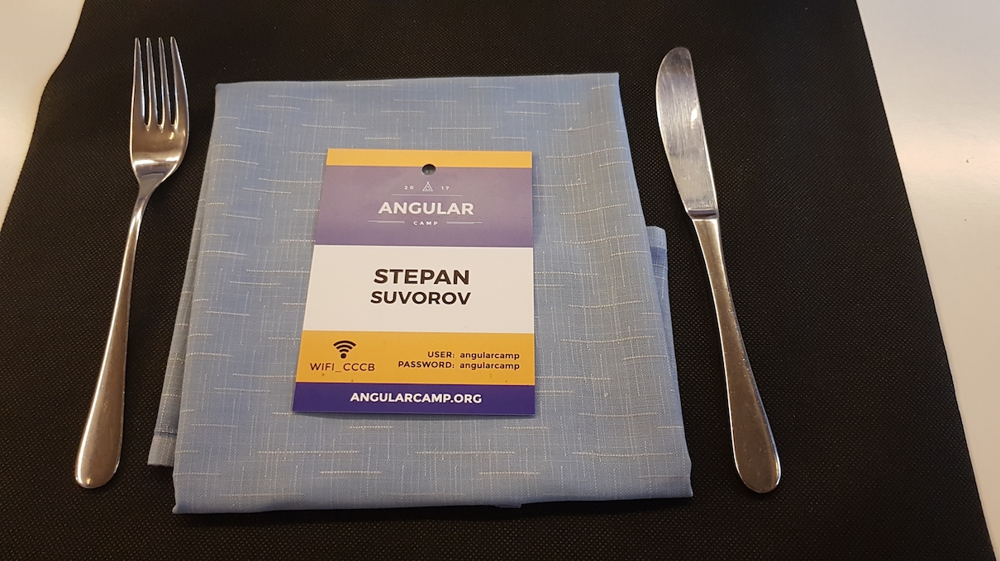
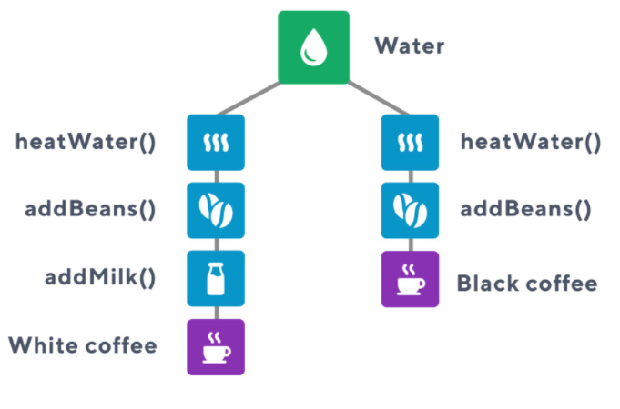
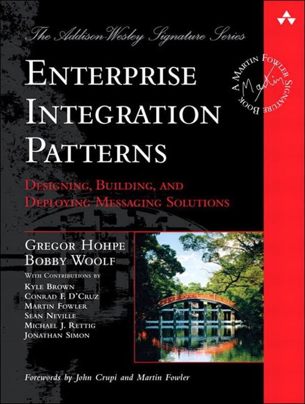

I had I chance to visit **[AngularCamp](https://angularcamp.org)** these days and would like to share some thoughts/notes with you.

## Todd Motto & James Henry - From imperative to reactive thinking ([slides](https://speakerdeck.com/toddmotto/from-imperative-to-reactive-thinking))

Todd showed 2 great examples of streams of real world.

Bulbs that subscribed to one switch:

and coffee machine that makes different sorts of coffee out of water:

Next part was about comparing **Imperative** and **Reactive** approaches base on "game of throwing the ball" implementation.

_Well... IMHO_

**Imperative**: too much code, really difficult to follow

**Reactive**: got lost even knowing how to work with Rxjs

 

## Dmitriy Shekhovtsov - Unleash The Power Of Angular With Knowledge of Patterns

Dmitriy started naming the patterns that everybody knows: [singleton](https://en.wikipedia.org/wiki/Singleton_pattern), [factory](https://en.wikipedia.org/wiki/Factory_(object-oriented_programming)), [pub/sub](https://en.wikipedia.org/wiki/Publish%E2%80%93subscribe_pattern), [adapter](https://en.wikipedia.org/wiki/Adapter_pattern) to warmup audience, after continued with: [DI](https://en.wikipedia.org/wiki/Dependency_injection), [module](https://en.wikipedia.org/wiki/Module_pattern), [IoC](https://en.wikipedia.org/wiki/Inversion_of_control),  [CQRS](https://en.wikipedia.org/wiki/Command%E2%80%93query_separation) to make some JS developers exited about new words.

Then he presented **Dependancy injection** pattern and provided 2 examples: with a fridge where parents "inject" food for the child and with carbonara that you don't need to take care about ingredients. Frankly speaking, both examples highlighted an encapsulation principle more than DI. After he should how Angular code would look like without DI. I think it would be better to highlight the power of flexibility that DI provides you, instead of showing that

**Module pattern** was next one. Dmitriy highlighted that even with EcmaScript2015+ with native modules we still have to compile it to an old school function wrapper. Some good reasons why to use this pattern:

- namespaces
- encapsulation
- structured code
- manage dependancy

and after he compared it to **ngModules**: import, export, providers.

Also Dmitriy provided interesting idea to split you **SharedModule** into 2: to put all you services separately. In this case you would not need **forRoot**/**forChild** approach.

Next one was a **Change Detection** pattern. Some explanation about Javascript types and memory allocation, and "_why the code worked in AngularJs and doesn't work in Angular_". The answer is **strict equality**.

Several more words about immutability, pure functions and single responsibility.

## Simona Cotin & Artur Daschevici - From Angular to React and back again

Simona and Artur provided kind of comparison for **Angular** and **React**(yes, yet another comparison ;) )

Simona started with Angular history, and told us what things had pushed AngularJs to be Angular:

- ES6
- Web components
- React
- RxJS
- Typescript
- EmberCli

and also, of course, it was a time for performance changes. so now we have:

- lazy loading
- AoT
- tree shaking

Then Artur took the floor and told us some parts of React:

- component based
- predictable state management
- ES6
- Flow
- Virtual DOM

Then they compared CLI tools and component declaration and tools for each framework.

Issues Angular:

- migration
    - Angular Style Guide
    - TypeScript
    - UpgradeModule
    - Upgrade cheatsheet

issues React:

- unmanageble large app
- state management
- no unified way of doing things

 

## Victor Savkin - State Management Patterns and Best Practices with NgRxb

too much code for 4th talk without break... it looked like Viktor wanted to put 4 hours talk in 40 minutes....

\* I'll rewatch video one more time and will return back to you with more information about this topic.

Also Victor several times during the talk recommended this book:

 

## Martin Splitt - Virtual Reality with A-Frame

Quite inspiring talk: Martin not only showed how to make VR in Javascript with help of simple library but also make all audience laugh.

He started with some examples of VR

- [Tilt Brush: Painting from a new perspective](https://www.youtube.com/watch?v=TckqNdrdbgk)
- [Google Earth VR — Bringing the whole wide world to virtual reality](https://www.youtube.com/watch?v=SCrkZOx5Q1M)

Compared different modern VR devices.

Explained How VR works.

I a bit of VR live coding with [**a-frame**](https://aframe.io) library.

 

**Filip Bech-Larsen - Building dynamic SPA website**

Filip showed results of his research how to build Angular over existing CMS: to use all management tools for content creation and editing and same time present it like SPA.

# Pascal Precht - Angular and Service Workers

Progressive web apps ([lighthouse](https://developers.google.com/web/tools/lighthouse/) - to check whether you app is progressive enough)

Service workers

Angular Service Worker

- install @angular/serviceworker
- angular-cli  serverWorker: true
- sw-register
- ngsw-manifest
- dynamic routing

# Carmen Popoviciu - A moment's reflection

Deep psychological talk about developer beings from Carmen that was nicely combined with Martin Splitt jokes.
