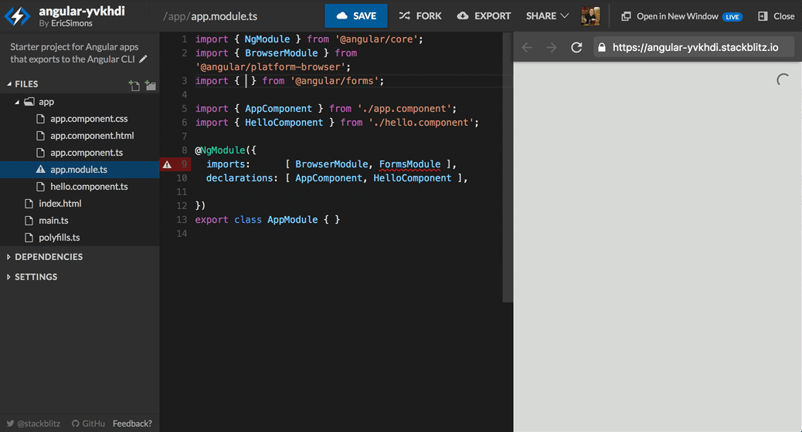

[**Stackblitz**](https://stackblitz.com) is nice combination of **VSCode** experience with **plunker** sandbox.

Some killer features:

- shortcuts (for example cmd+P)
- autocompletion
- npm packages
- debug + live reload is possible in separate window
- works offline
