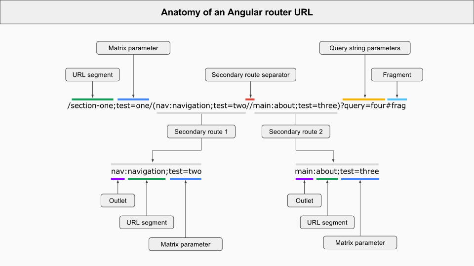

_Резюмируя статью "[The 7-step process of Angular router navigation](https://jvandemo.com/the-7-step-process-of-angular-router-navigation/)"_

Работу маршрутизатора мы можем разбить на 7 этапов:

1. **Parse**: разбирает  сроку запроса
2. **Redirect**: выполняет перенаправление (если нужно)
3. **Identify**: определяет стейт
4. **Guard**: запускает гарды конкретного стейта
5. **Resolve**: резолвит данные стейта
6. **Activate**: активирует компонент
7. **Manage**: слушает изменения, чтобы повторить процесс сначала

Давайте рассмотрим каждый этап более подробно.

## Parse

При разборе URL применяются следующие правила:

To parse the URL, Angular uses the following conventions:

- `/`: разбиваем на сегменты
- `()`: для [вторичных роутов](https://angular.io/guide/router#secondary-routes)
- `:`: для задания [именованых аутлетов](https://angular.io/guide/router#displaying-multiple-routes-in-named-outlets) 
- `;`: задание параметров в [матричной нотации](https://www.w3.org/DesignIssues/MatrixURIs.html)
- `?,&`: разделение [параметров запроса](https://angular.io/guide/router#query-parameters-and-fragments)
- `#`: задает [фрагмент](https://angular.io/guide/router#query-parameters-and-fragments)
- `//`: для разделения вторичных роутов

Исходя из этих правил, следующая строка:

```bash
/section-one;test=one/(nav:navigation;test=two//main:about;test=three)?query=four#frag
```

будет разобрана следующим образом:



## Redirect

До создания стейта у нас есть еще фаза редиректа. Возможны 2 варианта редиректа:

- **локальные** (не начинаются со слеша и заменяют фрагмент)
- **абсолютные** (начинаются со слеша и полностью заменяют URL)

## Identification

В этой фазе Роутер проходит по всем заданным стейтам и проверяет их на полное совпадение. Если полное совпадение не было найдено, он идет дальше.

Тут очень важно понимать, что при написании общих условий (wild card) они всегда должны идти в декларации ниже специфических.

## Guards

Когда роутер определился с конкретным стейтом, он запускает его гарды, чтобы проверить можно ли его активировать.

Обратите внимание на порядок запуска гардов:

- **CanDeactivate,** **CanActivateChild** (запускаются снизу вверх: от самого вложенного к самому корневому)
- **CanActivate** (сверху вниз)
- **CanLoad** (запускается в случае, когда стейт требует ленивой подгрузки модуля)

## Resolve

После того как роутер знает, что стейт можно активировать он запускает резолверы (если такие определены), для получения данных необходимых стейту.

## Activate

И вот только тут роутер доходит до шага активации компонента определенного для этого роута и его подстановки в **DOM** вместо **router-outlet**.

Если компонент уже был инициализирован, то используется существующий экземляр.

Роутер обновляет строку запроса браузера только тогда, когда компонент успешно инициализирован.

Manage

После того как произошла активация компонента и выведение его на экран, роутер снова слушает:

- изменения **URL** пользователем
- клики по **routerLink**
- вызовы **router.navigate()**

и при одном из этих действий начинает шаги с начала.

 

Вам была представлена последовательность действий роутера. Если вас интересует больше настройка роутера с примерами, то вам [сюда](http://stepansuvorov.com/blog/2017/02/%D0%BA%D0%BE%D0%BD%D1%86%D0%B5%D0%BF%D1%82%D1%83%D0%B0%D0%BB%D1%8C%D0%BD%D1%8B%D0%B9-%D1%80%D0%B0%D0%B7%D0%B1%D0%BE%D1%80-%D0%BC%D0%B0%D1%80%D1%88%D1%80%D1%83%D1%82%D0%B8%D0%B7%D0%B0%D1%82%D0%BE%D1%80/).
