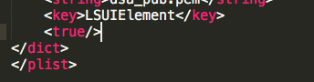

I have a hotkey for the terminal that why I decided to hide the terminal icon from Dock, but it appeared to be not so easy.

You need to go to app contents (by doing right click -> "**Show Package Contents**") and change **Info.plist** file - add special key:

**<key>LSUIElement</key>** **<true/>**

(it could be added to the end of the file):
