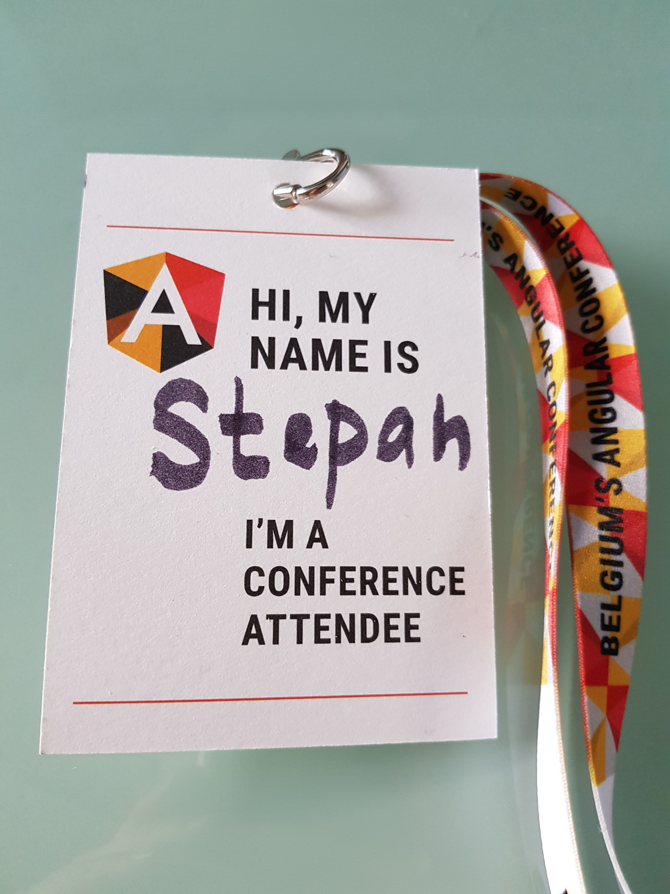
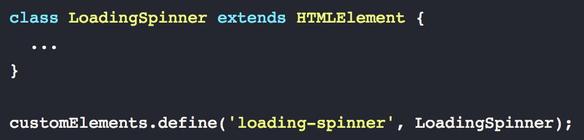
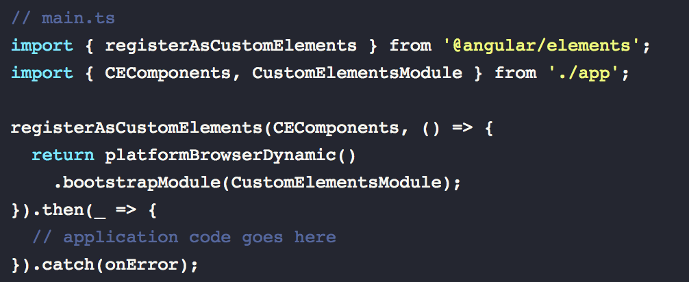

# 

# Pascal Precht - Angular Elements  ([video](https://www.youtube.com/watch?v=Hi2lRWUDuHA), [slides](https://pascalprecht.github.io/slides/angular-elements), [code](https://stackblitz.com/edit/ng-be-2017-demo-material) )

**Angular Elements** is very experimental from **Angular Labs**. Reference to Rob Wormald's talk "[A Glimpse at Angular Elements](https://www.youtube.com/watch?v=ljsOPm4MMEo)".

Why do we need it? It's still tricky to use Angular **outside** of Angular applications for:

- reusability
- CMS pages
- widgets

[WebComponents](https://developer.mozilla.org/en-US/docs/Web/Web_Components) could help to achieve this. Then Pascal made a quick introduction of main parts of web components: templates, html imports, shadow DOM and **custom elements**:

CustomElements pretty close to Angular Components:

`@HostBinding()`

→

Attributes

`@Input()`

→

Properties

`@Output()`

→

`CustomEvent()`

Lifecycle Hooks

→

Reactions

so.. **Angular Elements** - Angular Components packaged into Custom Elements:

- self-bootstrapping
- Hosts Angular Component inside Custom Element
- Bridges DOM APIs and Angular APIs

and then it was a life coding with [Hello World](https://stackblitz.com/edit/ng-be-2017-demo-hello-world) and [Material Components](https://stackblitz.com/edit/ng-be-2017-demo-material) examples.

P.S.: 2 or 3  years ago we have implemented the same concept for AngularJs, React and Backbone wrapped into CustomElements, you can check it [here](https://github.com/MVC-Elements).

# Uri Shaked - Static website with Angular ([video](https://www.youtube.com/watch?v=vE516nAUwFI), [slides](https://docs.google.com/presentation/d/17QG0ATttFhAPBREOQln3guw1ch6ozdWGCVWtw93ysxM/edit#slide=id.p), [code](https://github.com/patrickmichalina/fusebox-angular-universal-starter) )

Uri did a lot of life coding from scratch.

the goal:

- component-based architecture
- content shows immediately
- no server-side code

Project from scratch step-by-step:

- dependencies
- app skeleton
- module definition
- a component with a template

for this moment we've done with a part that usually CLI does for us

https://twitter.com/PascalPrecht/status/939064081121726464

But after it was something really nice:

We used **[Fuse-Box](https://fuse-box.org/)** instead of webpack and I was impressed by the speed of recompilation.

We integrated **Angular Universal** rendering, but not for server-side prerendering, but only for first compilation to provide page immediately. So server-side rendering without a server. I like the idea, but unfortunately not very useful when your data is constantly updating and you have routes.

Some nice extra resources:

- [ng2-fused](https://github.com/alex-klock/ng2-fused) - plugin for fuse-box
- [preboot](https://github.com/angular/preboot) -  a library to help manage the transition of state
- [fusebox-angular-universal-starter](https://github.com/patrickmichalina/fusebox-angular-universal-starter)

# Juri Strumpflohner - Create and publish Angular libs like a Pro ([video](https://www.youtube.com/watch?v=K4YMmwxGKjY), [slides](https://docs.google.com/presentation/d/1KzitBVVepOxgS-gxejehKC4V27ENeFMQ6Gwwrw5O9AE/edit#slide=id.g2b6eab8706_0_12))

It's great that question that I asked Igor Minar [previous ng-be](https://stepansuvorov.com/blog/2016/12/ng-be-2016-brief-review/) now was represented in such a detailed way by Juri.

Main parts:

- there is already an **[Angular Package Format](https://docs.google.com/document/d/1CZC2rcpxffTDfRDs6p1cfbmKNLA6x5O-NtkJglDaBVs/edit)**
- take care of **[PeerDependencies](https://nodejs.org/en/blog/npm/peer-dependencies/)**
- inline your assets (templates, css)
- FESM - literally put all in one file (or a single ES Module)
- compile into different formats(umd, es5, es2015) and specify paths in package.json

After Juri recommended some nice tools to automate the process:

- [semantic-release](https://www.npmjs.com/package/semantic-release)
- travis-ci

and ready package managers to do all the work:

- [generator-angular2-library](https://github.com/jvandemo/generator-angular2-library)
- [ng-packagr](https://github.com/dherges/ng-packagr)

and keep eye on Angular CLI Schematics!

# Vincent Ogloblinsky‏ - Hidden gems of TS compiler ([video](https://www.youtube.com/watch?v=WkJagE7b5U0), [slides](https://slides.com/vogloblinsky/hidden-gems-of-typescript-compiler#/))

First Vincent explained what regular compiler does, and it:

- parsing
    - lexical analysis
    - syntax analysis
- transforming
- generation

TS is doing quite the same:

- scanner
- parser
- binder
- checker
- emitter

What else we can do with AST?

- linting
- complexity check
- docs
- API

Some nice tools to check:

- [compodoc](https://compodoc.github.io/website/)
- [madge](https://github.com/pahen/madge)
- [madge3d](https://github.com/compodoc/madge3d)

I think the main thing of that presentation was

https://twitter.com/stevermeister/status/939081719872983040

 

# Philippe De Ryck - Cookies versus tokens: a paradoxical choice ([video](https://www.youtube.com/watch?v=9ZOpUtQ_4Uk))

Philippe never ceases to amaze me by uncovering hidden parts of obvious (from the first look) topic - sessions.

The talk was divided into 3 parts:

- **where** to store the data (locality):
    - old school sessions (server side)
    - JSON Web Tokens (client side)
        - **!important**: don't forget to verify the key! (not just decode the data)
- **how** to store
    - cookies
        - handled automatically ✔
        - difficult to secure   ✘
        - problems to support outside a browser ✔
        - enable [Cross-Site Request Forgery attacks](https://en.wikipedia.org/wiki/Cross-site_request_forgery) ([11:48](https://youtu.be/9ZOpUtQ_4Uk?t=11m48s)) ✘
    - auth headers
        - not handled automatically (and not present on all the requests) ✘
        - do not enable  Cross-Site Request Forgery   ✔
        - easy to support outside a browser    ✔
        - looks secure  ✔
            - don't forget about whitelist implementing angular interceptors ([18:08](https://youtu.be/9ZOpUtQ_4Uk?t=18m8s))
- how to **transport**
    - cookie - httpOnly
    - localStorage - not secure enough  ✘
    - [sessionStorage](https://developer.mozilla.org/en-US/docs/Web/API/Window/sessionStorage) ✔

# Maxim Salnikov - Creating an Angular Progressive Web App ([video](https://www.youtube.com/watch?v=LufnOxBbn0M), [slides](https://slides.com/webmax/pwa-ng-be#/))

The whole Maxim's presentation I had a feeling that I'm watching a video on x2 speed.

Starting from angular-cli 1.6 you can create your Angular application with ServiceWorkers by one command:

ng new app --service-worker

Unfortunately, you cannot use webpack dev server, so you need to build it first:

ng build --prod

and then run with a static web server on dist folder (I use [http-server](https://www.npmjs.com/package/http-server) for it):

http-server ./dist

still does not work with ng-cli server :(

register NGSW: import ServiceWorkerModule

caching strategies: **freshness** vs **performance**

 

# Manfred Steyer - Angular's new HttpClient ([video](https://www.youtube.com/watch?v=GFX6tsSLwYQ), [slides](https://speakerdeck.com/manfredsteyer/a-close-look-to-angulars-new-httpclient))

- custom data formats
    - work with XML
- progress information
    - by subscribing to an event
- interceptors for extensions

and lot of life coding with Interceptors...

# Aimee Knight - Pulling Back the Curtains From Your Stylesheets ([video](https://www.youtube.com/watch?v=eajyNEsdx4k))

Aimee presented low-level browser html/css life cycle.

**binary** -> **text** -> **tokenizer** -> **parser** -> **tree structure** (**DOM**)

_...lots of text on slides that had been just read..._

# Asim Hussain - How to hack an Angular app? ([video](https://www.youtube.com/watch?v=TDl53qqODQI), [slides](https://www.slideshare.net/jawache/how-to-hack-a-node-app-gdg-devfest-ukraine-2017))

Asim told us 3 hacker break-in stories that based on simple things.

Story1: Github story

git hook to localhost -> https://0:9200/_shutdown -> https://0:email -> memcache -> deprecated python library

moral: don't underestimate small things

Story2: Equifax

moral: use latest versions of your software to be sure that there are no known vulnerabilities

Story3:

moral: don't trust npm by default, there are fake npm packages.

## Dominic Elm - Taming snakes with reactive streams ([video](https://www.youtube.com/watch?v=j6WTrL_tHQk), [slides](https://speakerdeck.com/d3lm/taming-snakes-with-reactive-streams))

Why reactive?

- dom events
- http requests
- web sockets
- animations
- ...

How to think reactively?

No side effects!

Approach

1. split into small parts
2. define a trigger
3. compose all together

# Ayşegül Yönet - Performant Augmented Reality for the Web ([video](https://www.youtube.com/watch?v=khDIbNMIbkA), [slides](https://docs.google.com/presentation/d/1n68BtDWgpkZgZ5QXOIJXnrntsVH9NZoTAzQ_UhCy05E/edit#slide=id.gc6f919934_0_0))

Some information about VR and AR.

Technologies to achieve - WebGL & WebRTC

Libraries - [Three.ar.js](https://github.com/google-ar/three.ar.js)

Switch **ngZone** for all project (not to run for each rendering)- now possible with ng5:

**bootstrapModule(AppModule, { ngZone: 'noop'})**

# Todd Motto - Angular Architecture: From Patterns to Implementation ([video](https://www.youtube.com/watch?v=vGKRKDPGUSs), slides)

Toooo architectural abstraction with pizza restaurant at the end of the day...
