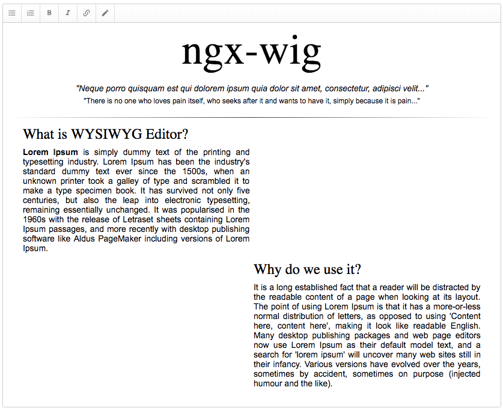

[ngx-wig](https://github.com/stevermeister/ngx-wig) _ opensource lightweight WYSIWYG editor for Angular.

I've just merged pull request with tests and we are ready to go.

# Finally, release!

P.S.: thanks a lot @**[bampakoa](https://github.com/bampakoa)** for the contribution!
