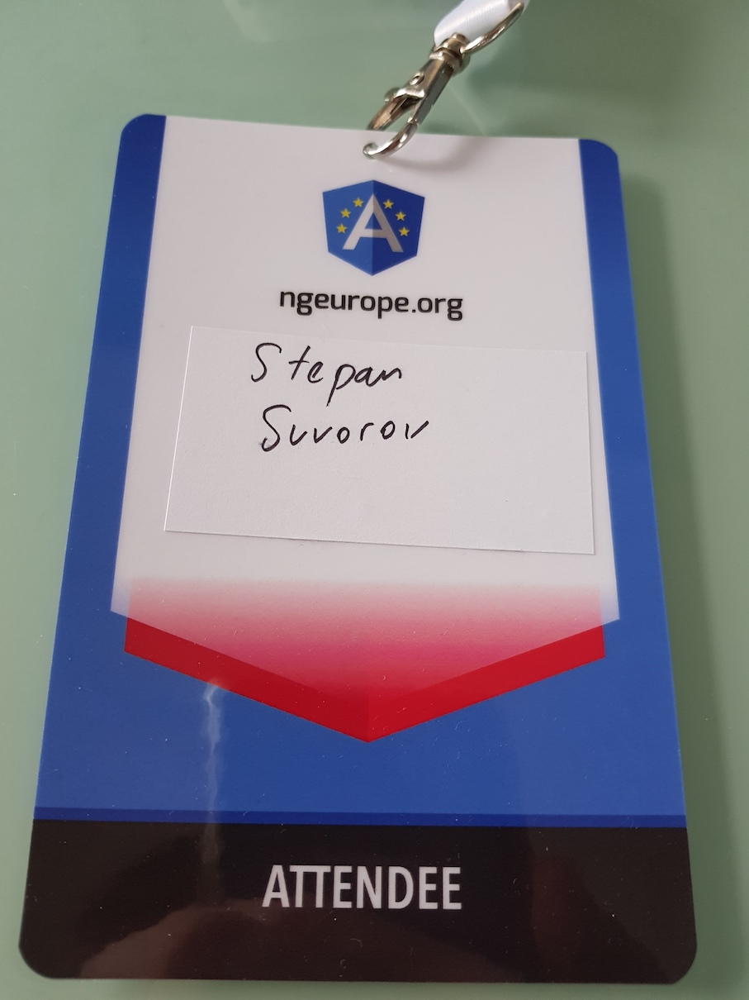
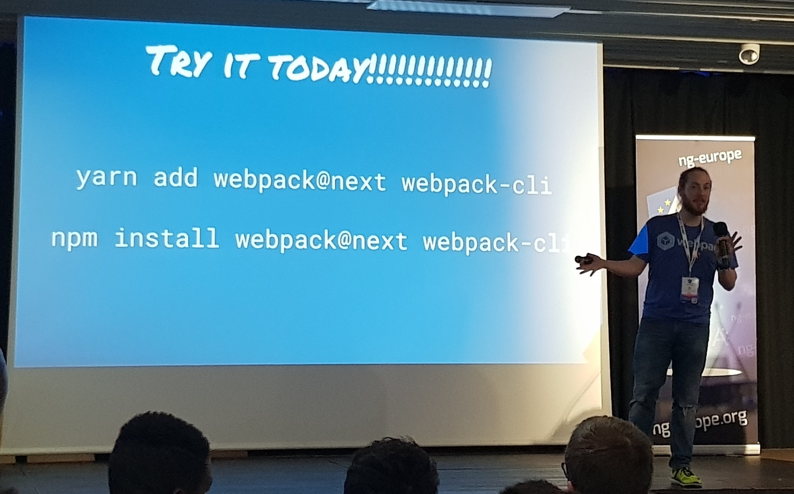

Just to have less confusion I would like to say that there were no **ngEurope2017**, it was [**ngEurope2016**](https://stepansuvorov.com/blog/2016/10/ngeurope-2016-brief-review/) in October and next one was ngEurope2018 in February.

## [Manfred Steyer](https://twitter.com/ManfredSteyer) - High-Performance Applications with Angular ([video](https://www.youtube.com/watch?v=oOnKcPpqOxs))

- **Lazy loading**
- **OnPush**
- **AOT** + **TreeShaking**(with build optimizer)
    - new AOT compiler is coming
- **Service Workers** for caching (did not cover)

## [Erik Haddad](https://twitter.com/erikhaddad) - PWA Angular and Firebase ([video](https://www.youtube.com/watch?v=aTMTjusHv9o))

- what is Angular
- what is PWA
- what is firebase
    - auth
    - database
    - storage
    - **cloud functions**
- AngularFire2
    - \* new **AngularFireStorage**
- [Firechat](https://firechat.social/messages/room/STv3iJ4SEVx1A6Fkx58O)

## [Christian Liebel](https://twitter.com/chris_liebel) - On the road to PWA: building real-cross platform Angular apps with Cordova & Electron ([video](https://www.youtube.com/watch?v=OcC-RJ1-joo), [code](https://github.com/thinktecture/ngeurope-2018-xplatform))

real cross-platform:

- single codebase
- maximum code reuse

What is PWA?

Native App Packaging: **[Cordova](https://cordova.apache.org/)** and **[Electron](https://electronjs.org/)**.

Demo session to show how DI works for different devices based on env.

## [Stefanie Trimble Fluin](https://twitter.com/stefaniefluin) - Creating Beautiful Experiences Fast with Angular Material ([video](https://www.youtube.com/watch?v=g9zuLHHT2Z4&t=3s))

- material design
- angular material
    - basic intro how to use the library
- theming
- CDK (was not covered)

## [Antal Andrei](https://twitter.com/andrei_antal) - A look into the future: Angular Elements ([video](https://www.youtube.com/watch?v=-pS8M_RBf84), [slides](https://slides.com/andreiantal/ng-europe_angular-elements), [code](https://github.com/andrei-antal/AngularElementsDemo))

- need to have angular components **outside angular**
- introduction of **web components**
- **Angular Elements** - angular components packaged in web components
    - **@angular/elements**
    - **ngDoBootstrap** inside component
    - **registerAsCustomElements**

Relative video: **[Pascal Precht - Angular Elements (at ng-be)](https://www.youtube.com/watch?v=Hi2lRWUDuHA)**

## [Asim Hussain](https://twitter.com/jawache) - How to hack an Angular app? ([video](https://www.youtube.com/watch?v=2WhlK-GXQLM))

Asim told us 3 hacker break-in stories that based on simple things.

Story1: Github story

git hook to localhost -> https://0:9200/\_shutdown -> https://0:email -> memcache -> deprecated python library

moral: **don't underestimate small things**

Story2: Equifax

moral: use latest versions of your software to be sure that there are **no known vulnerabilities**

Story3:

About **cross-env** fake npm package

moral: don't trust npm by default, there are fake npm packages.

[**nsp**](https://www.npmjs.com/package/nsp) - tool to check for package version

## [Todd Motto](https://twitter.com/toddmotto) - Angular Architecture: From Patterns to Implementation. ([video](https://www.youtube.com/watch?v=CbZ14jSrFZs))

Todd tried to show an example of real-world objects and their communication to describe **Redux**(or **ngRx**) logic and high-level component/modules architecture.

## [Sean Larkin](https://twitter.com/thelarkinn) - webpack4: most important update for Angular  ([video](https://www.youtube.com/watch?v=NbJonysf45Q))

Quite inspiring one!

- smaller and faster builds
    - new plugin system
        - hooks are now monomorphic
- modernization
- developer experience
    - RIP commonChunck plugin

## [Adam Bradley](https://twitter.com/adamdbradley) - Next Generation Ionic: Built for PWAs and interoperability ([video](https://www.youtube.com/watch?v=v15N8Ztp6Hs))

From the beginning, I have a feeling that it was a paid talk from a sponsor.

- ionic uses customElements (the same as Angular Elements)
- need to have a look at **[stenciljs](https://stenciljs.com/)** (it's still unclear after the talk)
- lazy loading on component level

## [Sven Sauleau](https://twitter.com/svensauleau) - Let's compose JavaScript and Reason ([video](https://www.youtube.com/watch?v=wN2gKbZl9I4))

It was quick intro with simple examples of [**Reason**](https://reasonml.github.io/) power over types. If you are about to start with **Reason** I strictly recommend to watch this talk.

## [Mashhood Rastgar](https://twitter.com/mashhoodr) - Rapid prototyping using Angular and Firebase ([video](https://www.youtube.com/watch?v=9ienVyg2Vnk))

Mashhood was showing a live coding doing a twiter clone with Firebase: database and auth. The whole app to create and deploy took him only 12min!  If you want to start working with Firebase services check the video.

## [Jen Looper](https://twitter.com/jenlooper) - Boost Your App's Emotional Intelligence with NativeScript, Angular and Machine Learning ([video](https://www.youtube.com/watch?v=We-yohLeSUY))

IMHO, the most inspiring talk of the conference. It was a combination of **IoT**, **AI**, and **NativeScript**.

After this talk, I already want to buy some IoT sensors and start building NativeScript to manage them.
