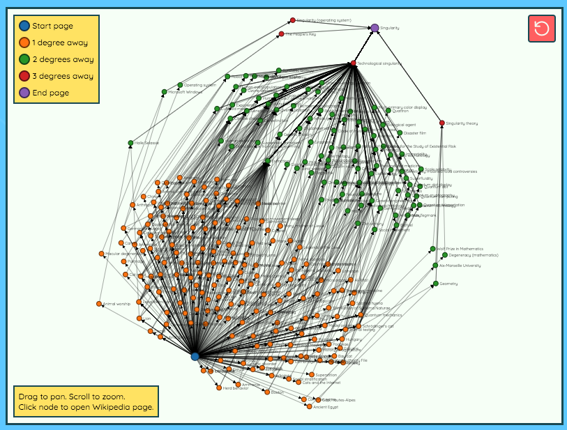

[**Six Degrees of Wikipedia**](https://www.sixdegreesofwikipedia.com/) shows you the shortest path from one definition to another.

For example, to get from **[Cat](https://en.wikipedia.org/wiki/Cat)** to **[Singularity](https://en.wikipedia.org/wiki/Singularity)** it took only 4 steps and 8 seconds! 
