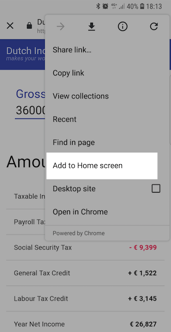

Finally I found some time to implement **service workers** that will allow you to use application even there is no internet connection. [Check it out](https://thetax.nl/)!

Also it's already **PWA application**, so you can make a shortcut for your mobile desktop:

