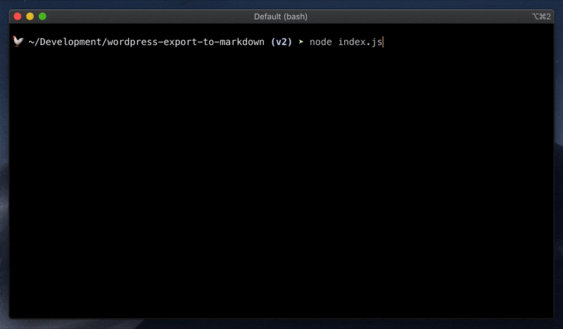

*I hope you know what Scully is, because this post is not about how to start with Angular Scully but a guide on how to migrate your WordPress blog content into Scully.*

## Export posts

The first thing you have to do is to export all your posts from WordPress. Luckily for us WordPress has a functionality to export all your posts into XML.
You can find this option in your WP Admin navigation:


You can check more details on WordPress official documentation - [Tools Export Screen](https://wordpress.org/support/article/tools-export-screen/).

After this operation you have your XML file, but it's still XML and you would like to have MarkDown format.

## XML to MD

As a way to convert XML into MD within keeping blog format we can use [wordpress-export-to-markdown](https://github.com/lonekorean/wordpress-export-to-markdown) tool:



Answer prompt questions carefullly because it's better to keep the same structure of URLs.

Conversion finished? Well done! Now you have you md files with images. Doesn't Scully support images within md?

## Blog images and Scully

Bad news for you. For now (10.06.20) Scully does not recognise images. (**Update 30.06.20**: Scully recognise image files and at least doesn't try to convert them to HTML, but still it does not copy them)

Good news - Scully has plugin system. If you want to know how to write Scully plugins please check [this](https://samvloeberghs.be/posts/custom-plugins-for-scully-angular-static-site-generator) article  by [Sam Vloeberghs](https://twitter.com/samvloeberghs), it's great!

## Scully plugin to copy images

We want Scully to copy images from source of md files to compiled html files. For that to happen, we will create a small image plugin(image.scully.plugin.ts):

```typescript
export function imageFilePlugin(raw: string, route: HandledRoute) {
  return new Promise((resolve) => {
    fs.copyFile(route.templateFile, './dist/static/images/' + route.data.sourceFile, (err) => resolve(''));
  });
}
```

There is yet neither `./dist/static` directory, nor `./dist/static/images`, so you need to create them before copying:

```typescript
if (!fs.existsSync('./dist/static')) {
  fs.mkdirSync('./dist/static');
}
if (!fs.existsSync('./dist/static/images')) {
  fs.mkdirSync('./dist/static/images');
}
```

Now we need to register our plugin for all types of images that we want to support(you can add more if you need):

```typescript
registerPlugin('fileHandler', 'png', imageFilePlugin);
registerPlugin('fileHandler', 'jpg', imageFilePlugin);
registerPlugin('fileHandler', 'gif', imageFilePlugin);
```

after some prettification, the final version of our image plugin (image.scully.plugin.ts) is:

```typescript
import { registerPlugin, HandledRoute } from '@scullyio/scully';
import * as fs from 'fs';

if (!fs.existsSync('./dist/static')) {
  fs.mkdirSync('./dist/static');
}
if (!fs.existsSync('./dist/static/images')) {
  fs.mkdirSync('./dist/static/images');
}

export function imageFilePlugin(raw: string, route: HandledRoute) {
  return new Promise((resolve) => {
    const src = route.templateFile;
    const dest = './dist/static/images/' + route.data.sourceFile;
    fs.copyFile(src, dest, (err) => {
        if (err) {
          console.log(err);
        }
        console.log(`${route.templateFile} was copied to ${dest}`);
        resolve('');
      }
    );
  });
}

registerPlugin('fileHandler', 'png', imageFilePlugin);
registerPlugin('fileHandler', 'jpg', imageFilePlugin);
registerPlugin('fileHandler', 'gif', imageFilePlugin);
```


and now we need to include this plugin to Scully config (scully.blog.config.ts) to make it work:

```typescript
import './src/image.scully.plugin';

export const config = {
  ...

```

## preRenderer router option 

After I created Image Plugin, [Sander Elias](https://twitter.com/esosanderelias) (creator of Scully) recomended me to choose even simplier way - to use `preRenderer` router option:

```typescript
export const config: ScullyConfig = {
  ...
  routes: {
    '/blog/:slug': {
      preRenderer: async (handledRoute: HandledRoute) => {
        ...
        return false;
      },
      ...
    },
  }
};
```

so we can just return `false` to let Scully know that we don't want to render this path. So we can put a condition: 

```typescript
const fileExtention = path.extname(handledRoute.data.sourceFile);
if (['.jpg', '.png', '.gif'].includes(fileExtention)) {
  return false;
}
return true;
```

and also we can add our copy functionality to the case when we have an image:

```typescript
const src = path.resolve('./' + handledRoute.route + fileExtention);
const dest = path.resolve('./dist/static/images/' + handledRoute.data.sourceFile);
fs.copyFile(src, dest);
```

**Important:** Scully ignores images by default (but doesn't copy them yet), so to make it work and to get all the handledRoutes for images, you just need to register a 'dummy' image plugin, that will do nothing but letting  Scully know that we're going to handle some extensions: 

```typescript
registerPlugin('fileHandler', 'png', async () => '');
registerPlugin('fileHandler', 'jpg', async () => '');
registerPlugin('fileHandler', 'gif', async () => '');
```

## Parse tags from XML

It's useful to have tags from your posts as well. By default [wordpress-export-to-markdown](https://github.com/lonekorean/wordpress-export-to-markdown) does not parse tags. I've created [PR](https://github.com/lonekorean/wordpress-export-to-markdown/pull/40) for it. Not sure how fast it's gonna be merged, so if you need tags you can use [my forked version](https://github.com/stevermeister/wordpress-export-to-markdown).


## Double enconding

It looks like there is an issue with WordPress XML Export, so if you have many non-Latin symbols, for example, you are writing your posts in another language it will be encoded 2 times. Thus, when I did export (with [wordpress-export-to-markdown](https://github.com/lonekorean/wordpress-export-to-markdown)), I changed [this line](https://github.com/lonekorean/wordpress-export-to-markdown/pull/41/files#diff-6947033678b93d106e25614dd972e66fR45) to make it work also for non-Latin titles.


## No tables and special symbols

Unfortunately [wordpress-export-to-markdown](https://github.com/lonekorean/wordpress-export-to-markdown) doesn't recognize old good html tables, so if you had them in WP Posts be prepared to do it manually again in md.

Also if you used symbols like `[`, `]`, `\`, `-`, `_`, `$` be prepared that they're gonna be ecranised with backslash to `\[`, `\]`, `\\`, `\-`, `\_`, `\$`. Sometimes, especially in code blocks, it's not expected behaviour. 

# Angular Services: title, articles, tags, search

When you have all your information in place (in .md files), you could think about such a nice and obvious functionality for WordPress (as well as any blog) as page title, **tags** or **search**, and now you can do it all on the client side!

## TitleService

Angular already has a title service, so you only need to inject this service

```typescript
  constructor(
    ...
    private titleService: Title) {
```

 and set a title based on your article: 

```typescript
this.scully.getCurrent().subscribe(article => {
  this.titleService.setTitle(article.title);
  this.article = article;
});
```


## Article Service

Let's create our base service - Articles Service to manipulate with all the content. We will use `scully.available$` stream for this, so: 

```typescript
getArticles(): Observable<Article[]> {
  return this.scully.available$;
}
``` 

but it's not that easy because if you have not only *.md files Scully will create an item for each file (yes, also for images), I opened [an issue](https://github.com/scullyio/scully/issues/653) and hope it's gonna be resolved soon, but for now you need to filter only *.md files, so: 

```typescript
this.scully.available$.pipe(
      map((articles: Article[]) => articles.filter((article: Article) =>
        article.sourceFile?.split('.').pop() === 'md')));
``` 

for each article you have a date, so I would like it to have DESC order - new ones on top:

```typescript
map((articles: Article[]) => {
  return articles.sort((articleA, articleB) => {
    return +new Date(articleB.date) - +new Date(articleA.date);
  });
})
``` 

it's also convenient to have a limit:

```typescript
map(articles => articles.slice(0, limit))
```

here are we:

```typescript
  getArticles(limit = 10): Observable<Article[]> {
    return this.scully.available$
      .pipe(
        tap(articles => console.log(articles)),
        map((articles: Article[]) => articles.filter((article: Article) =>
          article.sourceFile?.split('.').pop() === 'md')),
        map((articles: Article[]) => {
          return articles.sort((articleA, articleB) => {
            return +new Date(articleB.date) - +new Date(articleA.date);
          });
        }),
        map(articles => articles.slice(0, limit))
      );
  }
```  

With the help of Article Service now you can output a preview list of your articles:

```html
<app-article-preview [article]="article" *ngFor="let article of articles$|async"></app-article-preview>
```


## Tags Service

Based on ArticleService we can get all the tags, also with a counter for each one that we can create a tag cloud after:

```typescript
getTags(): Observable<Tag[]> {
  return this.articleService.getAllArticles().pipe(map(articles => {
    const tags = [];
    articles.forEach(article => {
      article.tags.split(',').forEach(articleTag => {
        const tag = tags.find(t => t.title === articleTag);
        if (!tag) tags.push({ title: articleTag, count: 0 });
        tag.count++;
      });
    });
    return tags;
  }));
}
```

## Search

It would be sad if your blog doesn't not have an option to seach (or to filter by tag). We already have ArticleService, so what we only need to do is to filter by tag:

```typescript
articles.filter((article) => {
  if (!tag) {
    return true;
  }
  return article.tags.includes(tag);
});
```
or search query:

```typescript
articles.filter((article) => {
  if (!searchTerm) {
    return true;
  }
  return article.title.includes(searchTerm) || article.tags.includes(searchTerm);
});
```

and now all together:

```typescript
getFilteredArticles(tag: string, searchTerm: string, limit: number = 10): Observable<Article[]> {
  return this.getAllArticles().pipe(
    map( (articles: Article[]) => {
      return articles.filter((article) => {
        if (!tag) {
          return true;
        }
        else if (!article.tags) {
          return false;
        }
        return article.tags.includes(tag);
      });
    }),
    map(articles => articles.filter(article => {
      if (!searchTerm) {
        return true;
      }

      return article.title.includes(searchTerm) || article.tags.includes(searchTerm);
    })),
    map(articles => articles.slice(0, limit))
  );
}
```

Isn't it cool to have everything on frontend with the search that executes for less than a second? 


## Code Highlight

Btw, if you don't know you can also highlight your code blocks (i.e. <pre><code class="language-typescript"></code></pre>).
For this you only need to activate this option in Scully config (scully.blog.config.ts):

```typescript
setPluginConfig('md', { enableSyntaxHighlighting: true });
```

because by default it's switched off. 

# Deployment

You can deploy to any static hosting. It could be [GitHub Pages](https://pages.github.com/), [FireBase](https://firebase.google.com/docs/hosting) or [Vercel](https://vercel.com/). My personal preference is [Netlify](https://www.netlify.com/). We just need to add a deployment command: 

```shell
ng build --prod && npm run scully
```

and setup distribution directory to `./dist/static`


## Partial compilation

If your blog has more than 100 posts you probably don't want to recompile all of them each time when you update one. For this you can use an option `routeFilter` and filter by only one section ( it's usually a year or a year and a month in WordPress):

```shell
ng build --prod && npm run scully -- --routeFilter "*2020/11*"
```

with such a flag Scully will regenerate only md files from 2020/11 directory.

You can go even further and use git to identify which files were changed in the last commit:

```shell
git show --name-only --oneline HEAD | tail -n +2 | grep 'blog/'
```

so the final command would be:

```shell
 npm run scully -- --routeFilter "$(git show --name-only --oneline HEAD | tail -n +2 | grep 'blog/' | xargs  | sed -e 's/ /, /g')" --scanRoutes
 ```

for more conveniece you can put it into your package.json commands.


# All the helpful resources

- all the code is [here](https://github.com/stevermeister/blog).
- And the site is life so you can play around - [https://blog.stepansuvorov.com/](https://blog.stepansuvorov.com/)
- [Scully Docs](https://scully.io/docs/features/)
- "[Custom plugins for Scully](https://samvloeberghs.be/posts/custom-plugins-for-scully-angular-static-site-generator)" by Sam Vloeberghs

...and, of couse, you can ping [me](https://twitter.com/stevermeister) with all your questions and suggestions.